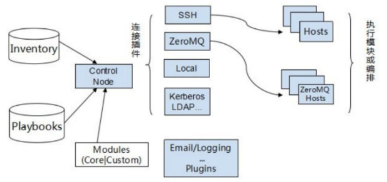
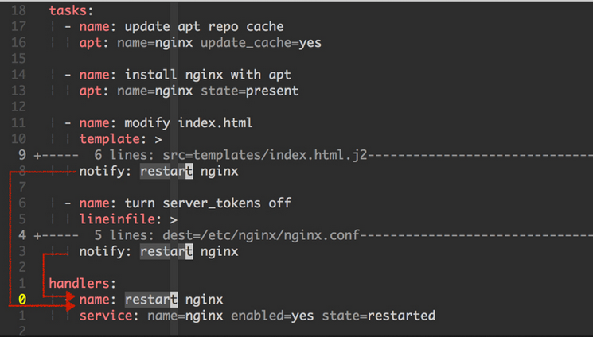

# ansible

Ansible 是一个模型驱动的配置管理器，支持多节点发布、远程任务执行。默认使用 SSH 进行远程连接。无需在被管理节点上安装附加软件，可使用各种编程语言进行扩展。

1. Python 阵营的配置管理器
2. 不用帮每台机器 (instance) 预安装 agent ，**只要有 SSH 和 Python 就可以闯天下！**。只要SSH能登录到远端机器，那么ansible就可以。
3. 4 大主流的配置管理器(Puppet, SaltStack, Chef, Ansible) 中， Ansible 是最容易上手，且马上就可以用的工具。

```
登录远程计算机方式：
1. 可以使用ssh通过命令登录形式进行远程机器管理。在/etc/ansible/hosts（默认的inventory文件）里配置ansible_ssh_pass=‘密码’ + 命令行-u运行参数来指定用户（也可以设置/etc/ansible/ansible.cfg中设置remote_user来设置默认登录远端用户名）
2. 或者配置ssh免密登录

即配置好ssh连接远端机器，ssh可以生效后ansible就可以使用。可以把ansible就当成ssh使用，可以想想成ansible通过ssh发送命令到远端执行，即可以执行ansible的功能模块操作远端和可以同时操作多个远端。
```

## 安装

```bash
sudo apt-get install -y ansible
or
sudo pip install ansible
```

完成后可以做以下测试（不需要做任何配置）

```bash
$ ansible --version
ansible 2.0.0.2
  config file = /etc/ansible/ansible.cfg
  configured module search path = Default w/o overrides

$ ansible localhost -m ping
localhost | SUCCESS => {
    "changed": false, 
    "ping": "pong"
}
```

**ssh的配置可以和ansible共用**

比如，一般情况下我们都会在~/.ssh/config配置ssh的连接信息，简化ssh的使用。比如config中已经配好了免密连接如下：

```
# ~/.ssh/config文件部分配置,免密登录
Host test_server
 user your_name
 Hostname 52.90.174.93
 IdentityFile ~/.ssh/github_rsa
```

只需要把Host名test_server加到/etc/ansible/hosts中就可以了，ansible会通过ssh使用到配置信息，不需要添加用户名，主机IP，秘钥文件等。

```
#/etc/ansible/hosts
[my_server]
test_server

$ ansible my_server -m ping
dev-video | SUCCESS => {
    "changed": false, 
    "ping": "pong"
}
```

## 基本架构



图为ansible的基本架构，从上图可以了解到其由以下部分组成：

- Modules：完成具体功能
  - 核心模块（Core Modules）：这些都是ansible自带的模块
  - 扩展模块（Custom Modules）：如果核心模块不足以完成某种功能，可以添加扩展模块
- 插件（Plugins）：完成模块功能的补充，比如Email，Logging等
- 剧本（Playbooks）：ansible的任务配置文件，将多个任务定义在剧本中，由ansible自动执行
- 连接插件（Connectior Plugins）：ansible基于连接插件连接到各个主机上，虽然ansible是使用ssh连接到各个主机的，但是它还支持其他的连接方法，所以需要有连接插件
- 主机群（Host Inventory）：定义ansible管理的主机


## 设置

1. ansible的默认配置文件路径为 /etc/ansible

    ```bash
    $ ansible --version
    ansible 2.0.0.2
      config file = /etc/ansible/ansible.cfg
      configured module search path = Default w/o overrides
    ```

2. 通常我们较偏爱把 ansible.cfg 和 hosts 这两个档案与其它的 Playbooks 放在同个专案目录底下，然后通过版本控制系统 (例如 Git) 把它们一起储存起来，以实现 Ansible 的 Infrastructure as Code！

## 命令格式

格式 : **command target option module module_option cmd**

command: ansible命令
target: 需要执行命令的目标主机或群组。hosts里的分组或分组下的具体机器
option: ansible命令选项
module: 需要用到的模块
module_opiton: 指定模块中的参数
cmd: 模块中的可用的命令

比如：

command |target |  option| module
---|---|---|----
ansible| my_server| -m |ping

### Inventory文件

Ansible 可同时操作属于一个组的多台主机,组和主机之间的关系通过 inventory 文件配置. 默认的文件路径为 /etc/ansible/hosts

除默认文件外,你还可以同时使用多个 inventory 文件，也可以从动态源,或云上拉取 inventory 配置信息.详见 动态 Inventory.

#### 主机与组

/etc/ansible/hosts文件支持使用以下变量设置相关的远程主机信息：

```
ansible_ssh_host     #用于指定被管理的主机的真实IP
ansible_ssh_port     #用于指定连接到被管理主机的ssh端口号，默认是22
ansible_ssh_user     #ssh连接时默认使用的用户名
ansible_ssh_pass     #ssh连接时的密码
ansible_sudo_pass     #使用sudo连接用户时的密码
ansible_sudo_exec     #如果sudo命令不在默认路径，需要指定sudo命令路径
ansible_ssh_private_key_file     #秘钥文件路径，秘钥文件如果不想使用ssh-agent管理时可以使用此选项
ansible_shell_type     #目标系统的shell的类型，默认sh
ansible_connection     #SSH 连接的类型： local , ssh , paramiko，在 ansible 1.2 之前默认是 paramiko ，后来智能选择，优先使用基于 ControlPersist 的 ssh （支持的前提）
ansible_python_interpreter     #用来指定python解释器的路径，默认为/usr/bin/python 同样可以指定ruby 、perl 的路径
ansible_*_interpreter     #其他解释器路径，用法与ansible_python_interpreter类似，这里"*"可以是ruby或才perl等

示例：
[local]
localhost ansible_ssh_user=learlee ansible_ssh_pass="password"

$ ansible local -m ping
localhost | SUCCESS => {
    "changed": false, 
    "ping": "pong"
}

```

**在.ssh目录下的config文件下已经设置过的ssh配置（比如免密登录），只需要把配置到config文件中的的host名放到ansible的hosts配置文件中即可**

一些配置示例：

```
mail.example.com

[webservers]
foo.example.com
bar.example.com

[dbservers]
one.example.com
two.example.com
three.example.com

#如果有主机的SSH端口不是标准的22端口,可在主机名之后加上端口号,用冒号分隔。SSH 配置文件中列出的端口号不会在 paramiko 连接中使用,会在 openssh 连接中使用。
badwolf.example.com:5309

#有一些静态IP地址,希望设置一些别名,但不是在系统的 host 文件中设置,又或者你是通过隧道在连接,那么可以设置如下:
jumper ansible_ssh_port=5555 ansible_ssh_host=192.168.1.50
[other]
jumper
或合并写也可以
[other]
jumper ansible_ssh_port=5555 ansible_ssh_host=192.168.1.50

#分配变量给主机很容易做到,这些变量定义后可在 playbooks 中使用:
[atlanta]
host1 http_port=80 maxRequestsPerChild=808
host2 http_port=303 maxRequestsPerChild=909

# 也可以定义属于整个组的变量
[atlanta]
host1
host2

[atlanta:vars]
ntp_server=ntp.atlanta.example.com
proxy=proxy.atlanta.example.com

#可以把一个组作为另一个组的子成员,以及分配变量给整个组使用. 这些变量可以给 /usr/bin/ansible-playbook 使用,但不能给 /usr/bin/ansible 使用:
[atlanta]
host1
host2

[raleigh]
host2
host3

[southeast:children]
atlanta
raleigh

[southeast:vars]
some_server=foo.southeast.example.com
halon_system_timeout=30
self_destruct_countdown=60
escape_pods=2
```

*方括号[]中是组名,用于对系统进行分类,便于对不同系统进行个别的管理.一个系统可以属于不同的组,比如一台服务器可以同时属于 webserver组 和 dbserver组.这时属于两个组的变量都可以为这台主机所用*

#### 分文件定义 Host 和 Group 变量

假设 inventory 文件的路径为:/etc/ansible/hosts

假设有一个主机名为 ‘foosball’, 主机同时属于两个组,一个是 ‘raleigh’, 另一个是 ‘webservers’. 那么以下配置文件(YAML格式)中的变量可以为 ‘foosball’ 主机所用。依次为 ‘raleigh’ 的组变量,’webservers’ 的组变量,’foosball’ 的主机变量:

```
/etc/ansible/group_vars/raleigh
/etc/ansible/group_vars/webservers
/etc/ansible/host_vars/foosball
```

举例来说,假设你有一些主机,属于不同的数据中心,并依次进行划分.每一个数据中心使用一些不同的服务器.比如 ntp 服务器, database 服务器等等。那么 ‘raleigh’ 这个组的组变量定义在文件 ‘/etc/ansible/group_vars/raleigh’ 之中,可能类似这样:

```
---
ntp_server: acme.example.org
database_server: storage.example.org
```

**这些定义变量的文件不是一定要存在,因为这是可选的特性.**

还有更进一步的运用,你可以为一个主机,或一个组,创建一个目录,目录名就是主机名或组名。目录中的可以创建多个文件, 文件中的变量都会被读取为主机或组的变量.如下 ‘raleigh’ 组对应于 /etc/ansible/group_vars/raleigh/ 目录,其下有两个文件 db_settings和cluster_settings, 其中分别设置不同的变量:

```
/etc/ansible/group_vars/raleigh/db_settings
/etc/ansible/group_vars/raleigh/cluster_settings
```

‘raleigh’ 组下的所有主机,都可以使用 ‘raleigh’ 组的变量。当变量变得太多时,分文件定义变量更方便我们进行管理和组织。 还有一个方式也可参考,详见 Ansible Vault 关于组变量的部分。 注意,分文件定义变量的方式只适用于 Ansible 1.4 及以上版本。

#### 动态 Inventory

静态 Inventory 指的是在文件中指定的主机和组，动态 Inventory 指通过外部脚本获取主机列表，并按照 ansible 所要求的格式返回给 ansilbe 命令的。这部分一般会结合 CMDB 资管系统、云计算平台等获取主机信息。由于主机资源一般会动态的进行增减，而这些系统一般会智能更新。我们可以通过这些工具提供的 API 或者接入库查询等方式返回主机列表。

只要你的脚本输出格式是满足要求的 JSON，这样就可以成为一个动态的资产生成器。

**脚本规约**

用于生成 JSON 的脚本对实现语言没有要求，它可以是一个可执行脚本、二进制文件，或者其他任何可以运行文件，但是必须输出为 JSON 格式。格式示例如下

```json
{
    "group1": {
        "hosts": [
            "192.168.28.71",
            "192.168.28.72"
        ],
        "vars": {
            "ansible_ssh_user": "johndoe",
            "ansible_ssh_private_key_file": "~/.ssh/mykey",
            "example_variable": "value"
        },
        "children":['group2']
    },
    "_meta": {
        "hostvars": {
            "192.168.28.71": {
                "host_specific_var": "bar"
            },
            "192.168.28.72": {
                "host_specific_var": "foo"
            }
        }
    }
}
```


**脚本代替hosts静态管理**

比如有如下静态管理：

```
[group1]
localhost ansible_ssh_user=learlee ansible_ssh_pass="password"

[group2]
192.168.13.128
192.168.13.5
 
[group2:vars]
ansible_ssh_port=5555
ansible_connection=ssh
```

可以通过python来实现并通过print输出，dynamic_investory.py实现方式如下：

```python
#!/usr/bin/python
#coding = utf-8
 
import json
group1 = 'group1'
group2 = 'group2'
hosts1 = ['localhost']
hosts2 = ['192.168.13.128', '192.168.13.5']
vars1 = {'ansible_ssh_user':"learlee",'ansible_ssh_pass':'password'}
vars2 = {'ansible_ssh_port':5555,'ansible_connection':'ssh'}
hostdata = {group1:{"hosts": hosts1, "vars": vars1}, group2:{"hosts": hosts2, "vars": vars2}}
print(json.dumps(hostdata, indent=4))

```

python脚本输出为

```bash
$ python3 myInv.py
{
    "group1": {
        "hosts": [
            "localhost"
        ],
        "vars": {
            "ansible_ssh_user": "learlee",
            "ansible_ssh_pass": "  "
        }
    },
    "group2": {
        "hosts": [
            "192.168.13.128",
            "192.168.13.5"
        ],
        "vars": {
            "ansible_ssh_port": 5555,
            "ansible_connection": "ssh"
        }
    }
}
```

**使用**

```bash
# 可以指定组
$ ansible -i dynamic_investory.py group1 -m ping
127.0.0.1 | SUCCESS => {
    "changed": false, 
    "ping": "pong"
}

```

## Ansible操作方式

一般来说，我们可以用 Ad-Hoc command 和 Playbook 两种方式来操作 Ansible。

### Ad-Hoc Commands 是什么？

Ad hoc 这个单字是来自拉丁文常用短语中的一个短语，通常用来形容为一个特定的问题或任务而专门设定的解决方案 1。Ad-Hoc Commands 可以翻译为简短地指令，从以下的例子中可以看到 Ad-Hoc commands 一次只能处理一件事情，这即是它与 Playbooks 最大的差异。

```bash
$ ansible localhost -m ping
localhost | SUCCESS => {
    "changed": false,
    "ping": "pong"
}

$ ansible localhost -m command -a "echo Hello World"
localhost | SUCCESS | rc=0 >>
Hello World
```

### Playbooks 是什么？

Playbook 就字面上的意思为剧本。我们可以通过事先写好的剧本 (Playbooks) 来让各个 Managed Node 进行指定的动作 (Plays) 和任务 (Tasks)。简而言之，Playbooks 是 Ansible 的脚本 (Script)，而且还是个比传统 Shell Script 还强大数百倍的脚本。

- 使用YAML格工，简单易读
- 可使用Jinja2表达式，并支持变量、判断、循环等语法

在一份 Playbook 中，可以有多个 Play、多个 Task 和多个 Module。

-  Play：通常为某个特定的目的，例如：
     - Setup a official website with Drupal (借由 Drupal 建置官网)
     - Restart the API service (重开 API 服务)
-  Task：是要实行 Play 这个目地所需做的每个步骤，例如：
     - Install the Nginx (安裝 Nginx)
     - Kill the djnago process (强制停止 django 的行程)
-  Module：Ansible 所提供的各种操作方法，例如：
     - apt: name=vim state=present (使用 apt 套件安装 vim)
     - command: /sbin/shutdown -r now (使用 shutdown 的指令重新开机)

一个Playbook如下：

```yml
---

- name: say 'hello world'
  hosts: all
  tasks:

    - name: echo 'hello world'
      command: echo 'hello world'
      register: result

    - name: print stdout
      debug:
        msg: ""
```

#### Ansible 常用的 Ansible Module

较常用的模组 (Modules)如下：

**apt** : apt module 是给 Debian, Ubuntu 等系统 (OS) 使用的套件模组 (Packaging Modules)，我们可以通过它管理 apt 套件。其类似的 Linux 指令有 apt, apt-get, aptitude 和 dpkg。

*系统需求：需先安装 python-apt (python 2) 或 python3-apt (python 3) 的 apt 套件。*

```yml
#更新套件索引 (快取)，等同于 apt-get update 指令
- name: Update repositories cache
  apt:
    update_cache: yes

#安装 vim 套件。

- name: Install the package "vim"
  apt:
    name: vim
    state: present

#移除 nano 套件。
- name: Remove "nano" package
  apt:
    name: nano
    state: absent
```

**command** : command module 是个可以在远端上执行指令的指令模组 (Commands Modules)，刚入门 Ansible 会用 module 不多？只要 Linux Shell 会通的指令都可以透过它使用。但它不支持变数 (variables) 和 <, >, |, ; 和 & 等运算，若有这类需求请改用 shell module。

```yml
#重新开机。
- name: Reboot at now
  command: /sbin/shutdown -r now

#当某个档案不存在时才执行该指令。
- name: create .ssh directory
  command: mkdir .ssh creates=.ssh/

#先切换目录再执行指令。
- name: cat /etc/passwd
  command: cat passwd
  args:
    chdir: /etc
```

**copy** : copy module 是从本地复制档案到远端的档案模组 (Files Modules)，若有使用变数需求者，可改用 template module。其类似的 Linux 指令为 scp。

```yml
#复制 ssh public key 到远端 (chmod 644 /target/file)。
- name: copy ssh public key to remote node
  copy:
    src: files/id_rsa.pub
    dest: /home/docker/.ssh/authorized_keys
    owner: docker
    group: docker
    mode: 0644

#复制 ssh public key 到远端 (chmod u=rw,g=r,o=r /target/file)。
- name: copy ssh public key to remote node
  copy:
    src: files/id_rsa.pub
    dest: /home/docker/.ssh/authorized_keys
    owner: docker
    group: docker
    mode: "u=rw,g=r,o=r"

#复制 nginx vhost 设定档到远端，并备份原有的档案。
- name: copy nginx vhost and backup the original
  copy:
    src: files/ironman.conf
    dest: /etc/nginx/sites-available/default
    owner: root
    group: root
    mode: 0644
    backup: yes
```

**file** : file module 是在远端建立和删除档案 (file)、目录 (directory)、软连结 (symlinks) 的档案模组 (Files Modules)。其类似的 Linux 指令为 chown, chown, ln, mkdir 和 touch。

```yml
#建立档案 (touch)，并设定档案权限为 644。
- name: touch a file, and set the permissions
  file:
    path: /etc/motd
    state: touch
    mode: "u=rw,g=r,o=r"

#建立目录 (mkdir)，并设定档案拥有者为 docker。
- name: create a directory, and set the permissions
  file:
    path: /home/docker/.ssh/
    state: directory
    owner: docker
    mode: "700"

#建立软连结 (ln)。
- name: create a symlink file
  file:
    src: /tmp
    dest: /home/docker/tmp
    state: link
```

**lineinfile** : lineinfile module 是个可用正规表示式对档案进行插入或取代文字的档案模组 (Files Modules)。其类似的 Linux 指令为 sed。

```yml
#移除 docker 使用者的 sudo 权限。
- name: remove sudo permission of docker
  lineinfile:
    dest: /etc/sudoers
    state: absent
    regexp: '^docker'

#在 /etc/hosts 档案里用 127.0.0.1 localhost 取代开头为 127.0.0.1 的一行。
- name: set localhost as 127.0.0.1
  lineinfile:
    dest: /etc/hosts
    regexp: '^127\.0\.0\.1'
    line: '127.0.0.1 localhost'
    owner: root
    group: root
    mode: 0644
```

**service** : service module 是个用来管理远端系统服务的系统模组 (System Modules)。其类似的 Linux 指令为 service。

```yml
#启用 nginx。
- name: start nginx service
  service:
    name: nginx
    state: started

#停止 nginx。
- name: stop nginx service
  service:
    name: nginx
    state: stopped

#重开网路服务。
- name: restart network service
  service:
    name: network
    state: restarted
    args: eth0

```

**shell** : shell module 是可以在远端用 /bin/sh 执行指令的指令模组 (Commands Modules)，支持变数 (variables) 和 <, >, |, ; 和 & 等运算。

```yml
#借由 ls 和 wc 检查档案数量。
- name: check files number
  shell: ls /home/docker/ | wc -l

把所有的 Python 行程给砍掉。

- name: kill all python process
  shell: kill -9 $(ps aux | grep ssh | awk '{ print $2 }')
```

**stat** : stat module 是用来检查档案状态的档案模组 (Files Modules)。其类似的 Linux 指令为 stat。

```yml
#检查档案是否存在，若不存在则建立它。
- name: check the 'vimrc' target exists
  stat:
    path: /home/docker/.vimrc
    register: stat_vimrc

- name: touch vimrc
  file:
    path: /home/docker/.vimrc
    state: touch
    mode: "u=rw,g=r,o=r"
    when: stat_vimrc.stat.exists == false

#取得某档案的 md5sum。
- name: Use md5sum to calculate checksum
  stat:
    path: /path/to/something
    checksum_algorithm: md5sum

```

** setup**

使用 Playbooks 时，Ansible 会自动执行 setup module 以收集各个 Managed node 的 facts。这个 facts 就如同系统变量一样，从 IP 位址、作业系统、CPU 等资讯应有尽有，可以在写Playbooks的时候用来做判断

```
This module is automatically called by playbooks to gather useful variables about remote hosts that can be used in playbooks. It can also be executed directly by /usr/bin/ansible to check what variables are available to a host. Ansible provides many facts about the system, automatically.
```

```bash
$ ansible all -m setup | less
server1 | SUCCESS => {
   "ansible_facts": {
       "ansible_all_ipv4_addresses": [
           "172.19.0.2"
       ],
       "ansible_all_ipv6_addresses": [
           "fe80::42:acff:fe13:2"
       ]
       ... ...
#搭配 filter 将发行版本 (distribution) 的资讯给过滤出来。
$ ansible all -m setup -a "filter=ansible_distribution*"
server1 | SUCCESS => {
   "ansible_facts": {
       "ansible_distribution": "Ubuntu",
       "ansible_distribution_major_version": "14",
       "ansible_distribution_release": "trusty",
       "ansible_distribution_version": "14.04"
   },
   "changed": false
}
```

通过撰写跨 Linux distribution 的 Playbooks来演示如何使用以上信息

```yml
#建立支持 Debian, Ubuntu, CentOS 安装 Vim 的 playbook。

---

- name: Setup the vim 
 hosts: all
 become: true
 tasks:
   # Debian, Ubuntu.
   - name: install apt packages
     apt: name=vim state=present
     when: ansible_pkg_mgr == "apt"

   # CentOS.
   - name: install yum packages
     yum: name=vim-minimal state=present
     when: ansible_pkg_mgr == "yum"
```

**template** : 可以用它和变量 (Variables) 来操作档案。我们只需事先定义变量和模板 (Templates)，即可用它动态产生远端的 Shell Scripts、设定档 (Configure) 等。换句话说，我们可以用一份 template 来产生开发 (Development)、测试 (Test) 和正式环境 (Production) 等不同的环境设定。

举例说明：

```yml
1.建立 template 档案
$ vi hello_world.txt.j2
Hello "{{ dynamic_word }}"
#由于 Ansible 是借由 Jinja2 来写作 template 系统，所以请使用 *.j2 的副档名。
#上面的 "{{ dynamic_word }}" 代表我们在此 template 里使用了名为 dynamic_word 的变量。

2.建立 playbook，并加入变量
$ vi template_demo.yml
---
- name: Play the template module
  hosts: localhost
  vars:
    dynamic_word: "World"

  tasks:
   - name: generation the hello_world.txt file
     template:
       src: hello_world.txt.j2
       dest: /tmp/hello_world.txt

   - name: show file context
     command: cat /tmp/hello_world.txt
     register: result

   - name: print stdout
     debug:
       msg: "{{result}}"

#在第 6 行，我们帮 dynamic_word 变数设了一个预设值 World。
#在第 9 行的第 1 个 task 里，我们使用了 template module，并指定了档案的来源 (src) 和目的地 (dest)。
#之后的 2 个 tasks 则是把 template module 产生出来的档案给印出来。

通过 -e 参数将 dynamic_word 覆写成 ansible。

$ ansible-playbook template_demo.yml -e "dynamic_word=ansible"
```

**此外, Ansible 使用 “{{ var }}” 来引用变量. 如果一个值以 “{” 开头, YAML 将认为它是一个字典, 所以我们必须引用它, 像这样:foo: "{{ variable }}"**

**怎么让 Playbooks 切换不同的环境？**

这个就需要通过变量更改参数-e与vars_files 来 include 其它的变数档案来联合处理

示例：

```yml

#Step1 建立通过vars_files引用文件的playbook
$ vi template_demo2.yml
---
- name: Play the template module
  hosts: localhost
  vars:
    env: "development"

  vars_files:
    - vars/{{env}}.yml

  tasks:
    - name: generation the hello_world.txt file
      template:
        src: hello_world.txt.j2
        dest: /tmp/hello_world.txt

    - name: show file context
      command: cat /tmp/hello_world.txt
      register: result

    - name: print stdout
      debug:
        msg: "{{result}}"

#Step2 建立 vars/development.yml
$ vi vars/development.yml
dynamic_word: "development"

#Step3 执行playbook，并通过 -e 切换各个环境。
$ ansible-playbook template_demo2.yml -e "env=development"
```


**Handlers** : Handler 本身是一种非同步的 callback function;在这里则是指关连于特定 tasks 的事件 (event) 触发机制。当这些特定的 tasks 状态为被改变 (changed) 且都已被执行时，才会触发一次 event。



以上图为例，要触发 restart nginx 这个 handler，需符合以下条件：
   - modify index.html 或 turn server_tokens off 两个 tasks 中，至少有一个状态为 changed。
   - 所有关连到 restart nginx handler 的 tasks 都已被执行。 


#### Include语句

使用 include 语句引用 task 文件的方法，可允许你将一个配置策略分解到更小的文件中。使用 include 语句引用 tasks 是将 tasks 从其他文件拉取过来。因为 handlers 也是 tasks，所以你也可以使用 include 语句去引用 handlers 文件。

Playbook 同样可以使用 include 引用其他 playbook 文件中的 play。这时被引用的 play 会被插入到当前的 playbook 中，当前的 playbook 中就有了一个更长的的 play 列表。

假如你希望在多个 play 或者多个 playbook 中重用同一个 task 列表，你可以使用 include files 做到这一点。 

一个 task include file 由一个普通的 task 列表所组成，像这样:

```yml
---
# possibly saved as tasks/foo.yml

- name: placeholder foo
  command: /bin/foo

- name: placeholder bar
  command: /bin/bar
```

在一个 playbook 中，Include 指令可以跟普通的 task 混合在一起使用:

```yml
tasks:

  - include: tasks/foo.yml

#也可以给 include 传递变量。我们称之为 ‘参数化的 include’。如果我们要部署多个 wordpress 实例，我们可将所有的 wordpress task 写在一个 wordpress.yml 文件中， 然后像下面这样使用 wordpress.yml 文件:

tasks:
  - include: wordpress.yml wp_user=timmy
  - include: wordpress.yml wp_user=alice
  - include: wordpress.yml wp_user=bob

#同理在handler部分就可以像如下一下引用
handlers:
  - include: handlers/handlers.yml
```

Include 语句也可用来将一个 playbook 文件导入另一个 playbook 文件。这种方式允许你定义一个 顶层的 playbook，这个顶层 playbook 由其他 playbook 所组成。

```yml
- name: this is a play at the top level of a file
  hosts: all
  remote_user: root

  tasks:
  - name: say hi
    tags: foo
    shell: echo "hi..."

#以下是引用其它的playbook
- include: load_balancers.yml
- include: webservers.yml
- include: dbservers.yml

```
#### Roles

Roles 的概念来自于这样的想法：通过 include 包含文件并将它们组合在一起，组织成一个简洁、可重用的抽象对象。这种方式可使你将注意力更多地放在大局上，只有在需要时才去深入了解细节。

Roles 基于一个已知的文件结构，去自动的加载某些 vars_files，tasks 以及 handlers。基于 roles 对内容进行分组，使得我们可以容易地与其他用户分享 roles 。

1. 角色，全名为Playbook Roles
2. 将Playbook 分割成多个文件的封装设计
3. 像是Python的Packages，使用Roles可以使用别人写好的处理脚本也可以分享自己的脚本

一个项目的结构如下:

```bash
site.yml
webservers.yml
fooservers.yml
roles/
   common/
     files/
     templates/
     tasks/
     handlers/
     vars/
     defaults/
     meta/
   webservers/
     files/
     templates/
     tasks/
     handlers/
     vars/
     defaults/
     meta/
```

一个 playbook 如下:

```yml
---
- hosts: webservers
  roles:
     - common
     - webservers
```
这个 playbook 为一个角色 ‘x’ 指定了如下的行为：

-    如果 roles/x/tasks/main.yml 存在, 其中列出的 tasks 将被添加到 play 中
-    如果 roles/x/handlers/main.yml 存在, 其中列出的 handlers 将被添加到 play 中
-    如果 roles/x/vars/main.yml 存在, 其中列出的 variables 将被添加到 play 中
-    如果 roles/x/meta/main.yml 存在, 其中列出的 “角色依赖” 将被添加到 roles 列表中 (1.3 and later)
-   所有 copy tasks 可以引用 roles/x/files/ 中的文件，不需要指明文件的路径。
-    所有 script tasks 可以引用 roles/x/files/ 中的脚本，不需要指明文件的路径。
-    所有 template tasks 可以引用 roles/x/templates/ 中的文件，不需要指明文件的路径。
-    所有 include tasks 可以引用 roles/x/tasks/ 中的文件，不需要指明文件的路径。

如果 roles 目录下有文件不存在，这些文件将被忽略。比如 roles 目录下面缺少了 ‘vars/’ 目录，这也没关系。

如果你愿意，也可以使用参数化的 roles，这种方式通过添加变量来实现，比如:

```yml
---

- hosts: webservers
  roles:
    - { role: foo_app_instance, dir: '/opt/a',  port: 5000 }
    - { role: foo_app_instance, dir: '/opt/b',  port: 5001 }
```
可以为 roles 设置触发条件，像这样:

```yml
---

- hosts: webservers
  roles:
    - { role: some_role, when: "ansible_os_family == 'RedHat'" }
```

希望定义一些 tasks，让它们在 roles 之前以及之后执行，你可以这样做:

```
---

- hosts: webservers

  pre_tasks:
    - shell: echo 'hello'

  roles:
    - { role: some_role }

  tasks:
    - shell: echo 'still busy'

  post_tasks:
    - shell: echo 'goodbye'

```

#### Roles角色依赖

“角色依赖” 使你可以自动地将其他 roles 拉取到现在使用的 role 中。”角色依赖” 保存在 roles 目录下的 meta/main.yml 文件中。

```yml
---

dependencies:
  - { role: common, some_parameter: 3 }
  - { role: apache, port: 80 }
  - { role: postgres, dbname: blarg, other_parameter: 12 }

# “角色依赖” 也可以通过绝对路径指定，如同顶级角色的设置:
dependencies:
   - { role: '/path/to/common/roles/foo', x: 1 }

# “角色依赖” 也可以通过源码控制仓库或者 tar 文件指定
dependencies:
  - { role: 'git+http://git.example.com/repos/role-foo,v1.1,foo' }
  - { role: '/path/to/tar/file.tgz,,friendly-name' }
```

**如何获取Roles?**

我们可以通过 Galaxy (银河) 和 ansible-galaxy (Terminal) 来使用 Roles。
- Galaxy 的全名为 Ansible Galaxy，它是官方维护的 Roles 市集 (marketplace) 网站。我们可以在网站上取得社群成员所维护的 Roles，其 source code 存放于 GitHub。
- ansible-galaxy 是管理 Roles 的指令，我们可以在 Terminal 里用它搜寻 (search)、安装 (install)、移除 (remove) Roles 等。换句话说它是 Ansible 世界的 pip。

**怎么搜寻 Roles？**

1. 开启浏览器 (Browsers) 并进入 https://galaxy.ansible.com。
2. 使用 ansible-galaxy search + 关键字进行搜寻

**怎么获取 Roles？**

ansible-galaxy install + Role 名称 来安装 role，如要自定存放 Roles 的位置，请使用 -p + 路径


## Ansible Tower

Ansible Tower (以前叫’AWX’)是能够帮助任何IT团队更容易使用Ansible的解决方案。该方案基于web。

Tower允许对用户进行权限控制，即使某用户不能传送某SSH凭证，你也可以通过Tower来对该用户共享该凭证。我们可以通过图形化界面来管理Inventory，也可以对各种各样的云资源做同步。Tower可以记录所有job的日志，也可以与LDAP集成，并且拥有强大的可浏览的REST API。Tower也提供了命令行工具，可以与Jenkins轻松集成。Provisioning回调对自动伸缩拓扑图提供了强大的支持。