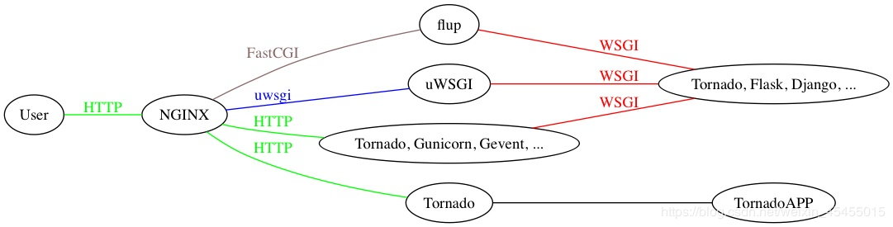

# CGI

CGI即Common Gateway Interface的缩写，直译为“通用网关接口”。为什么有这个东西，说白了就是在python,php,javaEE,ruby出现前就有了动态网易而开发。那个时候就是C/C++通过CGI来做Web。

CGI的本质是协议。CGI规范了WEB服务器与CGI程序（或CGI脚本）如何通过系统环境变量进行交互。Web服务器接受到请求，将请求解析成入参放入系统环境变量，并且按配置调用相应的CGI程序。CGI程序按CGI协议标准从系统环境变量中取出数据然后做相应业务操作，最后cgi程将处理结果通过标准输出、标准错误，传递给web 服务器。 web 服务器收到cgi返回的结果，构建Http Response返回给客户端，并杀死cgi进程。

我们简单的看几个CGI定义的环境变量，这样会直观很多。

名称 | 解释
---|---
REQUEST_METHOD | 前端页面数据请求方式：get/post
QUERY_STRING | 采用GET时所传输的信息
CONTENT_LENGTH | STDIO中的有效信息长度
SCRIPT_NAME | 所调用的CGI程序的名字
SERVER_NAME | 服务器的IP或名字
SERVER_PORT | 主机的端口号

CGI是一个接口协议，这些环境变量就是属于该协议的内容，所以不论你的server所在的操作系统是Linux还是Windows，也不论你的server是Apache还是Nginx，这些变量的名称和含义都是一样的。实际就是Apache/Nginx在将这些内容填充到环境变量中，而具体填充规范则来自于CGI接口协议。

CGI是一种标准，并不限定语言。所以Java、PHP、Python都可以通过这种方式来生成动态网页。所以
CGI可以用任何一种语言编写，只要这种语言具有标准输入、输出和环境变量。

## FastCGI（FCGI）

原来是CGI有一大硬伤。那就是每次CGI请求，那么Apache都有启动一个进程去执行这个CGI程序，即颇具Unix特色的fork-and-execute。当用户请求量大的时候，这个fork-and-execute的操作会严重拖慢Server的进程。而Java的Servlet技术则是一种常驻内存的技术，不会频繁的发生进程上下文的创建和销毁操作。

FastCGI技术应运而生。简单来说，其本质就是一个常驻内存的进程池技术，由调度器负责将传递过来的CGI请求发送给处理CGI的handler进程来处理。在一个请求处理完成之后，该处理进程不销毁，继续等待下一个请求的到来。

当然，支持C++的FCGI技术也出现了，Apache有FCGI的模块可以安装，比如mod_fcgid。

**FastCGI特点：**

1. FastCGI在进程中的应用程序，独立于核心web服务器运行,提供了一个比API更安全的环境。(APIs把应用程序的代码与核心的web服务器链接在一起，这意味着在一个错误的API的应用程序可能会损坏其他应用程序或核心服务器; 恶意的API的应用程序代码甚至可以窃取另一个应用程序或核心服务器的密钥。)
2. FastCGI的不依赖于任何Web服务器的内部架构，因此即使服务器技术的变化, FastCGI依然稳定不变。
3. FastCGI进程管理器自身初始化，启动多个CGI解释器进程(可见多个php-cgi)并等待来自Web Server的连接。

**FastCGI的不足**

因为是多进程，所以比CGI多线程消耗更多的服务器内

### 简单的搭架FCGI

**安装nginx：** `sudo apt-get install nginx`

```
#开启nginx服务
service nginx start
sudo systemctl start nginx.service
 
#查看nginx状态
service nginx status
sudo systemctl status nginx.service
 
 
#停止nginx服务
service nginx stop
sudo systemctl stop nginx.service
 
#重启nginx服务
service nginx restart 
sudo systemctl restart nginx.service
```

下载安装fastcgi:[下载地址](https://github.com/eatonphil/fastcgi-development-kit/releases)，安装过程如下

```
tar -zxvf fastcgi-development-kit-2.4.0.tar.gz
cd fastcgi-development-kit-2.4.0
./configure
sudo make
sudo make install
```
ubuntu下也可以使用`sudo apt-get install spawn-fcgi`命令安装


**编写测试C++ CGI程序,并编译**

```testcgi.cpp
#include "fcgi_stdio.h"
#include <stdlib.h>


int main(void)

{

    int count = 0;

    while (FCGI_Accept() >= 0)

        printf("Content-type: text/html\r\n"

        "\r\n"

        "<title>FastCGI Hello!</title>"

        "<h1>FastCGI Hello!</h1>"

        "Request number %d running on host <i>%s</i>\n",

        ++count, getenv("SERVER_NAME"));

    return 0;
}
```

g++ testcgi.cpp -o demo  -lfcgi

**创建存放CGI程序目录，并通过spawn-fcgi启动**

Spawn-FCGI是一个通用的FastCGI管理服务器，它是lighttpd中的一部份，很多人都用Lighttpd的Spawn-FCGI进行FastCGI模式下的管理工作，不过有不少缺点。

Spawn-FCGI目前已经独成为一个项目，更加稳定一些，也给很多Web 站点的配置带来便利。已经有不少站点将它与nginx搭配来解决动态网页。

1. mkdir /usr/share/nginx/cgi-bin
2. cp demo /usr/share/nginx/cgi-bin
3. spawn-fcgi -a 127.0.0.1 -p 8081 -C 25 -f /usr/share/nginx/cgi-bin/demo

```
正常启动返回如下
$ spawn-fcgi -a 127.0.0.1 -p 8081 -C 25 -f /home/learlee/cig-bin/demo 
spawn-fcgi: child spawned successfully: PID: 29878
如果遇到启动错误可以使用ldd查看是否缺了依赖文件，我当时是少了libfcgi.so.0，在fastcgi-development-kit安装目录中找到后拷贝到/usr/local/lib/就好了
$ ldd demo
	linux-vdso.so.1 =>  (0x00007ffcf49ea000)
	libfcgi.so.0 => /usr/local/lib/libfcgi.so.0 (0x00007fbd9be2b000)
	libm.so.6 => /lib/x86_64-linux-gnu/libm.so.6 (0x00007fbd9bb22000)
	libc.so.6 => /lib/x86_64-linux-gnu/libc.so.6 (0x00007fbd9b758000)
	/lib64/ld-linux-x86-64.so.2 (0x00007fbd9c036000)
```

**修改nginx默认配置，配置cgi，并重启nginx**

```
sudo vi /etc/nginx/sites-available/default

location ~ \.cgi$ {
        fastcgi_pass 127.0.0.1:8081;
        fastcgi_index index.cgi;
        fastcgi_param SCRIPT_FILENAME fcgi$fastcgi_script_name;
        include fastcgi_params;
    }
sudo service nginx restart
```

**访问测试**

通过http://localhost/xxx.cgi 访问，看nginx配置，只要是.cgi结尾的都会转发给我们写的CGI程序,所以以下路径都合法

```
GET http://localhost/aaa/xxxx.cgi
GET http://localhost/aaa.cgi
GET http://localhost/aaa/xxxx.cgi
GET http://localhost/aaa/bbb/xxxx.cgi
GET http://localhost/aaa/bbb/xxxx.cgi?a=1223
GET http://localhost/aaa/bbb/xxxx.cgi?a=1223&b=123

以上换成POST DELETE PUT都是合法的，比如下面的。
POST http://localhost/aaa/xxxx.cgi

```


## Simple CGI（SCGI）

它是FCGI在精简数据协议和响应过程后的产物。其设计目的是为了适应越来越多基于AJAX或REST的HTTP请求，而做出更快更简洁的应答。并且SCGI约定，当服务器返回对一个HTTP协议请求响应后，立刻关闭该HTTP连接。所以不难看出，SCGI更加适合于普遍意义上SOA所提倡的“请求-忘记”这种通信模式。

## WSGI

此协议是Python语言的专利，它定义了一组在Web服务宿主程序和HTTP响应代理程序之间通信的普遍适用的接口。它的产生是因为Python程序员注意到，对于Web框架和Web宿主服务器程序间，有严重的耦合性，比如说，某些框架是针对Apache的mod_python设计的。于是，WSGI就定义了一套非常低级别的接口。常见的Python Web框架都实现了这个协议。

定义了 Web 服务器和 Web 应用程序或框架之间的一种简单而通用的接口。描述的是Web服务器如何与Web应用间进行通信。

一定要记住它不是服务器、python模块、框架、API或者任何软件，只是一种描述web服务器（如nginx，uWSGI等服务器）如何与web应用程序（如用Django、Flask框架写的程序）通信的规范。

### uWSGI是什么？

uWSGI是一个Web服务器，它实现了WSGI协议、uwsgi、http等协议。它要做的就是把HTTP协议转化成语言支持的网络协议。比如把HTTP协议转化成WSGI协议，让Python可以直接使用。Nginx中HttpUwsgiModule的作用是与uWSGI服务器进行交换。

**uwsgi协议**是一个uWSGI服务器自有的协议，它用于定义传输信息的类型（type of information），每一个uwsgi packet前4byte为传输信息类型描述，用于与nginx等代理服务器通信，它与WSGI相比是两样东西。

uWSGI是实现了uwsgi和WSGI两种协议的Web服务器。他的工作位置和作用如下所示，当然uWSGI本身也是可以不用NGINX做代理的。可以直接面向User



为什么有了uWSGI为什么还需要nginx？因为nginx具备优秀的静态内容处理能力，然后将动态内容转发给uWSGI服务器，这样可以达到很好的客户端响应。

另外访问量不大的话，当然可以由uWSGI和Django构成。但是一旦访问量过大，客户端请求连接就要进行长时间的等待。这个时候就出来了分布式服务器，我们可以多来几台web服务器，都能处理请求。但是谁来分配客户端的请求连接和web服务器呢？Nginx就是这样一个管家的存在，由它来分配。这也就是由Nginx实现反向代理，即代理服务器。
