# 解决痛点

**解决开发到部署两个阶段因为环境不一致导致的问题。说白了就是，开发能运行，但部署运维却跑步起来！！！通过Docker容器化后，开发、测试、生产环境一致性得到保证。可以简单理解成部署服务编程安装APP**

可以简单理解启动起来的容器是一个小型的Linux系统！！！

# Docker


Docker 是一个开源的应用容器引擎,容器运行载体，基于 Go 语言 并遵从Apache2.0协议开源。

Docker 可以让开发者打包他们的应用以及依赖包到一个轻量级、可移植的容器中，然后发布到任何流行的 Linux 机器上，也可以实现虚拟化。

容器是完全使用沙箱机制，相互之间不会有任何接口（类似 iPhone 的 app）,更重要的是容器性能开销极低。

从运维的角度来说，就是把开发整体环境{运行环境（nginx,tomcat等）、OS、配置(一般是启动默认配置，也可以在启动时候改变，比如通过启动参数或Volume加载外部文件方式)、开发语言（包括版本）、代码、运行依赖包等}，只要与程序运行相关的软环境打包成为镜像，运维部署镜像即可。部署时候不考虑环境，减少因为环境原因造成的部署失败。也就是说打破了代码即应用，而变成镜像即应用。`一次封装，到处运行`！！

```
镜像可以理解成轻量级、可执行的独立软件包，用来打包软件运行环境和基于运行环境开发的软件。所以它包含运行软件所需的所有内容，包括代码、运行时、库、环境变量和配置文件。

运行起来的镜像（即容器），可以简单理解成宿主机上的一个独立的Linux机器，只是端口可以宿主机器绑定，容器的数据可以通过volume的方式和宿主机通过volume进行数据共享（即宿主机的数据可以同步给容器，容器中的数据也可以持久化到宿主机上）
```

*Docker 从 17.03 版本之后分为 CE（Community Edition: 社区版） 和 EE（Enterprise Edition: 企业版）。*

*docker理念一个容器运行一个进程！！！*

*image运行起来就是容器*

## OCI概念

Open Container Initiative，2015年6月创立，围绕容器格式和运行进制定一个开放的工业化标准。由以下两部分组成

- the Runtime Specification
- the Image Specification   (OCF  open container format是其标准)

the Runtime Specification outlines how to run a "filesystem bundle" that is unpacked on disk

At a high-levl an OCI implementation would download an OCI Image then unpack the image into an OCI Runtime filesystem bundle


## 对比虚拟机与Docker

Docker守护进程可以直接与主操作系统进行通信，为各个Docker容器分配资源；它还可以将容器与主操作系统隔离，并将各个容器互相隔离。虚拟机启动需要数分钟，而Docker容器可以在数毫秒内启动。由于没有臃肿的从操作系统，Docker可以节省大量的磁盘空间以及其他系统资源。

说了这么多Docker的优势，大家也没有必要完全否定虚拟机技术，因为两者有不同的使用场景。虚拟机更擅长于彻底隔离整个运行环境。例如，云服务提供商通常采用虚拟机技术隔离不同的用户。而Docker通常用于隔离不同的应用，例如前端，后端以及数据库。


从结构上来看，容器和虚拟机还是有很大不同的。左图的虚拟机的Guest层，还有Hypervisor层在Docker上已经被Docker Engine层所取代，在这里我们需要知道，Guest OS 是虚拟机安装的操作系统，是一个完整的系统内核，另外Hypervisor可以理解为硬件虚拟化平台，它在Host OS内以内核驱动的形式存在。虚拟机实现资源的隔离的方式是利用独立的Guest OS，以及利用Hypervisor虚拟化CPU、内存、IO等设备来实现的，对于虚拟机实现资源和环境隔离的方案，Docker显然简单很多。

然后Docker并没有和虚拟机一样利用一个独立的Guest OS执行环境的隔离，它利用的是目前Linux内核本身支持的容器方式，实现了资源和环境的隔离，简单来说，Docker就是利用Namespace 实现了系统环境的隔离即一个空间不会跨空间看到其它空间，利用了cgroup（control groups）实现了资源的限制即限制使用CPU,Mem等，利用镜像实例实现跟环境的隔离。

通俗来讲就是多容器从属于同一内核（Host OS）。虚拟机是每一个有自己独立的内核（Guest OS）。

```
虚拟机虚拟化硬件，容器虚拟化操作系统
```

namespace的6种名称空间功能完善内核版本如下图，所以如果想要完整的docker功能需要Linux内核达到3.8。


## Docker安装

这里只演示ubuntu下的安装

```bash
curl -fsSL https://get.docker.com -o get-docker.sh
sh get-docker.sh
#以非root用户可以直接运行docker时，需要执行
sudo usermod -aG docker ${USER}
#Remember that you will have to log out and back in for this to take effect!
#提示说需要log out就好，但我在ubuntu下发现需要reboot。docker组是安装docker引擎时候创建的
sudo service docker start

#以上流程是参考docs.docker.com官方Install using the convenience script安装过程
```

## Docker卸载

```bash
$ sudo apt-get purge docker-ce docker-ce-cli containerd.io
#Images, containers, volumes, or customized configuration files on your host are not automatically removed. To delete all images, containers, and volumes:
$ sudo rm -rf /var/lib/docker
```

## 镜像加速

鉴于国内网络问题，后续拉取 Docker 镜像十分缓慢，我们可以需要配置加速器来解决，我使用的是网易的镜像地址：http://hub-mirror.c.163.com。

新版的 Docker 使用 /etc/docker/daemon.json（Linux）

请在该配置文件中加入（没有该文件的话，请先建一个）：

```json
{
  "registry-mirrors": ["http://hub-mirror.c.163.com"]
}
```

也可以在/etc/default/docker文件中配置```DOCKER_OPTS="--registry-mirror=http://mirror-address"``` 如果该目录下没有该文件自行创建一个即可。该文件是docker的启动配置文件

# Docker镜像

docker的镜像由一层一层文件系统组合而成，所以在下载镜像的时候会发现下载很多文件。官方叫UnionFS。

最底层是bootfs(boot file system)主要是bootloader,kernel。当boot加载完成整个内核就在内存中，此时内存的使用权已由bootfs转交给内核，系统也会卸载bootfs。

然后是rootfs(root file system)，在bootfs之上。就是典型的Linux系统中的/dev,/proc,/bin,/etc等标准目录和文件。rootfs实际就是不同操作系统的发行版本。比如Ubuntu,redhat等。

最后就是我们添加的其他相关环境软件，如下图所示。每添加一个变为一层。

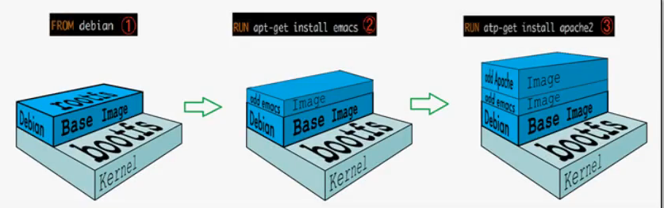

我们启动Docker容器的时候实际是直接用宿主机的kernel，只需要提供rootfs就可以。所以docker镜像可以看起来很小！！！而虚拟机是要bootfs并加载kernel的过程所以慢且大。

另外镜像都是**只读*的*，当容器启动时候，一个新的可写层被加载到镜像顶层。这一层通常叫做“容器层”，“容器层”之下的都叫“镜像层”。

一个tomcat的镜像可以用下图描述。


分层可以使得“层”被公用，下图可以看到MySQL 5.6和MySQL latest之间的公用部分只需要下载一次,之前下载过的都会显示Already exists

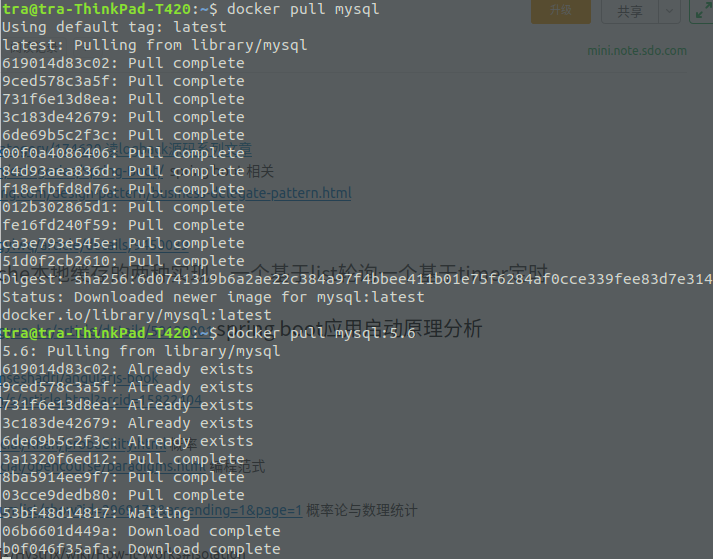

```
NOTE：
通过构建过程中的中间层镜像做调试。比如：某一步安装net-tools，那么可以启动这个中间镜像，测试安装是否成功

docker history imageId查看构建过程中生成了多少镜像。
```

## 镜像生成

制做方式

1. 依赖Dockerfile配置制作
2. 基于已有容器制作

### Dockerfile

Dockerfile is nothing but the source code for building Docker images

常用命令如下，使用命令的时候一定要分清楚是构建过程还是运行过程的。

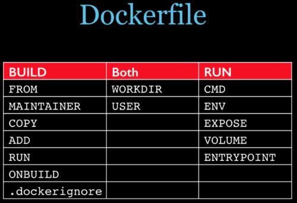

**概念和命令**

- Dockerfile中所有的shell命令都是基于你所创建的所用的基础镜像中所拥有的命令,即FROM命令指定的基础镜像中必需有你所使用的命令
  
- .dockerignore文件: ignore some file that you don't want package into image
  
- Format
  - '#' Comment
  - INSTRUCTION arguments
    - The instruction is not case-sensitive
    - Docker runs instructions in a Dockerfile in order
    - The first instruction must be 'FROM' in order to specify the Base Image from which you are building.(FROM \<repository\>[:\<tag\>] or FROM\<repository\>@\<digest\>)
  
- Environment replacement : Environment variables (declared with the ENV statement) can also be used in certain instructions as variables to be interpreted by the Dockerfile, Environment variables are notated in the Dockerfile either with $variable_name or ${variable_name}。在启动镜像成为容器的时候，设置容器的环境变量，比如：PATH等

- MAINTAINER(depreacted): MAINTAINER "dyp \<email@email.com\>".  **LABEL replace this!** Syntax: LABEL \<key\>=\<value\>  \<key\>=\<value\> ... 

- COPY: 从Docker主机复制文件到创建的新镜像文件
  - Syntax
    - COPY \<src\> \<src\> ... \<dest\>  or  COPY ["\<src\>",\<src\> ,...,"\<dest\>"]
      - \<src\> : 要复制的源文件或目录，支持使用通配符
      - \<dest\> : 目标路径，即正在创建的image的内部文件系统路径;建议为 \<dest\> 使用绝对路径，否则COPY指定则以WORKDIR为其起始路径
      - 注意： 在路径中有空白字符时，通常使用第二种格式   
  - 文件复制准则
    -  \<src\> 必须是build上下文中的路径，不能是Dockerfile文件父目录中的文件
    -  如果\<src\> 是目录，则其内部文件或子目录会被递归复制，但\<src\> 目录自身不会被复制
    -  如果指定了多个 \<src\> ，或在\<src\> 中使用了通配符，则\<dest\>必须是一个目录，且必须以/结尾
    -  如果\<dest\>事先不存在，它将会被自动创建，这包括其父目录路径

- ADD: 类似于COPY指令， ADD支持使用TAR文件和URL路径
  - Syntax
    - ADD \<src\> \<src\> ... \<dest\>  or  ADD ["\<src\>",\<src\> ,...,"\<dest\>"]
  - 操作准则
    - 同COPY指令
    - 如果\<src\>为URL且\<dest\>不以```/```结尾，则\<src\>指定的文件将被下载并直接被创建为\<dest\>;如果\<dest\>以```/```结尾，则文件名URL指定的文件将被直接下载并保存为\<dest\>/\<filename\>
    - 如果\<src\>是一个本地系统上的tar文件，它将会被展开为一个目录，其行为类似于“tar -x”命令;然而，通过URL获取到的tar文件将不会自动展开
    - 如果\<src\>有多个，或其间接或直接使用了通配符，则\<dest\>必须是一个以/结尾的目录路径;否则其被视作一个普通文件，\<src\>的内容将被直接写入到\<dest\>

- VOLUME
  - 用于在image中创建一个挂载点目录，以挂载Docker host（宿主机）上的卷或其它容器上的卷(--volumes-from参数指定)
  - 父镜像声明过的卷在子镜像中是写不进去文件的。见下面示例。
  - Syntax
    - VOLUME \<mountpoint\>   or   VOLUME ["\<mountpoint\>"]
    - 挂载到宿主机的位置并没有指定，所以docker会自动绑定主机上的一个目录。可以通过`docker inspec NAME|ID`来查看
    - 通过命令行可以指定宿主机目录：`docker run --name test -it -v /home/xqh/myimage:/data imageName`;这样在容器中对/data目录下的操作，还是在主机上对/home/xqh/myimage的操作，都是完全实时同步的（指的是启动后，容器中的修改会反应到宿主机绑定目录，反之亦然;启动时完全以宿主机文件为主）。
  - 如果宿主机挂载点目录路径下此前有文件存在，docker run命令启动会在卷挂载完成后：1.清空容器文件。2.将此容器中指定的路径中的文件拷贝到宿主机中。启动完成后，双向同步数据的修改。所以不要在dockerfile中把文件下载到VOLUME指定的容器目录中，启动的时候会被宿主机目录改写，如果宿主机目录为空，就会清空容器目录。
  - 容器运行时应该尽量保持容器存储层不发生写操作，对于数据库类需要保存动态数据的应用，其数据库文件应该保存于卷(volume)中。为了防止运行时用户忘记将动态文件所保存目录挂载为卷，在 Dockerfile 中，我们可以事先指定某些目录挂载为匿名卷，这样在运行时如果用户不指定挂载，其应用也可以正常运行，不会向容器存储层写入大量数据。
  - 使用commit命令创建基于容器的镜像的时候，VOLUME的宿主机下的文件是不会被打包到镜像文件中。

```
--volumes-from：实际是共享宿主机的挂载点
```

- EXPOSE
  - 用于为容器打开指定要监听的端口以实现与外部通信,但指定不了宿主机端口，所以是动态绑定到宿主机随意端口，但必需要在启动的时候以```docker -P```爆露并绑定随机主机端口，如果没有使用EXPOSE指定容器监听端口，`-P`参数是没法绑定端口的。 所以这里指定的可以理解为默认爆露端口。
  - Syntax
    - EXPOSE \<port\> [/\<protocol\>][\<port\>[/\<protocol\>]...]   \<protocol\>用于指定传输层协议，可为tcp或udp二者之一，默认为TCP
    - EXPOSE指令可一次指定多个端口： EXPOSE 1121/udp 11211/tcp
  - 命令行可以通过-p(小写p)可以指定要映射的端口(宿主机端口、容器端口都可以设定)，并且在一个指定的端口上只可以绑定一个容器。支持的格式有：```IP:HostPort:ContainerPort | IP::ContainerPort | HostPort:ContainerPort ```缺省掉的值都是由宿主机随机映射

- WORKDIR
  - 用于为Dockerfile中所有的RUN、CMD、 ENTRYPOINT、COPY和ADD指定设定工作目录。启动后通过docker名利登录到启动容器中的默认路径也是WORKDIR指定的。
  - Syntax
    - WORKDIR \<dirpath\>
      - 在Dockerfile文件中，WORKDIR指令可出现多次，其路径也可以为相对路径，不过，其是相对此前一个WORKDIR指令指定的路径
      - WORKDIR可以调用由ENV指定定义的变量（ WORKDIR $STATEPATH ）

- ENV
  - 用于镜像定义所需的环境变量，并可被Dockerfile文件中位于其后的其它指令（如ENV、ADD、COPY等）所调用;即可以在启动的时候指定运行环境变量，也可以用来指定创建时所需要的变量，分别处理不同阶段，运行时指的是Image运行阶段的事(docker run)，创建时指创建Image阶段的事（docker build）。ENV值在运行时可以使用`-e`参数进行覆盖默认值。
  - 请用格式为$variable_name  or  ${variable_name}
  - Syntax
    - ENV \<key\> \<value\>]  or  ENV \<key\>=\<value\>
    - 第一种格式中，\<key\> 之后的所有内容均会被视作其 \<value\>的组成部分，因此一次只能设置一个变量
    - 第二种格式可用一次设置多个变量，第个变量为一个\<key\>=\<value\>的键值对，如果\<value\>中包含空格，可以以反斜线（\）进行转义，也可以对\<value\>加引号进行标识;另外，反斜线也可用于续行
    - 定义多个变量时，建议使用第二种方式，以便在同一层中完成所有功能

可以看下面实例，可以看到ENV WORKDIR启动后容器的实际影像，ENV在镜像启动过程中设置了系统环境变量，而WORKDIR设置了PWD

```dockerfile
FROM centos

ENV mypath /tmp #设置启动系统环境变量mypath=/tmp

WORKDIR $mypath #设置PWD=/tmp

RUN yum -y install vim && yum -y install net-tools

EXPOSE 80

CMD /bin/bash
```


  
```
环境变量PWD：显示当前工作路径的环境变量
环境变量OLDPWD：显示上一次的工作路径。
```

- RUN
  - 用来在docker **build过程**中运行的程序或命令
  - Syntax
    - RUN \<command\>  or  RUN ["\<executable\>", "\<param1\>", "\<param2\>"]
  - 第一种格式中， \<command\> 通常是一个shell命令，且以“/bin/sh -c”的模式来运行它,后面的CMD，ENTRYPOINT也一样，这意味着此进程在容器中的PID不为1,不能接收到Unix信号，因此，当使用docker stop \<container\>命令停止容器时，此进程接收不到SIGTERM信号。（能接到信息的进程是进程号为1的进程）
  - 第二中语法格式中的参数是一个**JSON格式的数组**(所以中括号并不是可选项的意思，是必需要存在的)，\<executable\>为要运行的命令，后面的\<paramN\>为传递给命令的选项或参数;然而，此程格式指定的命令不会以“/bin/sh -c”来发起而是直接由系统内核创建或可以理解为用exec来启动的命令，因此常见的shell操作如变量替换以及通配符（？，*等）替换将不会进行;不过，如果要运行的命令依赖于些shell特性的话，可以将其替换为类似以下的式式
    - RUN ["/bin/bash", "-c", "\<executable\>", "\<param1\>", "\<param2\>"]
    - 注意：**JSON格式的数组**中要用双引号
  
- CMD
  - 类似于RUN指命，CMD指令也可以用于运行任何命令或应用程序，不过，二者的运行时间点不同
    - RUN指令运行于镜像文件构建过程中，而CMD指令运行镜像文件启动一个容器时
    - CMD指令的首要目的在于为启动的容器指定默认要运行的程序，且其运行结束后，容器也将终止;不过，CMD指定的命令其可以被docker run的命令行选项所覆盖
    - 在Dockerfile中可以存在多个CMD指令，但仅**最后一个会生效**
  - Syntax
    - CMD \<command\>  or  CMD ["\<executable\>", "\<param1\>", "\<param2\>"]  or CMD ["\<param1\>", "\<param2\>"]    
    - 前两个语法格式的意义同RUN
    - 第三种则用于为ENTRYPOINT指令提供默认参数

    ```docker
    Dockerfile：CMD /bin/httpd -f -h /data/web/html/
    Docker image instpect imageName：tag输出如下
    "Cmd": [
                    "/bin/sh",
                    "-c",
                    "/bin/httpd -f -h /data/web/html/"
                ]

    Dockerfile：CMD ["/bin/httpd", "-f", "-h", "/data/web/html/"]
    Docker image instpect imageName：tag输出如下
    "Cmd": [
                    "/bin/httpd",
                    "-f",
                    "-h",
                    "/data/web/html/"
                ]
    ```

- ENTRYPOINT
  - 类似CMD指令的功能， 用于为容器指定默认运行程序，从而使得容器像是一个单独可执行程序
  - Syntax
    - ENTRYPOINT \<command\>  or  ENTRYPOINT ["\<executable\>", "\<param1\>", "\<param2\>"] 

    ```docker
    Dockerfile：ENTRYPOINT /bin/httpd -f -h /data/web/html/
    Docker image instpect imageName：tag输出如下
    "Entrypoint": [
                    "/bin/sh",
                    "-c",
                    "/bin/httpd -f -h /data/web/html/"
                ]

    Dockerfile：ENTRYPOINT ["/bin/httpd", "-f", "-h", "/data/web/html/"]
    Docker image instpect imageName：tag输出如下
    "Entrypoint": [
                    "/bin/httpd",
                    "-f",
                    "-h",
                    "/data/web/html/"
                ]
    ```
  - 与CMD不同的是，由ENTRYPOINT启动的程序不会被docker run命令行指定的参数所覆盖，而且，这些命令行参数会被当作参数传递给ENTRYPOINT指定的程序。可以用这种方式把ENTRYPOINT指定成依赖ENV设置的环境变量的shell脚本，使用脚本设置完运行环境后通过`exec $@`来执行CMD传过来的实际要启动的程序命令，因为exec暗含替换旧进程，使用旧进程PID的操作。

  Dockerfile内容如下:

  ```docker
  FROM nginx
  LABEL maintainer="xxx <xxx@xxx.com>"

  NGX_DOC_ROOT=/data/web/html/
  ADD entrypint.sh /bin/

  CMD ["/user/sbin/nginx", "-g", "daemon off;"]

  #实际最后执行的是 /bin/entrypoint.sh /user/sbin/nginx -g daemon off(命令行参数会被当作参数传递给ENTRYPOINT指定的程序);其中/user/sbin/nginx -g daemon off;部分会实当成参数传入entrypoint.sh中。所以才能$@引用到并执行替换当前的进程成为主进程PID为1

  ENTRYPOINT ["/bin/entrypoint.sh"]
  ```

  entrypoint.sh内容如下，通过启动参数动态配置启动参数：
  ```sh
  #!/bin.sh
  # 向my.conf写入数据，设置nginx配置文件， HOSTNAME，PORT可以是运行docker时候传入的命令行参数
  cat > /etc/my.conf << EOF
  server {
    server_name ${HOSTNAME};
    listen ${IP:-0.0.0.0}:{PORT:-80};
    root ${NGX_DOC_ROOT:-/usr/share/nginx/html};
  } 
  EOF

  exec "$@"
  ```

  - 如果非要改写可以在运行进用`--entrypoint`参数，比如在一个镜像中有/bin/python命令，那么我们想看一下版本但ENTRYPOINT设定不可能是python --version，这个时候我们可以使用`docker container run  --entrypoint "/bin/python"  --name sencom image --version`;从上示例可以发现--version的参数并没有直接跟在python命令后，而是在image名字后面跟着，这就是上面说的“命令行参数会被当作参数传递给ENTRYPOINT指定的程序”即python程序。

```
NOTE:
在docker中有一个很特殊的进程——PID为1的进程，这也是docker的主进程，通过Dockerfile中的 ENTRYPOINT 和/或 CMD指令指定。当主进程退出的时候，容器所拥有的PIG命名空间就会被销毁，容器的生命周期也会结束docker最佳实践建议的是一个container一个service。所以命令一但执行完毕就会清掉容器，这就造成一个错觉，CMD nginx后理论应该持续运行，但看容器状态的时候确是退出状态。而CMD或ENTRYPOINT是脚本脚本（比如entrypoint.sh）的情况，实际脚本的PID是1的进程，脚本设置好各种运行状态后需要用exec来启动真的服务进程，用到就是exec的特性，可以看下段细节描述。

exec:在bash下输入man exec，找到exec命令解释处，可以看到有"No new process is created. 和 replaces the current process image with a new process image"这样的解释，这就是说exec命令不产生新的子进程。那么exec与source的区别是什么呢？使用exec command方式，会用command进程替换当前shell进程，并且保持PID不变。执行完毕，直接退出，不回到之前的shell环境。docker里面就用了这样的特性启动主进程，docker先启动配置进程，然后使用exec启用主进程把配置进程进行替换，但pid确不变，要不然主进程会成为配置进程的子进程。
```

- Syntax
  - ENTRYPOINT  \<command\>   or  ENTRYPOINT ["\<executable\>", "\<param1\>", "\<param2\>"]
- docker run 命令传入的命令参数会覆盖CMD指令的内容并且附加到ENTRYPOINT命令最后做为其参数使用
- Dockerfile文件中也可以存在多个ENTRYPOINT指令，但仅有最后一个会生效

```
Dockerfile:ENTRYPOINT ["/bin/httpd", "-f", "-h", "/data/web/html/"]
Docker image instpect imageName：tag输出如下（注：没有ENTRYPOINT的时候是没有以下输出的）
"Entrypoint": [
                "/bin/httpd",
                "-f",
                "-h",
                "/data/web/html/"
            ]
```

- USER
  - 用于指定运行image时或运行Dockerfile中USER命令滞后的，任何RUN、CMD或ENTRYPOINT指令指定的程序时的用户名或UID。但ADD，COPY命令依旧是root用户
  - 默认情况下，container的运行身份为root用户
  - Syntax
    - USER \<UID\>|\<UserName\> 
    - 需要注意的是，\<UID\>可以为任意数字，但实践中其必须为容器中/etc/passwd中某用户的有效UID，否则，docker run命令将运行失败

- HEALTHCHECK
  - 告诉Docker如何去测试容器是否工作。比如测试一个web服务是否进入了死循环，是否还能处理新的链接，是否还在工作等
  - Syntax
    - HEALTHCHECK [OPTIONS] CMD 通过在容器内部运行CMD命令来做健康检测
      - OPTIONS选项   
        -  --interval=DURATION(default 30s)
        -  --timeout=DURATION(default 30s)
        -  --start-period=DURATION(default 0s) #主进程启运多后开始检测
        -  --retries=N (default 3)
     - CMD退出状态码
       - 0:success
       - 1:unhealthy
       - 2:reserved -不要使用该退出码
     - For example: HEALTHCHECK --interva=5m --timeout=3s CMD curl -f http://localhost/ || exit 1
    - HEALTHCHECK NONE 关闭所有检测，包括从基镜像继承的

- SHELL
  - 定义默认使用的是哪个shell
  - 默认Linux是["/bin/sh", "-c"], Win是["cmd", "/S", "/C"]
  - SHELL指令必须以JSON数据格式写： SHELL ["executable", "parameters"]
  - 可以出现多次

- STOPSIGNAL
  - 设置系统调用息号值，该值可以使容器退出
  - 该值可以是 syscall table中的位序
  - Syntax： STOPSIGNAL signal

- ARG
  - 定义build-time时使用的变量， builder过程中用--build-arg \<varname\> = \<value\>来使用;而ENV是在不仅在build-time时有效，在running-time时也有效
  - 用${varname}来在Dockerfile中引用
  - 如果有ENV那么ENV的同名参数会覆盖ARG的参数

- ONBUILD
  - Dockerfile中定义一个触发器,在别人用该镜像做基础镜像构建的时候运行
  - ONBUILD不能自我嵌套，且不会触发FROM和MAINTAINER指令
  - 在ONBUILD中使用ADD或COPY指令应该小心，因为新构建过程的上下文可能会缺失文件导致构建失败
  - Syntax
    - ONBUILD \<INSTRUCTION\>

看下面实例：

父镜像创建Dockerfile

```dockerfile
# myCentosf.dockerfile 
FROM centos

ONBUILD RUN echo "onbuild running"

RUN yum install -y curl
ENTRYPOINT ["curl","-s","http://www.baidu.com"]
```
然后通过`docker build -f myCentosf.dockerfile -t myipf .`命令创建myipf镜像。
使用myipf镜像创建子镜像Dockerfile

```dockerfile
# myCentosc.dockerfile
FROM myipf

ENV DYP_ENV "I LOVE FAMILY"

ENTRYPOINT ["curl","-s","http://www.baidu.com"]
```

创建镜像`docker build -f myCentosc.dockerfile -t myipc .`会看到有Executing 1 build trigger提示，然后输出onbuild running


**Dockerfile 首字母要大写, 且命令能压缩成一个的尽量做成一个，因为每一个更改命令都成为镜像的一层（分层联合挂载机制）**

**示例**

```Dockerfile
#基于busybox最新的版本进行创建镜像
FROM busybox:latest

#在以该镜像做基础镜像做镜像的时候，会先下载一个nginx到/data/web/nginx/
ONBUILD ADD http://nginx.org/download/nginx-1.14.2.tar.gz /data/web/nginx/

ARG author="lear <lear521@163.com>"

MAINTAINER ${author}
# LABLE maintainer="lear <lear521@163.com>"

#文件
COPY index.html /data/web/html/

#目录
COPY youtube_topic/ /data/web/youtube_topic/

#会从网上下载并放到指定目录下
ADD http://nginx.org/download/nginx-1.14.2.tar.gz /data/web/nginx/
RUN cd /data/web/nginx/ && \
    tar -xf nginx-1.14.2.tar.gz 

#docker内部目录
WORKDIR /usr/local/
#这个时候目录是/usr/local/
ADD index.html ./  
 
#将docker下/data/mysql/目录做为内部挂载点
VOLUME /data/mysql/   

EXPOSE 80/tcp

ENV DOC_ROOT /data/web/htmlother/
#如果DOC_ROOT没有值则用/data/web/html2/
COPY index.html ${DOC_ROOT:-/data/web/html2/} 

RUN echo '<h1>Busybox httpd server</h1>' > /data/web/html/index2.html

#CMD ["/bin/httpd", "-f", "-h", "/data/web/html/"]

HEALTHCHECK --interval=5m --start-period=10s --timeout=3s CMD wget -O - -q http://localhost/ || exit 1

ENTRYPOINT ["/bin/httpd", "-f", "-h", "/data/web/html/"]
```

```bash
NOTE: Linux的默认值设计方法

  ${variable:-word} 代表，如果variable有给值，則以variable設定的文字為主，如未設定，則以word字串为主。
  ${variable:+word} 代表，如果variable有给值，則值為word；如果variable未給值，則最後結果為空字串(empty)。

```

## 基于容器制作镜像

实际是把对一个容器的变更部分变成镜像，也可以理解成把正在运行的容器制作成镜像。

docker commit [options] container [repository[:tag]]

```
Options:
  -a, --author string    Author (e.g., "John Hannibal Smith <hannibal@a-team.com>")
  -c, --change list      Apply Dockerfile instruction to the created image
  -m, --message string   Commit message
  -p, --pause            Pause container during commit (default true)
```

*一般会用-p来先暂停容器，避免打包过程中还出现更改。*

## 镜像的导入导出

该方式是为了避免push到仓库。用导出文做共享,方便本地多机简单测试

```
docker save  #导出
docker save  -o myimages.gz dyp/httpd:v0.2

docker load  #导入
docker load -i myimages.gz
```

docker各个部件的关系图如下


- Dockerfile用来指导Docker制作镜像
- Docker镜像是最后部署的交付产品，不再是单纯的源代码
- Docker容器可以理解成Image的运行态


# 总结

Dockerfile可以看成将手动配置Linux机器变成脚本化配置，而运行image成容器后，可以理解成container是个微型Linux（有基本功能）+通过>导出容器命令运行结果的机器（可以看MySQL数据导出）。所以可以登录该容器，并在该容器运行Linux基础命令，也能把数据导出到宿主机中。登录容器后操作容器中的软件（比如MySQL,Redis或自己写的Springboot程序等）和在一台linux下一模一样。

通过port来成为宿主机器的影子服务器，所有的请求宿主机该port的请求都转给容器。通过volume实现容器和宿主机器数据的同步。

```
所以在暴露port和volume的时候考虑如下问题：
1. 程序启动后需要用到哪些端口，比如tomcat启动需要8080,SpringBoot程序启动后也需要8080
2. 软件哪些数据需要持久化和查看、状态需要外部更改
 2.1 容器中的软件程序哪些路径下的数据要持久化，那么就volume到宿主机器中
 2.2 容器中的软件哪些配置需要更改，那么就volume到宿主机器中
 2.3 容器中的哪些信息记录（比如：log）需要外部方便查看，那么就volume到宿主机器中
```

我们应该注意到运行docker的hello-world后用`docker ps -a`查看是停止状态，原因很简单，容器里没有持续运行的任务。如果有持续运行的任务就会是UP。

https://blog.csdn.net/babys/article/details/71170254

## 容器的网络模式

1. None --- 容器不能访问外部网络，内部存在回路地址。
2. Container --- 将容器的网络栈合并到一起，可与其他容器共享网络。
3. Host --- 与主机共享网络。
4. Bridge --- **默认网络模式**，通过主机和容器的端口映射（iptable转发）来通信。桥接是在主机上，一般叫docker0。
5. 自定义网络 --- 主要是为了解决 docker 跨网络通信能力不足的问题和特殊网络需求问题。主要包括：桥接网络、插件网络和Overlay网络（原生的跨主机多子网模型）。

Docker在默认情况下，分别会建立一个bridge、一个host和一个none的网络.

Docker安装后会创建自带的三种网络，可以通过docker network ls查看，通过docker network inspect查看详细信息。

```
默认的名为bridge的网络是有很多限制的，为此，我们可以自行创建bridge类型的网络。默认的bridge网络与自建bridge网络有以下区别：

- 端口不会自行发布，必须使用-p参数才能为外界访问，而使用自建的bridge网络时，container的端口可直接被相同网络下的其他container访问。

- container之间的如果需要通过名字访问，需要--link参数，而如果使用自建的bridge网络，container之间可以通过名字互访。
```

### 虚拟网桥docker0

Docker启动时，自动在主机上创建虚拟网桥docker0，并随机分配一个本地空闲私有网段的一个地址给docker0接口。

虚拟网桥docker0在内核层连通了其他的物理或虚拟网卡，将所有容器和本地主机都放到同一个网络。

docker0接口的默认配置包含了IP地址、子网掩码等，可以在docker服务启动的时候进行自定义配置。


可以通过命令行查看网桥和其对应的docker0虚拟网卡

```bash
$ brctl show
bridge name	bridge id		STP enabled	interfaces
docker0		8000.0242fdb180be	no		veth1e06ee1
$ ifconfig
docker0   Link encap:Ethernet  HWaddr 02:42:fd:b1:80:be  
          inet addr:172.17.0.1  Bcast:172.17.255.255  Mask:255.255.0.0
          inet6 addr: fe80::42:fdff:feb1:80be/64 Scope:Link
          UP BROADCAST RUNNING MULTICAST  MTU:1500  Metric:1
          RX packets:8420 errors:0 dropped:0 overruns:0 frame:0
          TX packets:8458 errors:0 dropped:0 overruns:0 carrier:0
          collisions:0 txqueuelen:0 
          RX bytes:580668 (580.6 KB)  TX bytes:12569663 (12.5 MB)

```

Bridge是容器启动的默认网络模式。

[参考](https://blog.csdn.net/anliven/article/details/72888052 )

### Docker容器与外网

docker容器之间与网络相关的命令

```
如果需要使用宿主机器的iptables管理docker容器的互联，需要在/etc/default/docker配置文件添加 DOCKER_OPTS="=-icc=false --iptables = true"，然后容器网络就可以用宿主机器iptables管理

NOTE: -icc是关闭默认链接，然后设置--iptables=true。启动容器时候，让容器互联用--link启动就可以控制容器之间的链接。

--link：docker启动选项
$ docker run --link=[container_name]:[alias] [image] [command] 

E.G.:
$ docker run -it --name test --link=testweb:webtest your_image /bin/bash
#在新启动容器中执行下面命令
$ ping webtest
是可以ping到testweb的容器。但在docker停止后再次启动两容器的ip即使变化了，test也是能通过webtest连接上testweb容器。这是因为启动test容器的时候会动态设置test容器中的env环境变量和hosts文件使webtest名字指向testweb容器的ip地址和端口

$ env 示例:
WEBTEST_PORT_80_TCP_ADDR=xxx.xxx.xxx.xxx
WEBTEST_PORT_80_TCP=tcp://xxx.xxx.xxx.xxx:80
WEBTEST_PORT=tcp://xxx.xxx.xxx.xxx:80
WEBTEST_PORT_80_TCP_PORT=90
WEBTEST_PORT_80_TCP_PROTO=tcp

$ cat /etc/hosts
xxx.xxx.xxx.xxx    webtest

所以反向去ping的时候不一定能ping通，因为不一定做了--link参数绑定或者做了配置！！！

默认同宿主机的不同容器是可以直接互联的，但重新启动后也会发生IP变化问题，所以也是可以使用--link来解决。
```

通过上面描述了解到，docker启动增加了`--iptables = true`参数后，容器之间的互通实际是通过容器的iptables来控制的。那先看下iptables的4表5链，其运行流程如下图：


四表：
- filter表——过滤数据包
- Nat表——用于网络地址转换（IP、端口）
- Mangle表——修改数据包的服务类型、TTL、并且可以配置路由实现QOS
- Raw表——决定数据包是否被状态跟踪机制处理

五链：
- INPUT链——进来的数据包应用此规则链中的策略
- OUTPUT链——外出的数据包应用此规则链中的策略
- FORWARD链——转发数据包时应用此规则链中的策略
- PREROUTING链——对数据包作路由选择前应用此链中的规则（所有的数据包进来的时侯都先由这个链处理）
- POSTROUTING链——对数据包作路由选择后应用此链中的规则（所有的数据包出来的时侯都先由这个链处理）


通过下面的实例，可以证明以下两点：

1. 在不做限制的时候，容器之间是无障碍联通
2. 通过iptables设置宿主机器，可以控制容器联通

使用下面的dockerfile创建用来测试容器互通的镜像，包含了测试过程中需要的工具，ping、curl、ifconfig等。

```dockerfile
FROM ubuntu:18.04
RUN apt-get update && apt-get install -y apt-utils && apt-get install -y iputils-ping && apt-get install -y nginx && apt-get install -y curl && apt-get install -y net-tools
EXPOSE 80
CMD ["/usr/sbin/nginx", "-g", "daemon off;"]
```

Step1：创建镜像，并启动容器

```bash
$docker build -f netTest.dockerfile  -t cct:1.0.1 .
#启动nginx服务
$docker run -d -P --name cct101 cct:1.0.1
#启动交互式容易方便测试对cct101的联通性
$docker run -it -P --name cct101c cct:1.0.1 /bin/bash
```

Step2：查看两个容器启动后的iptables状态，可以看到DOCKER子链上多了两个记录，通过docker exec containerId ifconfig查看，能匹配容器ip地址

```bash
$sudo iptables -L -n
Chain DOCKER (1 references)
target     prot opt source               destination         
ACCEPT     tcp  --  0.0.0.0/0            172.17.0.2           tcp dpt:80
ACCEPT     tcp  --  0.0.0.0/0            172.17.0.3           tcp dpt:80

#在cct101c中访问cct101的服务
root@7ab643ebb877:/# curl 172.17.0.2
<!DOCTYPE html>
<html>
<head>
<title>Welcome to nginx!</title>
<style>
    body {
        width: 35em;
        margin: 0 auto;
        font-family: Tahoma, Verdana, Arial, sans-serif;
    }
</style>
</head>
<body>
<h1>Welcome to nginx!</h1>
<p>If you see this page, the nginx web server is successfully installed and
working. Further configuration is required.</p>

<p>For online documentation and support please refer to
<a href="http://nginx.org/">nginx.org</a>.<br/>
Commercial support is available at
<a href="http://nginx.com/">nginx.com</a>.</p>

<p><em>Thank you for using nginx.</em></p>
</body>
</html>
```

Step3：上面的测试说名联通性没有问题，那么我们现在在宿主机器上设置iptables禁止两机器联通，配置与测试如下。

```bash
$sudo iptables -I DOCKER -s 172.17.0.3 -d 172.17.0.2 -p TCP --dport 80 -j DROP
$sudo iptables -L -n
Chain DOCKER (1 references)
target     prot opt source               destination         
DROP       tcp  --  172.17.0.3           172.17.0.2           tcp dpt:80
ACCEPT     tcp  --  0.0.0.0/0            172.17.0.2           tcp dpt:80
ACCEPT     tcp  --  0.0.0.0/0            172.17.0.3           tcp dpt:80

#这个时候就访问不通了
root@7ab643ebb877:/# curl 172.17.0.2 
```

在同宿主机器的都容器，可以通过宿主机iptables控制，那么多宿主机情况下使用iptables就更能控制了多机器了，使用方式和没有容器时候的多服务器联通控制一样。

### 跨宿主机链接

实际上跨主机连接仍然靠的是iptables，如果宿主机没有禁止外网连接，那么只需要知道容器绑定的宿主机端口和宿主机容器IP，然后在另一台宿主机中就可以通过【`需要连接的宿主机IP：需要连接的容器绑定的宿主机端口`】就可以访问到。但如过想直接通过容器IP地址访问容器服务，则需要下面方式。

下图可以看到容器在没有使用下列方式的时候是如何通过`宿主机IP：容器绑定宿主机端口`链接。实际可以简单理解成宿主机指定端口转发到容器端口。这也就是为什么每个宿主机的端口只能绑定一个容器端口的原因。


#### 使用网桥配置多主机

可以使用网桥把不同宿主机的容器挂在同一网段。

Step1：修改/etc/default/docker配置文件的DOCKER_OPTS选项加入，-b指定自定义网桥，--fixed-cidr限制ip地地址范围（10.211.55.5/26）

Step2：通过网桥管理工具创建配置网桥，但重启后会失效，所以一般通过配置/etc/network/interfaces,示例如下：

```
auto br0
ifcace br0 inet static #设置静态IP
address 10.211.55.5
netmask 255.255.255.0
gateway 10.211.55.1
bridge_ports eth0　＃指定物理机网卡，重启后用ifconfig查看，eth0不再具有自己的IP地址，这样实际是br0网桥和宿主机网卡进行了绑定
```

## Docker容器中的uid和gid

默认情况下，容器中的进程以 root 用户权限运行，并且这个 root 用户和宿主机中的 root 是同一个用户。

那么什么是uid和gid？实际这两个由Linux内核负责管理，并通过内核级别的系统调用来决定是否应该为某个请求授予特权。比如:当进程试图写入文件时，内核会检查创建进程的 uid 和 gid，以确定它是否有足够的权限修改文件。注意，内核使用的是 uid 和 gid，而不是用户名和组名。

说回容器技术，与虚拟机技术不同：同一主机上运行的所有容器共享同一个内核(主机的内核)。容器化带来的巨大价值在于所有这些独立的容器(其实是进程)可以共享一个内核。这意味着即使由成百上千的容器运行在 docker 宿主机上，但**内核控制的 uid 和 gid 则仍然只有一套**。所以同一个 uid 在宿主机和容器中代表的是同一个用户(即便在不同的地方显示了不同的用户名)。

看下面示例，我们启动一个ubuntu容器，运行sleep命令看下默认的启动是运行在什么权限。

```bash
$ docker run -d  --name sleepme ubuntu:18.04 sleep infinity
$ ps aux | grep -i sleep
root      1516  0.0  0.0   4532   752 ?        Ss   13:30   0:00 sleep infinity
--color=auto -i sleep
root     27696  0.0  0.0   4376   656 ?        S    13:04   0:00 sleep 3000
$ docker exec -it sleepme bash
root@431cbf660ddc:/# ps aux|grep sleep
root         1  0.0  0.0   4532   752 ?        Ss   05:30   0:00 sleep infinity
```

宿主机和容器指示sleep infinity运行的权限都是root。

```shell
#在test目录下创建一个testfile，并使用sudo chown root:root testfile转个root账户
$ ls -la
总用量 12
drwxrwxr-x 2 learlee learlee 4096 8月   6 13:55 .
drwxrwxr-x 9 learlee learlee 4096 8月   6 13:42 ..
-rw-rw-r-- 1 root    root       4 8月   6 13:58 testfile

# 启动ubuntu镜像挂载存放testfile的目录
$ docker run --rm -it -w=/test -v /home/learlee/DockerRun/test:/test ubuntu:18.04
root@bf93121d9a68:/test# ls 
testfile
# 发现在容器里是可以写testfile的,并且权限也和容器外一样是root的文件
root@bf93121d9a68:/test# cat "abc" > testfile
cat: abc: No such file or directory
root@bf93121d9a68:/test# ls
testfile
root@bf93121d9a68:/test# ls -la testfile 
-rw-rw-r-- 1 root root 0 Aug  6 05:57 testfile
root@bf93121d9a68:/test# cat testfile
root@bf93121d9a68:/test# echo "abc" > testfile
root@bf93121d9a68:/test# cat testfile
abc

#退出容器，用宿主机账户操作发现是权限不够，但文件内容已经在容器中更改过了
$ echo "cba" > testfile
bash: testfile: 权限不够
$ cat testfile
abc
```

### 指定启动容器的用户身份

可以通过Dockerfile中添加USER来决定使用哪个用户，如下,其中useradd创建的用户UID指定为1000，如果1000是宿主机存在的，那么就只是给宿主机的UID=1000的用户添加了组。但USER这个命令相当与给容器里的用户起了别名，如果宿主机是learlee(uid=1000)那么在容器中就叫appuser，但两个在Linux内核看来是一样的，都是UID=1000的那个用户。

```dockerfile
FROM ubuntu
RUN useradd -r -u 1000 -g appuser
USER appuser
ENTRYPOINT ["sleep", "infinity"]
```

或者通过 docker run 命令的 --user 参数指定容器中进程的用户身份

比如执行下面的命令：
```
$ docker run -d --user 1000 --name sleepme ubuntu sleep infinity
```

需要注意的是，在创建容器时通过 docker run --user 指定的用户身份会覆盖掉 Dockerfile 中指定的值。

演示的对数据卷中文件的操作可以看出，一旦容器中的进程有机会访问到宿主机的资源，它的权限和宿主机上用户的权限是一样的。所以比较安全的做法是为容器中的进程指定一个具有合适权限的用户，而不要使用默认的 root 用户。当然还有更好的方案，就是应用 Linux 的 user namespace 技术隔离用户。

## Docker命令类

- docker image
- docker network
- docker container
- docker logs [-c -f ]

*Ctrl p q退出交并使运行起来的容器运行在后台（一直压着Ctrl 顺序输入p q）。或者在启动的时候用-d参数*

```
docker安装完成后，可以理解成添加了docker的shell工具命令，和其他的Shell utilities（比如：cp，ls,rm等）没啥区别，所以shell脚本里是可以使用的，也可以和其它shell命令合起来使用。

因为看成docker shell工具命令，可以用$()、``等来帮我们处理很多工作。比如：

条件删除(-f后使用tab键可以提示过滤关键字)
# docker rm $(docker ps -f "filter_condtion" -q)

# 停止所有容器
$ docker stop $(docker ps -a -q)

# 删除
$ docker rm $(docker ps -a -q)

# 停止指定所有容器建议使用docker 的 -f
$ docker stop $(docker ps | grep rock | awk '{print $1}')

# 删除指定所有容器
$ docker rm $(docker ps -a| grep rock | awk '{print $1}')
```

### docker命令小知识

docker exec ： 会创建一个新终端。

docker attach：进入已经存在的终端。

## 设置Docker资源限制

以下都是docker ran or create所支持的。

### MEM

不设置没限制

| --memory-swap | --memory | 功能  |
| ------------- | -------- | ---- |
|正数 S|正数 M| 容器可用总空间为S，其中ram为M，Swap为（S-M）,若S=M，则无可用Swap|
|0|正数 M|相当未设置Swap|
|unset|正数 M|若主机（Docker Host）启用了swap,则容器的可用swa务
|-1|正数M|若主机（Docker Host）启用了swap,则容器可使用的最大务上的所有swap空间的Swap资源|

--oom-kill-disable : 默认情况下，如果发生OOM错，内核会杀掉容务程。如果想改变这种行为就可以使用该参数。但只有当设置了-m/--memory后，才能设置务。如果-m没有设置，宿主机会的内存使用会超出限制，内核需要去杀掉宿主机系统进程来获务

### CPU

不设置没限制，在Docker >=1.13的版本， 还可以设置实时调度优先级。

```
CFS调度算法负责在linux上维护为任务提供处理器时间方面的平衡。设置值区间为[100,139]或[0,99],后者是实时优先级取值范围
```

--cpu-shares int: 通过比例进行分配，比如A：1024  B：512 ，这AB两个容器以2：1的方式进行分配CPU

--cpus decimal : 固定分配

--cpuset-cpus string: 指定CPU核型，即固定容器所能运行的CPU。第一个CPU值为0.             CPUs in which to allow execution (0-3, 0,1)

```
Usage:200%代表使用2个cpu
```

## Docker安装如何知道暴露Port和Volum

当安装的时候可以使用`docker inspect`来查看镜像里的ExposePorts和Volumes相关值，当然，这个不能完全保证，因为可能制作镜像的时候并没有做Exopse。所以没有的时候就要看相关Docker文档了。一般情况下`hub.docker.com`下查询出来的都可以看到启动说明。

```json
 "ExposedPorts": {
                "22/tcp": {},
                "443/tcp": {},
                "80/tcp": {}
            }

"Volumes": {
                "/etc/gitlab": {},
                "/var/log/gitlab": {},
                "/var/opt/gitlab": {}
            }          
```

## 安装MySQL

一般安装过程如下
1. docker search mysql
2. docker pull mysql:5.6
3. docker run 

```bash
docker pull mysql:5.6

docker run -p 3306:3306 --name mysql -v /home/tra/MyApp/mysql/conf:/etc/mysql/conf.d -v /home/tra/MyApp/mysql/logs:/logs -v /home/tra/MyApp/mysql/data:/var/lib/mysql -e MYSQL_ROOT_PASSWORD=123456 -d mysql:5.6

如果你还用mysql存放图片这种大的数据，需要加上--max-allowed-packet=size启动，如下所示：
docker run -p 3306:3306 --name mysql -v /home/tra/MyApp/mysql/conf:/etc/mysql/conf.d -v /home/tra/MyApp/mysql/logs:/logs -v /home/tra/MyApp/mysql/data:/var/lib/mysql -e MYSQL_ROOT_PASSWORD=123456 -d mysql:5.6 --max-allowed-packet=67108864

/home/tra/MyApp/mysql可以使用$(pwd)代替，如果你就在/home/tra/MyApp/mysql目录下执行docker run的话
```

从`docker run`的参数可以看出，启动镜像成为容器，核心是要暴露port和volume。port和宿主机绑定后，只要能通过IP访问到宿主机，那么再加上绑定port就可以访问到容器了。简单理解成，宿主机会转发该port的网络请求信息给容器。（通过mysql workbench验证MySQL安装是很好的实例证明）

而volume是为了让容器的配置和数据可以通过宿主机器直接改变配置和持久化容器的数据到宿主机器。（数据卷绑定后，宿主机和容器是双向同步数据）。所以在配置的时候，通常考虑这些点：
1. 哪些是数据、目录需要持久化到宿主机上做备份
2. 哪些是配置文件、目录需要在宿主机上暴露方便用户定
3. 哪些是日志目录需要在宿主机上方便查看

说白了就是希望通过哪个端口让宿主机在有网络请求时候和容器沟通（绑定容器暴露的PORT），希望容器哪些路径的数据保存到宿主机/启动容器的时候在宿主机哪读取先前数据和配置

```
Docker容器一旦停止，如果没有保存数据到宿主机中，在通过镜像启动后是没以后数据的。因为image中并没保存运行时数据。
```

### 查看是否成功启动

1. 通过docker ps命令查看
```bash
tra@tra-ThinkPad-T420:~$ docker ps
CONTAINER ID        IMAGE               COMMAND                  CREATED             STATUS              PORTS                    NAMES
cecaea5d1ce1        mysql:5.6           "docker-entrypoint.s…"   2 minutes ago       Up About a minute   0.0.0.0:3306->3306/tcp   mysql
```

2. 通过exec交互进入容器验证


3. 通过MySQL Workbench验证

就像是访问本机上安装的MySQL一样，通过localhost:3306直接访问。（如果启动的时候-p绑定的不是3306,这里端口号需要变更）

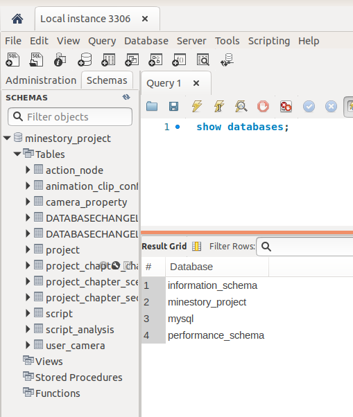

(数据库数据是为了演示，用SQL脚本添加)

**数据导出**

通过docker执行mysqldump即可

`docker exec containerId sh -c 'exec mysqldump --all-databases -u[name] -p[password]' > /宿主机器路径/文件名.sql` 

##  portainer安装

一个docker服务的界面客户端，方便查看docker服务器的镜像、启动的容器等。

直接使用`docker run -d -p 8088:9000 -v "/var/run/docker.sock:/var/run/docker.sock" --privileged=true portainer/portainer
`安装。

成功后通过localhost:8088使用浏览器看到登录界面，第一次登录的时候需要设置管理员账户。

登录后界面如下：

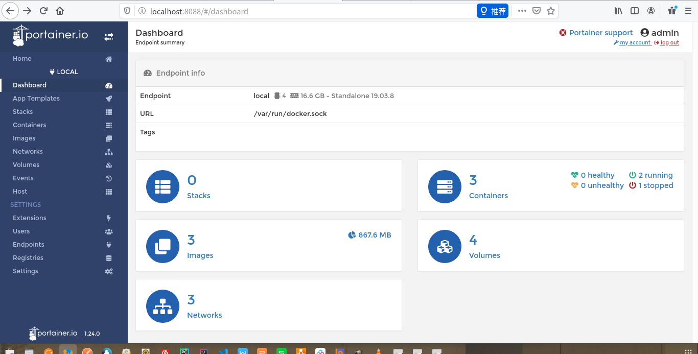


## jenkins安装

官方docker库：https://hub.docker.com/r/jenkins/jenkins

官方使用文档：https://github.com/jenkinsci/docker/blob/master/README.md

**简单启动过程**

1. docker pull jenkins/jenkins:lts
2. docker run --name myjenkins -p 8000:8080 -p 50000:50000 -v /home/tra/DockerRunTime/jenkinsRT:/var/jenkins_home jenkins/jenkins:lts
3. localhost:8000登录

```
NOTE:
1. /home/tra/DockerRunTime/jenkinsRT目录宿主机改成了 chmod 777

2. 启动的时候注意下面的小字，保存初始化密码。如果不保存也会在登录页面提示在什么地方去找。可以使用docker exec -it containerId "/bin/bash"进入容器查看，或者在宿主机column中查看
Jenkins initial setup is required. An admin user has been created and a password generated.
Please use the following password to proceed to installation:

a3db14756b674fdaa8271abe608ecf1a

如果在启动的时候添加了-v /your/host/path:/var/jenkins_home,那么可以在/your/host/path/secrets/initialAdminPassword文件中，在容器中对应位置就是/var/jenkins_home/secrets/initialAdminPassword。如果没有添加卷的话就需要通过exec -it containerId /bin/bash附加到容器中查看

```
## redis安装

1. 下载 `docer pull redis:3.2`

2. 运行`docker run -p 6379:6379 --name redis -v /home/tra/MyApp/redis/data:/data -v /home/tra/MyApp/redis/config/redis.conf:/usr/local/etc/redis/redis.conf -d redis:3.2 redis-server /usr/local/etc/redis/redis.conf --appendonly yes`

如果想给redis更改配置文件只需要在`/home/tra/MyApp/redis/config/redis.conf`目录里创建redis.conf的配置文件即可。这里会让人迷惑，用过redis的应该知道redis.conf是个目录。

```
redis:3.2 redis-server /usr/local/etc/redis/redis.conf --appendonly yes

上面部分是在执行redis-server命令，整体意思是redis-server通过/usr/local/etc/redis/redis.conf目录下的配置文件启动，appendonly参数为yes（开启redis持久化）。和我们在本地下载redis，然后在cmd中启动是一样的。
```

3. 验证`docker exec -it contianerId redis-cli`登录进容器的redis命令行终端，进入后通过set命令存入值，然后shutdown。最后你可以在宿主机器的`/home/tra/MyApp/redis/data`目录下看到appendonly.aof文件

## 安装Tomecat

```bash
$ docker pull tomcat:9.0
$ docker run -it -p 8888:8080 -v $(pwd)/tomcat/:/usr/local/tomcat/webapps/ tomcat:9.0
#You can then go to http://localhost:8888 or http://host-ip:8888 in a browser

The default Tomcat environment in the image is:
CATALINA_BASE:   /usr/local/tomcat
CATALINA_HOME:   /usr/local/tomcat
CATALINA_TMPDIR: /usr/local/tomcat/temp
JRE_HOME:        /usr
CLASSPATH:       /usr/local/tomcat/bin/bootstrap.jar:/usr/local/tomcat/bin/tomcat-juli.jar
```

测试

```
在$(pwd)/tomcat目录下
step 1: 添加hello目录
step 2: 进入hello创建index.html
step 3: <h1>hello world</h1>写入index.html
step 4： http://localhost:8888/hello/index.html
```

```
如果在绑定卷的时候指定成/usr/local/tomcat/因为宿主机下没有数据会把该目录数据清空。导致如下错误：docker: Error response from daemon: OCI runtime create failed: container_linux.go:345: starting container process caused "exec: \"catalina.sh\": executable file not found in $PATH": unknown.

如下测试，因为我的目录下有hello目录所以正给目录成了我宿主机内容。导致tomcat相关文件全部丢失
$ docker run -it --rm -p 8888:8080 -v $(pwd):/usr/local/tomcat/ tomcat:9.0 /bin/bash
root@6414df6da4b4:/usr/local/tomcat# ls
hello
root@6414df6da4b4:/usr/local/tomcat# ls -la hello
total 12
drwxrwxr-x 2 1000 1000 4096 Mar 10 09:46 .
drwxrwxrwx 3 1000 1000 4096 Mar 10 09:43 ..
-rw-rw-r-- 1 1000 1000   21 Mar 10 09:46 index.html
root@6414df6da4b4:/usr/local/tomcat# cd hello/
root@6414df6da4b4:/usr/local/tomcat/hello# cat index.html 
<h1>hello world</h1>
```

## 安装gitlab

gitlab docker页面：https://hub.docker.com/r/gitlab/gitlab-ce

gitlab docker说明文档：https://docs.gitlab.com/omnibus/docker/README.html

拉取运行命令如下，但hostname、volume和publish参数需要依据自己的实际情况调整

```bash
$ docker pull gitlab/gitlab-ce

$ sudo docker run --detach \
  --hostname gitlab.example.com \
  --publish 443:443 --publish 80:80 --publish 22:22 \
  --name gitlab \
  --restart always \
  --volume /srv/gitlab/config:/etc/gitlab \
  --volume /srv/gitlab/logs:/var/log/gitlab \
  --volume /srv/gitlab/data:/var/opt/gitlab \
  gitlab/gitlab-ce:latest
```

所有的GitLab数据会保存在/srv/gitlab/的子目录下，https是443，http是80，ssh是22。

如果是本机启动，可以直接使用localhost:port来访问。而这里的port是和容器80相对应的。

需要稍等下，要不然访问会出502。但能看当gitlab的标志，说明服务器还在初始化。第一次正常访问后会跳转的如下页面给root用户设置密码。

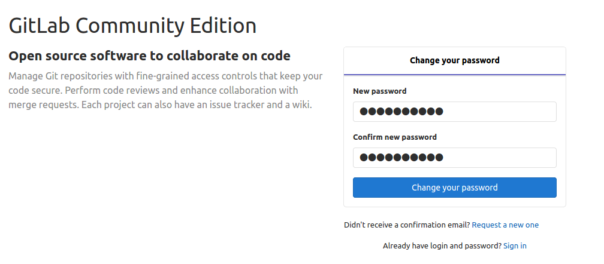

设置完成后就可以用root用户登录了。进入如下页面，开始正常操作。

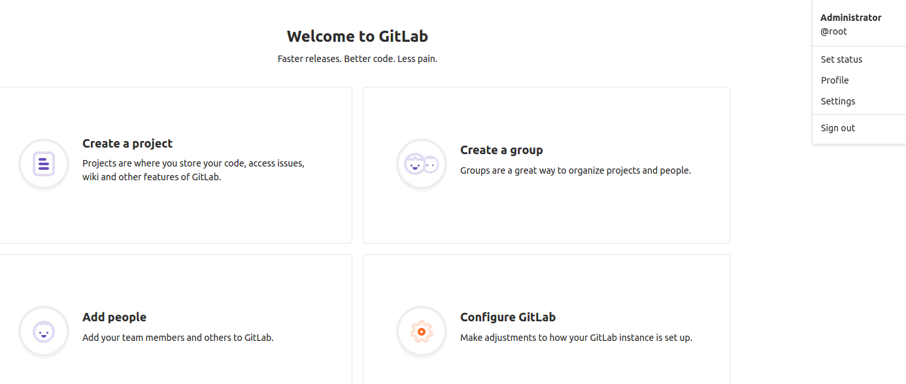


# Gerrit安装

```
$ docker pull gerritcodereview/gerrit
$ sudo docker run -ti \
  -p 8080:8080 -p 29418:29418 \
  --name gerrit \
  --volume /home/learlee/DockerRun/gerrit_home/db:/var/gerrit/db \
  --volume /home/learlee/DockerRun/gerrit_home/git:/var/gerrit/git \
  --volume /home/learlee/DockerRun/gerrit_home/cache:/var/gerrit/cache \
  gerritcodereview/gerrit:latest

这里只把数据相关暴露了出来。但要确保宿主机目录权限，如果指定不存在的话自动创建的目录可能会出现权限问题。

```
本地安装完成后可以使用localhost:8080访问。登录如下界面

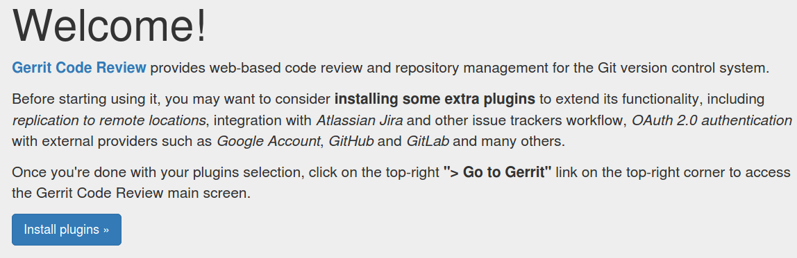

可对外暴露的Port和Volume
```
ports:
  - "29418"
  - "8080"

volumes:
  - /var/gerrit/etc
  - /var/gerrit/git
  - /var/gerrit/db
  - /var/gerrit/index
  - /var/gerrit/cache

docker inspect看Volumes和ExposedPorts或者dockerhub的网页描述也能拿到
```

如果在生产环境下的话需要全部开放以便配置，可使用如下命令启动。要确保宿主机相关目录权限！！！使用以下方式启动的gerrit用户需要自己配置，没有登录界面。

```
sudo docker run -ti \
  -p 8080:8080 -p 29418:29418 \
  --name gerrit \
  --volume /home/learlee/DockerRun/gerrit_home/etc:/var/gerrit/etc \
  --volume /home/learlee/DockerRun/gerrit_home/git:/var/gerrit/git \
  --volume /home/learlee/DockerRun/gerrit_home/db:/var/gerrit/db \
  --volume /home/learlee/DockerRun/gerrit_home/index:/var/gerrit/index \
  --volume /home/learlee/DockerRun/gerrit_home/cache:/var/gerrit/cache \
  gerritcodereview/gerrit:latest
```

使用默认登录后界面如下。可以确区分出和只暴露存储目录的区别

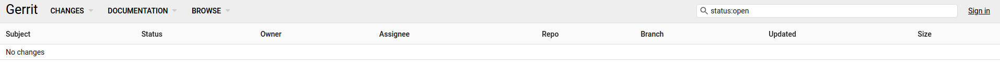


# elasticsearch

还是通过安装三步曲：

1. 查找`docker search elasticsearch`
2. 下载`docker pull elasticsearch`
3. 去hub.docker.com查看使用命令并启动。本地测试学习用途安装的时候我们可以使用默认的net，去掉net启动参数。`docker run -d --name elasticsearch -p 9200:9200 -p 9300:9300 -e "discovery.type=single-node" elasticsearch:latest`
4. 测试服务启动成功否。`curl localhost:9200`
```
$ curl localhost:9200
{
  "name" : "1nrnhTI",
  "cluster_name" : "elasticsearch",
  "cluster_uuid" : "LsGIcbWpR8yEr9bLK7NFhg",
  "version" : {
    "number" : "5.6.12",
    "build_hash" : "cfe3d9f",
    "build_date" : "2018-09-10T20:12:43.732Z",
    "build_snapshot" : false,
    "lucene_version" : "6.6.1"
  },
  "tagline" : "You Know, for Search"
}

```


从下面数据看到，elasticsearch对内存的需求量还是挺大的。所以我们可以通过-e来修改JAVA启动的内存`docker run -d --name elasticsearch -p 9200:9200 -p 9300:9300 -e "discovery.type=single-node"  -e ES_JAVA_OPTS="-Xms64m -Xmx512m" elasticsearch:latest`

```
docker stats edb563fc077e

CONTAINER ID        NAME                CPU %               MEM USAGE / LIMIT    MEM %               NET I/O             BLOCK I/O           PIDS
edb563fc077e        elasticsearch       0.33%               2.22GiB / 15.49GiB   14.33%              7.96kB / 0B         0B / 156kB          38

#加了JAVA内存环境参数后
CONTAINER ID        NAME                CPU %               MEM USAGE / LIMIT     MEM %               NET I/O             BLOCK I/O           PIDS
ff96a4b80167        elasticsearch       0.78%               244.7MiB / 15.49GiB   1.54%               2.86kB / 0B         0B / 156kB          43


```

# openldap与phpLDAPadmin安装

openldap提供ldap服务，phpLDAPadmin提供一个界面客户端，所以phpLDAPadmin是依赖openldap的。所以先安装openldap服务，如下所示：

```bash
$ docker pull osixia/openldap

# 给定了数据存储卷，配置文件并没有暴露（/etc/ldap/slapd.d是个文件）
# OpenLDAP监听的端口：
#      默认监听端口：389（明文数据传输）
#      加密监听端口：636（密文数据传输）
# 如果不设定LDAP_DOMAIN默认是example.org
# 如果不设定密码，admin默认密码是admin
$ docker run -d \
--name=openldap \
-p 389:389 \
-p 636:636 \
-e "LDAP_DOMAIN=dyp.org" \
-e "LDAP_ADMIN_PASSWORD=123456" \
-e "LDAP_CONFIG_PASSWORD=123456" \
-v /home/learlee/DockerRun/ldap_home/data:/var/lib/ldap  \
osixia/openldap

# 测试安装是否成功
$ docker exec openldap ldapsearch -x -H ldap://localhost -b dc=dyp,dc=org -D "cn=admin,dc=dyp,dc=org" -w 123456
# extended LDIF
#
# LDAPv3
# base <dc=dyp,dc=org> with scope subtree
# filter: (objectclass=*)
# requesting: ALL
#

# dyp.org
dn: dc=dyp,dc=org
objectClass: top
objectClass: dcObject
objectClass: organization
o: Example Inc.
dc: dyp

# admin, dyp.org
dn: cn=admin,dc=dyp,dc=org
objectClass: simpleSecurityObject
objectClass: organizationalRole
cn: admin
description: LDAP administrator
userPassword:: e1NTSEF9OHdDbkhVc0Y0M2xKbzBXT1M0akxZazdHTUhsTjFsQjk=

# search result
search: 2
result: 0 Success

# numResponses: 3
# numEntries: 2
```

接下来安装phpLDAPadmin，在同一个宿主机下

```bash
$ docker pull osixia/phpldapadmin
$ docker run -p 6443:443 --name phpldapadmin-service --link openldap:ldap-host --env PHPLDAPADMIN_LDAP_HOSTS=ldap-host --detach osixia/phpldapadmin
```
通过 https://localhost:6443 访问phpLDAPadmin，但由于用的不是CA认证的证书，会显示如下页面：

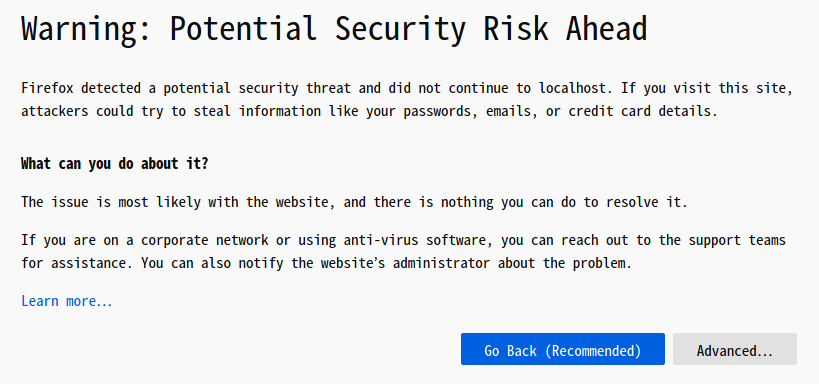

点击[Advanced]-->[Accept the risk and continue]就可以看到如下页面

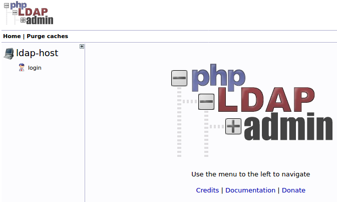

点击登录输入用户密码，初始化参见ldap服务启动设置，如果没有设置默认的用户是`dn=admin,dc=example,dc=org`密码是`admin`

```
用户：cn=admin,dc=dyp,dc=org
密码：123456
```
也可以使用官方提供的脚本模板直接启动两个服务。可以很直接的表明他们之间的联系。看`--link`参数。
```bash
#!/bin/bash -e
docker run --name ldap-service --hostname ldap-service --detach osixia/openldap:1.1.8
docker run --name phpldapadmin-service --hostname phpldapadmin-service --link ldap-service:ldap-host --env PHPLDAPADMIN_LDAP_HOSTS=ldap-host --detach osixia/phpldapadmin:0.9.0

PHPLDAP_IP=$(docker inspect -f "{{ .NetworkSettings.IPAddress }}" phpldapadmin-service)

echo "Go to: https://$PHPLDAP_IP"
echo "Login DN: cn=admin,dc=example,dc=org"
echo "Password: admin"
echo "Test cmd: docker exec openldap ldapsearch -x -H ldap://localhost -b dc=example,dc=org -D "cn=admin,dc=example,dc=org" -w admin"
```

## 创建自己的Nginx镜像

先写好deockerfile。实际上dockerfile里面的命令都可以在FROM的环境中运行。可以理解成，你在环境中需要执行哪些操作，在环境中测试过后，封装到dockerfile里面就好。但不是全部命令都可以，典型的如ADD COPY命令。

```dockerfile
FROM ubuntu:18.04

RUN apt-get update && apt-get install -y nginx

# clear default nginx web
RUN cd /var/www/html && rm -rf *

# add index page 
ADD index.html /var/www/html/

EXPOSE 80

VOLUME [ "/var/www/html/" ]

# If you add a custom CMD in the Dockerfile, be sure to include -g daemon off; 
# in the CMD in order for nginx to stay in the foreground, 
# so that Docker can track the process properly 
# (otherwise your container will stop immediately after starting)!
CMD [ "/usr/sbin/nginx", "-g", "daemon off;" ] 

```

运行测试过程

```bash
docker build  -f UbuntuNginx.dockerfile -t mynginx:1.0.0 .
docker run -it -p 8080:80 -v /home/tra/WorkSpace/html/:/var/www/html/ --name mynginxbin -d mynginx:1.0.0
curl http://localhost:8080
```

[源代码](src/MyNginx)

如果通过shell脚本先配置再启动，请参看下面的dockerfile,使用exec在shell脚本中启动nginx以替换shell脚本进程，并占用shell脚本原本PID

```
# Dockerfile部分内容如下

FROM nginx
LABEL maintainer="xxx <xxx@xxx.com>"

NGX_DOC_ROOT=/data/web/html/
ADD entrypint.sh /bin/

CMD ["/user/sbin/nginx", "-g", "daemon off;"]

#实际最后执行的是 /bin/entrypoint.sh /user/sbin/nginx -g daemon off(命令行参数会被当作参数传递给ENTRYPOINT指定的程序);其中/user/sbin/nginx -g daemon off;部分会实当成参数传入entrypoint.sh中。所以才能$@引用到并执行替换当前的进程成为主进程PID为1

ENTRYPOINT ["/bin/entrypoint.sh"]
```

entrypoint.sh部分内容如下：
```sh
#!/bin.sh
# 向my.conf写入数据，设置nginx配置文件， HOSTNAME，PORT可以是运行docker时候传入的命令行参数
cat > /etc/my.conf << EOF
server {
  server_name ${HOSTNAME};
  listen ${IP:-0.0.0.0}:{PORT:-80};
  root ${NGX_DOC_ROOT:-/usr/share/nginx/html};
} 
EOF

exec "$@"
```

# 容器生命周期

Docker的主进程（PID1进程）是一个很特殊的存在，它的生命周期就是docker container的生命周期，它得对产生的子进程负责，在写Dockerfile的时候，务必明确PID1进程是什么。

通过Dockerfile中的 ENTRYPOINT 和/或 CMD指令指定。当主进程(PID=1的进程)退出的时候，容器所拥有的PIG命名空间就会被销毁，容器的生命周期也会结束docker最佳实践建议的是一个container一个service。所以命令一但执行完毕就会清掉容器。

所以保证容器运行不停止需要下面两个条件：

1. 进程在容器中前台运行，即你不能使用&将进程变成后台运行。
2. 进程本身是持续运行的。

简单符要求的实例：
很简单的while循环脚本

```bash
$ docker run -d --name ct ubuntu:18.0.4 /bin/sh -c "while true; do echo working; sleep 1; done"

$ docker exec ct ps -ef
UID        PID  PPID  C STIME TTY          TIME CMD
root         1     0  0 07:21 ?        00:00:00 /bin/sh -c while true; do echo working; sleep 1; done
root       107     1  0 07:23 ?        00:00:00 sleep 1

#查看前台logs输出
$ docker logs ct
working
working
working
... ...
```

**来看一个实例**

在docker中，对于CMD和 ENTRYPOINT，支持两种进程执行方式：exec和shell。
以下实例只列举了CMD，ENTRYPOINT同理
shell的格式是：`CMD "executable param1 param2"`

最终转换后的格式是：
```
"Cmd": [
          "/bin/sh",
          "-c",
          "executable param1 param2"
       ]
```

Exec的格式是: `CMD ["executable","param1","param2"]`

最终转换后的格式是：
```
"Cmd": [
          "executable",
          "param1",
          "param2"
       ]
```
现在有两个镜像，Dockerfile分别如下：

```dockerfile
# 镜像redis:shell

FROM ubuntu:14.04
RUN apt-get update && apt-get install -y apt-utils &&  apt-get -y install redis-server && rm -rf /var/lib/apt/lists/*
EXPOSE 6379
CMD "/usr/bin/redis-server"

# 镜像redis:exec

FROM ubuntu:18.04
RUN apt-get update && apt-get install -y apt-utils &&  apt-get -y install redis-server && rm -rf /var/lib/apt/lists/*
EXPOSE 6379
CMD ["/usr/bin/redis-server"]
```

**分别启动**

```bash
docker run -d --name myredis1 redis:shell
docker run -d --name myredis2 redis:exec
```

那个docker镜像更好一点呢？

**shell启动**

我们前面讲过，PID=1进程（主进程）需要对自己的子进程负责，对于redis:shell，它产生的PID1进程是`/bin/sh -c "/usr/bin/redis-server"`

也就是说，是/bin/sh这个进程，不是/usr/bin/redis-server！

/usr/bin/redis-server只是它创建的一个子进程！

执行命令`docker exec myredis1 ps -ef`可以验证这种猜测,如下所示`/bin/sh -c "/usr/bin/redis-server"`的进程的PID=1而`/usr/bin/redis-server`的PID是6

```bash
UID        PID  PPID  C STIME TTY          TIME CMD
root         1     0  0 05:53 ?        00:00:00 /bin/sh -c "/usr/bin/redis-server"
root         6     1  0 05:53 ?        00:00:00 /usr/bin/redis-server *:6379
root        10     0 20 05:54 ?        00:00:00 ps -ef

```

**exec启动**

执行命令`docker exec myredis2 ps -ef`可以验证`/usr/bin/redis-server`进程PID=1

```bash
$ docker exec myredis2 ps -ef
UID        PID  PPID  C STIME TTY          TIME CMD
root         1     0  1 06:13 ?        00:00:00 /usr/bin/redis-server *:6379
root         9     0  0 06:13 ?        00:00:00 ps -ef
```
通过exec方式运行的container的主进程则是我们所期望的。


你可能会觉得，这有什么大不了的呢，问题出现当我们停止container的时候。这个时候是否会有退出程序处理就很关键了。

**停止redis:shell**

```
docker stop myredis1
docker logs myredis1
```

Stop的时候，docker明显停顿了一段时间，而且查看日志可以看出，redis没有做任何保存数据库的操作，直接被强制退出了。这期间发生了什么？首先，运行stop命令会向容器发送 SIGTERM信号，告诉主进程：你该退出了，感觉收拾收拾。但是，这里的主进程是/bin/sh啊，它怎么可能会有处理redis进程退出的机制？所以redis进程不会马上退出。 Docker Daemon等待一段时间之后（默认是10s），发现容器还没有完全退出，这时候就会发送 SIGKILL，将容器强行杀死。在这过程中，redis进程完全不知道自己该退出了，所以他没有做任何收尾的工作。

**停止redis:exec**

```
docker stop myredis2
docker logs myredis2
```

这一次stop的时候是立即生效了，没有卡顿延迟现象，从输出来看，redis进行了shutdown的操作，把该持久化的数据都保存到磁盘了。因为这时候的PID1进程是/usr/bin/redis-server它是能够正确处理SIGTERM信号的。这才是我们所期望的。

## 守护式容器

了解了PID1的进程，我们就清楚只要让PID1的进程不退出，容器就不会关闭。如果能和启动Linux后台运行进程一样启动容器，那就是守护式容器。

需要保证容器中的PID1的进程不能结束！！！

守护式容器的特点：

1. 可以长期运行
2. 没有交互式会话

方式一:

```bash
$docker run -i -t image /bin/bash
ctrl p q 退出
# 然后用ps看进程
$ docker exec containerId ps -ef
UID        PID  PPID  C STIME TTY          TIME CMD
root         1     0  0 02:39 pts/0    00:00:00 /bin/bash
root        11     0  0 03:57 ?        00:00:00 ps -ef
```

方式二：

```bash
$docker run -d image

# 容器中CMD/ENTRYPOINT启动的进程是前台进程并且不退出，否则容器会关闭

# 比如CMD ["/bin/bash"] 运行完成后直接退出
```

常用的几个查看、执行命令:
```
dokcer logs：看容器日志

docker top : 看运行容器进程

docker exec ：在运行的容器中执行命令 -i交互 -t分配TTY。
从下面的实例可以看出，exec -i -t会在容器里新开一个进程。而PID=1的进程是启动容器时启动的，比如通过“方式一”启动的。只要PID=1没结束，容器就会一直纯在
docker exec -i -t contianerId /bin/bash
root@contianerId:/# ps -ef
UID        PID  PPID  C STIME TTY          TIME CMD
root         1     0  0 02:39 pts/0    00:00:00 /bin/bash
root        16     0  6 04:03 pts/1    00:00:00 /bin/bash
root        25    16  0 04:03 pts/1    00:00:00 ps -ef
```

# docker compose

有了dockerfile，运维的时候就可以动态的创建镜像、部署镜像、启动停止镜像。当然也可以通过传递镜像来避免创建。但目前大部分服务都是微服务架构，完整的服务需要多个服务共同协同。有的时候启动顺序还有需要。那么如果管理多个微服务体系会变得困难。也就是安一定的业务规则批量管理容器成为了运维的需求。而docker compse就是解决这个需求的工具。另外就是集群管理了。

docker compose就是一个编排多容器分布式部署的工具，通过命令管理容器的构建、启动、停止。

1. 使用dockerfile创建容器
2. 用docker-compose.yml定义服务组成与关系
3. docker-compose up依据docker-compose.yml定义启动相关容器

安装

```bash
$ sudo curl -L "https://github.com/docker/compose/releases/download/1.25.4/docker-compose-$(uname -s)-$(uname -m)" -o /usr/local/bin/docker-compose

$ sudo chmod +x /usr/local/bin/docker-compose

$ docker-compose -v
docker-compose version 1.25.4, build 8d51620a

``` 

删除

```bash
$ sudo rm /usr/local/bin/docker-compose
```

通过安装就知道是把文件下载到Linux的默认path下，只要删除文件就可以。

[Get Started with Docker compose](https://docs.docker.com/compose/gettingstarted/)里有详细的入门教程。

[runoob的教程](https://www.runoob.com/docker/docker-compose.html)，这个教程多了些基础的配置指令。比如depends_on等。

## 制作SpringBoot项目镜像

本节打包一个简单的springboot项目。

[源码文件](src/SpringBoot)

我们写个如下的dockerfile。然后将jar文件放到dockerfile同目录下。`docker build -f springboot.dockerfile -t mymvc:1.0.0 .
` 生成镜像，然后 `docker run -d -P --name mymvc mymvc:1.0.0`运行镜像，因为没有指定端口所以可以通过`docker ps`查看端口映射关系。最后可以使用`http://localhost:yourport/mvc/hello%20world`验证！

```
FROM java：8

COPY *.jar /app.jar

CMD ["--server.port=8080"]

EXPOSE 8080

ENTRYPOINT ["java", "-jar", "/app.jar"]
```

上面的CMD实际是给ENTRYPOINT的参数，通过下面运行后的ps输出可以看出。

```bash
$ docker exec  mymvc ps -ef
UID        PID  PPID  C STIME TTY          TIME CMD
root         1     0  6 09:27 ?        00:00:08 java -jar /app.jar --server.port=8080
root        44     0  0 09:30 ?        00:00:00 ps -ef

```

## 一些参数的区别

## docker run 中的-v和-mount区别

最开始 -v 或者 --volume 选项是给单独容器使用， --mount 选项是给集群服务使用。但是从 Docker 17.06 开始，也可以在单独容器上使用 --mount。通常来讲 --mount 选项也更加具体(explicit)和“啰嗦”(verbose)，最大的区别是

- -v 选项将所有选项集中到一个值
- --mount 选项将可选项分开

如果需要指定 volume driver 选项，那么必须使用 --mount

- -v 或 --volume: 包含三个 field，使用`:` 来分割，所有值需要按照正确的顺序。并且只能创建bind mount。第一个 field 是 volume 的名字，并且在宿主机上唯一，对于匿名 volume，第一个field通常被省略；第二个field是宿主机上将要被挂载到容器的path或者文件；第三个field可选，比如说 ro

- --mount: 包含多个 key-value 对，使用逗号分割。--mount 选项更加复杂，但是各个值之间无需考虑顺序。
   - type，可以为 bind, volume, tmpfs, 如果不指定type选项，则默认为挂载volume
   - source 也可以写成 src，对于 named volumes，可以设置 volume 的名字，对于匿名volume，可以省略
   - destination 可以写成 dst或者 target 该值会挂载到容器
   - readonly 可选，如果使用，表示只读
   - volume-opt 可选，可以使用多次

```bash
$ docker run -d \
  --name=nginxtest \
  --mount source=nginx-vol,destination=/usr/share/nginx/html \
  nginx:latest

$ docker run -d \
  --name=nginxtest \
  -v nginx-vol:/usr/share/nginx/html \
  nginx:latest
```

```
挂载volume命令格式：[type=volume,]source=my-volume,destination=/path/in/container[,...]
创建bind mount命令格式：type=bind,source=/path/on/host,destination=/path/in/container[,...]
如果创建bind mount并指定source则必须是绝对路径，且路径必须已经存在
```

**创建bind mount和挂载volume的比较**

对比项 |	bind mount |	volume
---|---|---
Source位置 |	用户指定 |	/var/lib/docker/volumes/
Source为空 |	覆盖dest为空 |	保留dest内容
Source非空 |	覆盖dest内容 |  覆盖dest内容
Source种类 |	文件或目录 |	只能是目录
可移植性 |	一般（自行维护） |	强（docker托管）
宿主直接访问 |	容易（仅需chown） |	受限（需登陆root用户）*

下面示例是一个volumes的详细数据，其中Mountpoint需要使用root用户才能访问

```shell
$ docker volume inspect dyp-test
[
    {
        "CreatedAt": "2020-07-01T14:09:18+08:00",
        "Driver": "local",
        "Labels": {},
        "Mountpoint": "/var/lib/docker/volumes/dyp-test/_data",
        "Name": "dyp-test",
        "Options": {},
        "Scope": "local"
    }
]
$ cd /var/lib/docker/volumes
bash: cd: /var/lib/docker/volumes: 权限不够

```