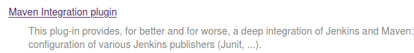

# Jenkins

Jenkins 是一个可扩展的持续集成引擎。

拥有的功能：

- 软件构建自动化 ：配置完成后，CI系统会依照预先制定的时间表，或者针对某一特定事件，对目标软件进行构建。
- 生成JUnit/TestNG测试报告。
- 分布式构建支持Jenkins能够让多台计算机一起构建/测试。
- 文件识别:Jenkins能够跟踪哪次构建生成哪些jar，哪次构建使用哪个版本的jar等。
- 插件支持:支持扩展插件，你可以开发适合自己团队使用的工具。

主要用于：

- 持续、自动地构建(build)/测试(test)/发布（deploy）软件项目。
- 监控一些定时执行的或事件触发性任务。

所以我们可以认为他能做以下工作：

- 软件构建（build）自动化 ：配置完成后，CI系统会依照预先制定的时间表，或者针对某一特定事件（有新增、修改的代目时），对目标软件进行构建。看新增或修改后的代码会不会破坏了原有软件的成功构建

- 构建可持续的自动化测试（test） ：构建检查的扩展部分，构建后执行预先制定的一套测试规则，完成后触发通知(Email,RSS等等)给相关的当事人。

- 生成后后续过程的自动化 :当自动化检查和测试成功完成，软件构建的周期中可能也需要一些额外的任务，诸如生成文档、打包软件、部署构件到一个运行环境或者软件仓库。这样，构件才能更迅速地提供给用户使用。

- 完成定时任务

CI系统的基本结构如下图：

该系统的各个组成部分是按如下顺序来发挥作用的：

1. 开发者检入代码到源代码仓库。

2. CI系统会为每一个项目创建了一个单独的工作区（可以理解成一个对立的目录名叫workspace）。当预设或请求一次新的构建时，它将把源代码仓库的源码存放到对应的工作区。

3. CI系统会在对应的工作区内执行构建（build）过程。

4. （配置如果存在）构建完成后，CI系统会在一个新的构件中执行定义的一套测试（test）。完成后触发通知(Email,RSS等等)给相关的当事人。

5. （配置如果存在）如果构建（build）成功，这个构件会被打包并转移到一个部署目标(如应用服务器)或存储为软件仓库中的一个新版本。软件仓库可以是CI系统的一部分，也可以是一个外部的仓库，诸如一个文件服务器或者像`Java.net、 SourceForge`之类的网站。

6. CI系统通常会根据请求发起相应的操作，诸如即时构建、生成报告，或者检索一些构建好的构件。

[参考1](https://blog.csdn.net/ios_xumin/article/details/78125913)

# jenkins安装

个人建议使用docker安装，你可以想象成安装个软件，但有不会侵扰你目前的系统。和手机上的软件的区别就是通过命令行安装与启动。可以参考Docker部分中的jenkins安装[安装](../Docker/README.md#jenkins安装)

安装完成后需要初始化，可以直接全部默认选项，缺少的插件后期都可以在Jenkins的Manage Jenkins选下下的Manage Plugins中进行添加。如下图：

如果是通过本地ssh向远端发送命令执行脚本，脚本中有输出并标记颜色，建议添加AnsiColor插件

没有添加的时候远端脚本Error输出有颜色标记显示如下。

添加完插件，在你的任务里勾选如下配置

然后显示效果变为

# 与Gerrit Maven集成

假设你的项目是通过spring boot创建，并且附带了更新启动脚本。我们假设需要完成以下功能

1. 当有新提交merge进gerrit自动触发
2. 测试编译是否能通过
3. 通过ssh向远端发送命令启动服务

下面让我们一步一步实现目标。

## 从gerrit拉取代码

这步需要先添加Maven插件，默认插件里没有。所以没有能用来创建Maven任务的东西。按在jenkins安装中的说明找到Plugin Manager，然后进入选择Available选项页，检索Maven Integration plugin，并安装。如下图：

安装完成后，点击重新启动jenkins或者在安装的时候就选择安装完成重新启动。

配置Manve，【Manage Jenkins】-->【Global Tool Configuration】安如下图配置

*JDK不需要配置，Docker安装Jenkins的时候自带了*

添加gerrit秘钥，用来拉去代码使用。目前假设的是gerrit和本地验证是通过ssh秘钥验证，如下操作也是基于此操作的。【Credential

点击【global】进入页面,然后点击【Add Credentials】显示如下页面，然后添加自己的ssh秘钥

做完上面两步基本工作算是完成了，然后点击【new item】创建新工作任务，在Enter an Item name中输入你想要的名字，然后选择Maven project然后进入相关配置页面。

创建页面如下：

配置页面如下(选择source code management)：

## 联通远端服务完成命令发送

前题：选择使用ssh的免密登录作为基础，然后通过jenkins透过ssh发送命令。

Step1： 建立本机与远端机器的免密登录。
Step2： 添加maven集成插件