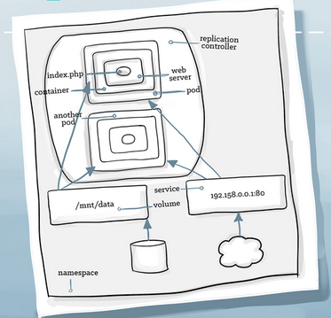
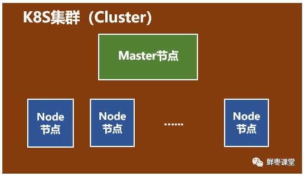

# Docker存在的问题

1. 无法有效集群
2. 没有有效容灾、自愈机制
3. 没有预设编排模板\容器间依赖管理、无法快速、大规模容器调度
4. 没有统一配置管理中心工具
5. 没有容器生命周期管理工具

所以才引入了编排工具，compose、swarm or k8s。

# 编排工具

1. docker compose(单机编排)，docker swarm(增加多机能力)，docker machine(把docker host初始化并加入docker swarm的管理之下)
2. mesos(资源管理器), marathon（将docker host资源抽像成mesos可管理资源）
3. kubernetes

# 什么是Kubernetes

Kubernetes（k8s）是自动化容器操作的开源平台，这些操作包括部署，调度和节点集群间扩展。如果你曾经用过Docker容器技术部署容器，那么可以将Docker看成Kubernetes内部使用的低级别组件。**Kubernetes不仅仅支持Docker，还支持Rocket（这是另一种容器技术）**。

Kubernetes特性：

- 自动化容器的部署和复制
- 随时扩展或收缩容器规模
- 将容器组织成组，并且提供容器间的负载均衡
- 很容易地升级应用程序容器的新版本
- 密钥和配置管理
- 存储(docker volume)编排
- 批量处理执行
- 提供容器弹性，如果容器失效就替换它，等等...

下图展示了一个完整的K8s所拥有的元素，以及元素之间的关系。



**图元素解析**

1. 每个应用的运行都要依赖一个环境，对于一个 PHP 应用来说，这个环境包括了一个 webserver，一个可读的文件系统和 PHP 的 engine。（对应于图上web server的方框）
2. 容器为应用提供了隔离的环境，在这个环境里应用就能运行起来（对应于图container方框，比如docker可以是其容器）。但是这些相互隔离的容器需要管理，也需要跟外面的世界沟通。**共享的文件系统，网络，调度，负载均衡和资源分配**都是挑战。
3. pod代表着一个运行着的工作单元（对应于图pod方框）。通常，每个pod中只有一个容器，但有些情况下，如果几个容器是紧耦合的，这几个容器就会运行在同一个pod中。Kubernetes 承担了 pod与外界环境通信的工作。并且同一个Pod里的容器共享同一个网络命名空间，可以使用localhost互相通信;而且同一个Pod里的容器可以共享volume。Pod的里运行的多个容器，其中一个叫主容器，而其它的是辅助的，比如运行一个Nginx服务的Docker，但又需要收集Log这个时候就可以再启一个Log收集的服务Docker,前一个就叫主容器。
4. Replication controller 提供了一种管理任意数量 pod 的方式。一个 replication controller 包含了一个 pod 模板，这个模板可以被不限次数地复制。通过 replication controller，Kubernetes 可以管理 pod 的生命周期，包括扩/缩容，滚动部署和监控等功能。确保任意时间都有指定数量的Pod“副本”在运行。（对应于图replication controller方框）
   
   ```
    当创建Replication Controller时，需要指定两个东西：
    1. Pod模板：用来创建Pod副本的模板。
    2. Label：Replication Controller需要监控的Pod的标签。
   ```

5. service 可以和 Kubernetes 环境中其它部分（包括其它 pod 和 replication controller）进行通信，告诉它们你的应用提供什么服务。Pod可以增减，但是 service 的 IP 地址和端口号是不变的。而且其它应用可以通过 Kubernetes 的服务发现找到你的 service。并且service是定义一系列Pod以及访问这些Pod的策略的一层抽象。Service通过Label找到Pod组。（对应service方框）
   ```
   假定有2个后台Pod，并且定义后台Service的名称为‘backend-service’，lable选择器为（tier=backend, app=myapp）。backend-service 的Service会完成如下两件重要的事情：
   1. 会为Service创建一个本地集群的DNS入口，因此前端Pod只需要DNS查找主机名为 ‘backend-service’，就能够解析出前端应用程序可用的IP地址。
   2. 现在前端已经得到了后台服务的IP地址，但是它应该访问2个后台Pod的哪一个呢？Service在这2个后台Pod之间提供透明的负载均衡，会将请求分发给其中的任意一个。通过每个Node上运行的代理（kube-proxy）完成。

   有一个特别类型的Kubernetes Service，称为'LoadBalancer'，作为外部负载均衡器使用，在一定数量的Pod之间均衡流量。比如，对于负载均衡Web流量很有用。
   ```
6. Volume 代表了一块容器可以访问和存储信息的空间，对于应用来说，volume 是一个本地的文件系统。实际上，除了本地存储，Ceph、Gluster、Elastic Block Storage 和很多其它后端存储都可以作为 volume。（对应于volume方框）
7. Namespace 是 Kubernetes 内的分组机制。Service，pod，replication controller 和 volume 可以很容易地和 namespace 配合工作，但是 namespace 为集群中的组件间提供了一定程度的隔离。（对应于namespace方框）

另一个重要概念label：Kubernetes的Label是attach到Pod的一对键/值对，用来传递用户定义的属性。来区分事物，还可以根据 label 来查询。label 是开放式的：可以根据角色，稳定性或其它重要的特性来指定。比如，你可能创建了一个"tier"和“app”标签，通过Label（tier=frontend, app=myapp）来标记前端Pod容器，使用Label（tier=backend, app=myapp）标记后台Pod。

# Kubernetes框架

一个K8S系统，通常称为一个K8S集群（Cluster）。这个集群主要包括两个部分：一个Master节点（主节点）和 一群Node节点（计算节点）

下图是整体结构，是一个主从式集群，Master结点可冗余配置，负责管理和控制。Node节点是工作负载节点，里面是具体的容器。



**Master节点**


Master节点包括API Server、Scheduler、Controller manager、etcd。

API Server：是整个系统的对外接口，供客户端和其它组件调用，相当于“营业厅”。

Scheduler：负责对集群内部的资源进行调度，相当于“调度室”。

Controller manager：负责管理控制器，相当于“大总管”。

**Node节点**


Node节点包括Docker、kubelet、kube-proxy、Fluentd、kube-dns（可选），还有就是Pod。

- Docker: 创建容器的，但k8s支持的容器并不只限于Docker。
- Kubelet: 主要负责监视（即Master Scheduler）指派到它所在Node上的Pod，包括创建、修改、监控、删除等。
- Kube-proxy: 主要负责为Pod对象提供代理。
- Fluentd: 主要负责日志收集、存储与查询。

```
Pod是Kubernetes最基本的操作单元。一个Pod代表着集群中运行的一个进程，它内部封装了一个或多个紧密相关的容器。除了Pod之外，K8S还有一个Service的概念，一个Service可以看作一组提供相同服务的Pod的对外访问接口。
```

[参考引用](https://blog.csdn.net/wenjianfeng/article/details/90130895)

# Kubeadm

kubeadm 能帮助您建立一个小型的符合最佳实践的 Kubernetes 集群。通过使用 kubeadm, 您的集群会符合 Kubernetes 合规性测试的要求. Kubeadm 也支持其他的集群生命周期操作，比如升级、降级和管理启动引导令牌。

因为您可以在不同类型的机器（比如笔记本、服务器和树莓派等）上安装 kubeadm，因此它非常适合与 Terraform 或 Ansible 这类自动化管理系统集成。

kubeadm 的简单便捷为大家带来了广泛的用户案例：
- 新用户可以从 kubeadm 开始来试用 Kubernetes。
- 熟悉 Kubernetes 的用户可以使用 kubeadm 快速搭建集群并测试他们的应用。
- 大型的项目可以将 kubeadm 和其他的安装工具一起形成一个比较复杂的系统。

kubeadm 的设计初衷是为新用户提供一种便捷的方式来首次试用 Kubernetes， 同时也方便老用户搭建集群测试他们的应用。 此外 kubeadm 也可以跟其它生态系统与/或安装工具集成到一起，提供更强大的功能。

默认情况下K8S使用CRI（Container Runtime Interface）接口来与用户选择的容器运行时通讯。如果用户没有指定运行时，Kubeadm会自动尝试扫描检测安装在本机的常见的容器运行时（container runtime）。实际是通过扫描Unix主机socket。如下所示几种常见的Runtime和对应的socket parth

Runtime |	Path to Unix domain socket
---|---
Docker | /var/run/docker.sock
containerd | /run/containerd/containerd.sock
CRI-O	| /var/run/crio/crio.sock

如果Docker和containerd都被检测到，docker的有限级更高。因为在Docker 18.09版本后containerd会和Docker一起被安装。如果是其他组合被检测到，kubeadm会退出并报错。（比如containerd和CRIO同时被检测到）

## 安装

Master节点需要：安装kubelet，kubeadm，kubectl，Dokcer

Node节点需要：安装kubelet，kubeadm，kubectl，Dokcer，并加入master节点

**环境设置**

```bash
#以下操作都是在Ubuntu 16.04下
Step1：关闭swap
使用命令‘swapoff -a’ 禁用swap

Step2：关闭防火墙和SElinux
systemctl stop firewalld
输出：Failed to stop firewalld.service: Unit firewalld.service not loaded.
执行：systemctl disable firewalld
输出：Failed to execute operation: No such file or directory
执行：setenforce 0
输出：The program 'setenforce' is currently not installed. You can install it by typing:apt install selinux-utils
执行：apt install selinux-utils
写入
$ vim /etc/selinux/config
写入如下内容，
SELINUX=disabled

Step3:安装并启动docker-ce版本
curl -fsSL https://get.docker.com -o get-docker.sh
sh get-docker.sh
#以非root用户可以直接运行docker时，需要执行
sudo usermod -aG docker ${USER}
#Remember that you will have to log out and back in for this to take effect!
#提示说需要log out就好，但我在ubuntu下发现需要reboot。docker组是安装docker引擎时候创建的
sudo service docker start
```

**安装kubeadm,kubelet,kubectl**

这三个包需要安装在所有的机器上。

- kubeadm: 用来引导创建cluster的命令工具

- kubelet: 在所有集群机器上，用来启动pods和containers.

- kubectl: 用来访问集群的命令行

kubeadm不会安装和管理kubelet和kubectl，所以你需要保证这两个包的版本能匹配Kubeadm安装的K8S控制面板。使用国内镜像站

```bash
sudo apt-get update && sudo apt-get install -y apt-transport-https curl

sudo curl -s https://mirrors.aliyun.com/kubernetes/apt/doc/apt-key.gpg | sudo apt-key add -

sudo tee /etc/apt/sources.list.d/kubernetes.list << EOF
deb https://mirrors.aliyun.com/kubernetes/apt kubernetes-xenial main
EOF

sudo apt-get update

#查看版本
apt-cache madison kubeadm
#查看过版本之后就可以指定版本安装
$ sudo apt-get install -y kubelet=1.14.0-00 kubeadm=1.14.0-00 kubectl=1.14.0-00
$ sudo apt-mark hold kubelet=1.14.0-00 kubeadm=1.14.0-00 kubectl=1.14.0-00
```

*kubeadm config print init-defaults 来查看kubeadm的启动配置，更多命令命使用kubeadm help或者Use "kubeadm [command] --help" for more information about a command.*

```
Note:
注意: 如果您的机器已经安装了 kubeadm, 请运行 apt-get update && apt-get upgrade 或者 yum update 来升级至最新版本的 kubeadm.

升级过程中，kubelet 会每隔几秒钟重启并陷入了不断循环等待 kubeadm 发布指令的状态。 这个死循环的过程是正常的，当升级并初始化完成您的主节点之后，kubelet 才会正常运行。

kubeadm 的整体功能目前还是 Beta 状态，然而很快在 2018 年就会转换成正式发布 (GA) 状态。

Kubernetes 发现版本的通常只维护支持九个月，在维护周期内，如果发现有比较重大的 bug 或者安全问题的话， 可能会发布一个补丁版本。同时也适用于 kubeadm。
```

## 启动Shell自动补全

kubectl为bash和zsh提供自动补全机制，但在这之前要先确认bash-completion在本机是有的，可以通过`type _init_completion`查看，如果有，然后在Linux下只需要使用`kubectl completion bash`命令就可以。

### 安装bash-completion

如果没有安装可以用`apt-get install bash-completion or yum install bash-completion`命令安装。

通过命令安装成功后，会有`/usr/share/bash-completion/bash_completion`文件生成，然后尝试重启你的shell窗口，执行`type _init_completion`命令，如果成功一切OK。如果没有成功，將`source /usr/share/bash-completion/bash_completion`添加到`～/.bashrc`文件中。在重启Shell窗口就好了。


### PKI证书

Kubernets需要PKI证书来做身份验证，但如果你是使用kubeadm来安装的kubernetes，会自动安装该证书。当然你也可以使用你自己私有的证书。

使用Kubeadm安装K8s，证书会存放在/etc/kubernetes/pki目录中

## single-node kubernetres集群

通过安装Minikube，可以通过虚拟机实现单节点K8S集群。但我们需要先使用`grep -E --color 'vmx|svm' /proc/cpuinfo`命令查看机器是否支持虚拟化，如果支持命令是非空输出。

安装KVM或VirtualBox管理程序。当然Minikube同样支持`--driver=none`选项，让K8S组件运行在宿主机上而不是VM中。使用`--driver=none`选项，需要Docker和Linux环境就可以。当然这里需要的使用.deb安装Docker，而不是snap版本的！！！

*none选项会有安全和数据丢失问题*

可选的driver如下（除了none都需要事先安装好）：

-    docker 
-    virtualbox
-    podman  (EXPERIMENTAL)
-    vmwarefusion
-    kvm2 
-    hyperkit
-    hyperv Note that the IP below is dynamic and can change. It can be retrieved with minikube ip.
-    vmware (VMware unified driver)
-    parallels 
-    none (Runs the Kubernetes components on the host and not in a virtual machine. You need to be running Linux and to have Docker installed.)并且你需要是root用户才能启动。要不就用sudo。

**minikube安装**

通过上面了解，我们梳理下minikube安装前置条件：
- 需要一个Driver（当然可以使node）,这一条算是非强制。
- 需安装docker，可以参考[Docker文档](../Docker/README.md)
- 需安装kubectl
- `grep -E --color 'vmx|svm' /proc/cpuinfo`命令需要有输出，即支持虚拟化

官方安装方式`curl -Lo minikube https://storage.googleapis.com/minikube/releases/latest/minikube-linux-amd64 && chmod +x minikube && sudo mv minikube /usr/local/bin/`，但这种网络一直很不稳定。


**启动本地集群**

安装好minikube后启动如下：

```
$ sudo minikube start --driver=none
😄  Ubuntu 16.04 上的 minikube v1.12.1
✨  根据用户配置使用 none 驱动程序
👍  Starting control plane node minikube in cluster minikube
🤹  Running on localhost (CPUs=4, Memory=15980MB, Disk=922201MB) ...
ℹ️  OS release is Ubuntu 16.04.6 LTS
🐳  正在 Docker 19.03.12 中准备 Kubernetes v1.18.3…
    > kubeadm.sha256: 65 B / 65 B [--------------------------] 100.00% ? p/s 0s
    > kubelet.sha256: 65 B / 65 B [--------------------------] 100.00% ? p/s 0s
    > kubectl.sha256: 65 B / 65 B [--------------------------] 100.00% ? p/s 0s
    > kubeadm: 37.97 MiB / 37.97 MiB [---------------] 100.00% 1.21 MiB p/s 31s
    > kubectl: 41.99 MiB / 41.99 MiB [---------------] 100.00% 1.35 MiB p/s 31s
    > kubelet: 108.04 MiB / 108.04 MiB [-----------] 100.00% 1.43 MiB p/s 1m16s
🤹  开始配置本地主机环境...

❗  The 'none' driver is designed for experts who need to integrate with an existing VM
💡  Most users should use the newer 'docker' driver instead, which does not require root!
📘  For more information, see: https://minikube.sigs.k8s.io/docs/reference/drivers/none/

❗  kubectl 和 minikube 配置将存储在 /home/learlee 中
❗  如需以您自己的用户身份使用 kubectl 或 minikube 命令，您可能需要重新定位该命令。例如，如需覆盖您的自定义设置，请运行：

    ▪ sudo mv /home/learlee/.kube /home/learlee/.minikube $HOME
    ▪ sudo chown -R $USER $HOME/.kube $HOME/.minikube

💡  此操作还可通过设置环境变量 CHANGE_MINIKUBE_NONE_USER=true 自动完成
🔎  Verifying Kubernetes components...
🌟  Enabled addons: default-storageclass, storage-provisioner
🏄  完成！kubectl 已经配置至 "minikube"
```

从提示信息可以看出，官方推荐用docker代替none做启动driver参数,所以推荐使用`minikube start  --driver=docker --registry-mirror=https://registry.docker-cn.com`

```
$ minikube start --driver=docker --registry-mirror=https://registry.docker-cn.com
😄  Ubuntu 16.04 上的 minikube v1.12.1
✨  根据用户配置使用 docker 驱动程序
👍  Starting control plane node minikube in cluster minikube
🔥  Creating docker container (CPUs=2, Memory=3900MB) ...
🐳  正在 Docker 19.03.2 中准备 Kubernetes v1.18.3…
🔎  Verifying Kubernetes components...
🌟  Enabled addons: default-storageclass, storage-provisioner
🏄  完成！kubectl 已经配置至 "minikube"

```

**查看本地集群状态**

完成后可以通过如下命令查看状态

```
$ sudo minikube status
minikube
type: Control Plane
host: Running
kubelet: Running
apiserver: Running
kubeconfig: Configured

```

或者通过如下命令查看启动的集群

```
$ sudo kubectl cluster-info
Kubernetes master is running at https://192.168.1.107:8443
KubeDNS is running at https://192.168.1.107:8443/api/v1/namespaces/kube-system/services/kube-dns:dns/proxy

```

**停止minikube**

```bash
$ sudo minikube stop
✋  Stopping "minikube" in none ...
🛑  Node "minikube" stopped.

#然后再看状态
$ sudo kubectl cluster-info

To further debug and diagnose cluster problems, use 'kubectl cluster-info dump'.
The connection to the server localhost:8080 was refused - did you specify the right host or port?
$ sudo minikube status
minikube
type: Control Plane
host: Stopped
kubelet: Stopped
apiserver: Stopped
kubeconfig: Stopped
```

**删除minikube创建的集群**

```bash
$ sudo minikube delete
🔄  正在使用 kubeadm 卸载 Kubernetes v1.18.3…
🔥  正在删除 none 中的“minikube”…
💀  Removed all traces of the "minikube" cluster.

#再看状态
$ sudo kubectl cluster-info

To further debug and diagnose cluster problems, use 'kubectl cluster-info dump'.
The connection to the server localhost:8080 was refused - did you specify the right host or port?
$ sudo minikube status
🤷  There is no local cluster named "minikube"
👉  To fix this, run: "minikube start"

```

```bash
[master]$ ps -e | grep -i kube
  1688 pts/0    00:05:40 kubelet
  2019 ?        00:06:16 kube-apiserver
  2344 ?        00:00:09 kube-proxy
  7781 ?        00:03:56 kube-controller
  7835 ?        00:00:18 kube-scheduler

[node]$ ps -e | grep -i kube  
  1158 pts/0    00:00:02 kubelet
  1594 ?        00:00:00 kube-proxy

#Master上进行查看
[master]$ kubectl get nodes
NAME    STATUS   ROLES    AGE    VERSION
node1   Ready    master   170m   v1.14.0
node2   Ready    <none>   36s    v1.14.0
```

###
```bash
Example usage:

Create a two-machine cluster with one control-plane node
(which controls the cluster), and one worker node
(where your workloads, like Pods and Deployments run).

┌──────────────────────────────────────────────────────────┐
│ On the first machine:                                    │
├──────────────────────────────────────────────────────────┤
│ control-plane# kubeadm init                              │
└──────────────────────────────────────────────────────────┘

┌──────────────────────────────────────────────────────────┐
│ On the second machine:                                   │
├──────────────────────────────────────────────────────────┤
│ worker # kubeadm join <arguments-returned-from-init>      │
└──────────────────────────────────────────────────────────┘

You can then repeat the second step on as many other machines as you like.
```

安装参考(https://blog.csdn.net/qq_14845119/article/details/83349471)
https://www.cnblogs.com/baylorqu/p/10754924.html
https://www.jianshu.com/p/2ba3d8c6678d

https://labs.play-with-k8s.com/


「Fan: Certificates:
mkdir $HOME/certs
cd $HOME/certs
openssl genrsa -out dashboard.key 2048
openssl rsa -in dashboard.key -out dashboard.key
openssl req -sha256 -new -key dashboard.key -out dashboard.csr -subj '/CN=localhost'
openssl x509 -req -sha256 -days 365 -in dashboard.csr -signkey dashboard.key -out dashboard.crt
kubectl -n kube-system create secret generic kubernetes-dashboard-certs --from-file=$HOME/certs

Deploy dashboard:
kubectl apply -f https://raw.githubusercontent.com/kubernetes/dashboard/master/src/deploy/recommended/kubernetes-dashboard.yaml

Check if the replica set is fulfuilled:
kubectl -n kube-system get rs

Create a PSP:
kubectl -n kube-system create -f - <<EOF
apiVersion: extensions/v1beta1
kind: PodSecurityPolicy
metadata:
  name: dashboard
spec:
  privileged: false
  seLinux:
    rule: RunAsAny
  supplementalGroups:
    rule: RunAsAny
  runAsUser:
    rule: RunAsAny
  fsGroup:
    rule: RunAsAny
  volumes:
  - '*'
EOF

Create a role to allow use of the PSP:
kubectl -n kube-system create role psp:dashboard --verb=use --resource=podsecuritypolicy --resource-name=dashboard

Bind the role to kubernetes-dashboard service account:
kubectl -n kube-system create rolebinding kubernetes-dashboard-policy --role=psp:dashboard --serviceaccount=kube-system:kubernetes-dashboard
kubectl --as=system:serviceaccount:kube-system:kubernetes-dashboard -n kube-system auth can-i use podsecuritypolicy/dashboard

Expose dashboard service on a NodePort:
Edit the kubernetes-dashboard service and change the following options:
* spec.type from ClusterIP to NodePort
* spec.ports[0].nodePort from 32641 to whatever port you want it to be exposed on
kubectl -n kube-system edit service kubernetes-dashboard
kubectl -n kube-system get services」
