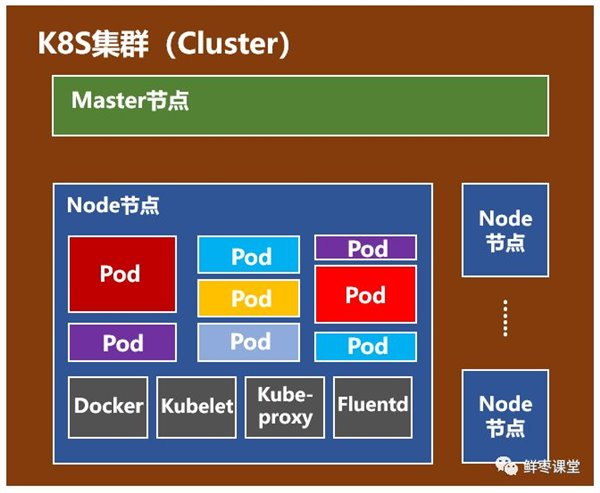

# 编排工具

1. docker compose(单机编排)，docker swarm(增加多机能力)，docker machine(把docker host初始化并加入docker swarm的管理之下)
2. mesos(资源管理器), marathon（将docker host资源抽像成mesos可管理资源）
3. kubernetes

# 什么是Kubernetes

Kubernetes（k8s）是自动化容器操作的开源平台，这些操作包括部署，调度和节点集群间扩展。如果你曾经用过Docker容器技术部署容器，那么可以将Docker看成Kubernetes内部使用的低级别组件。**Kubernetes不仅仅支持Docker，还支持Rocket，这是另一种容器技术**。

Kubernetes特性：

- 自动化容器的部署和复制
- 随时扩展或收缩容器规模
- 将容器组织成组，并且提供容器间的负载均衡
- 很容易地升级应用程序容器的新版本
- 密钥和配置管理
- 存储(docker volume)编排
- 批量处理执行
- 提供容器弹性，如果容器失效就替换它，等等...

下图展示了一个完整的K8s所拥有的元素，以及元素之间的关系。


**图元素解析**

1. 每个应用的运行都要依赖一个环境，对于一个 PHP 应用来说，这个环境包括了一个 webserver，一个可读的文件系统和 PHP 的 engine。（对应于图上web server的方框）
2. 容器为应用提供了隔离的环境，在这个环境里应用就能运行起来（对应于图container方框，比如docker可以是其容器）。但是这些相互隔离的容器需要管理，也需要跟外面的世界沟通。共享的文件系统，网络，调度，负载均衡和资源分配都是挑战。
3. pod代表着一个运行着的工作单元（对应于图pod方框）。通常，每个pod中只有一个容器，但有些情况下，如果几个容器是紧耦合的，这几个容器就会运行在同一个pod中。Kubernetes 承担了 pod与外界环境通信的工作。并且同一个Pod里的容器共享同一个网络命名空间，可以使用localhost互相通信;而且同一个Pod里的容器可以共享volume。Pod的里运行的多个容器，其中一个叫主容器，而其它的是辅助的，比如运行一个Nginx服务的Docker，但又需要收集Log这个时候就可以再启一个Log收集的服务Docker,前一个就叫主容器。
4. Replication controller 提供了一种管理任意数量 pod 的方式。一个 replication controller 包含了一个 pod 模板，这个模板可以被不限次数地复制。通过 replication controller，Kubernetes 可以管理 pod 的生命周期，包括扩/缩容，滚动部署和监控等功能。确保任意时间都有指定数量的Pod“副本”在运行。（对应于图replication controller方框）
   
   ```
    当创建Replication Controller时，需要指定两个东西：
    Pod模板：用来创建Pod副本的模板
    Label：Replication Controller需要监控的Pod的标签。
   ```

5. service 可以和 Kubernetes 环境中其它部分（包括其它 pod 和 replication controller）进行通信，告诉它们你的应用提供什么服务。Pod可以增减，但是 service 的 IP 地址和端口号是不变的。而且其它应用可以通过 Kubernetes 的服务发现找到你的 service。并且service是定义一系列Pod以及访问这些Pod的策略的一层抽象。Service通过Label找到Pod组。（对应service方框）
   ```
   假定有2个后台Pod，并且定义后台Service的名称为‘backend-service’，lable选择器为（tier=backend, app=myapp）。backend-service 的Service会完成如下两件重要的事情：
   1. 会为Service创建一个本地集群的DNS入口，因此前端Pod只需要DNS查找主机名为 ‘backend-service’，就能够解析出前端应用程序可用的IP地址。
   2. 现在前端已经得到了后台服务的IP地址，但是它应该访问2个后台Pod的哪一个呢？Service在这2个后台Pod之间提供透明的负载均衡，会将请求分发给其中的任意一个。通过每个Node上运行的代理（kube-proxy）完成。

   有一个特别类型的Kubernetes Service，称为'LoadBalancer'，作为外部负载均衡器使用，在一定数量的Pod之间均衡流量。比如，对于负载均衡Web流量很有用。
   ```
6. Volume 代表了一块容器可以访问和存储信息的空间，对于应用来说，volume 是一个本地的文件系统。实际上，除了本地存储，Ceph、Gluster、Elastic Block Storage 和很多其它后端存储都可以作为 volume。（对应于volume方框）
7. Namespace 是 Kubernetes 内的分组机制。Service，pod，replication controller 和 volume 可以很容易地和 namespace 配合工作，但是 namespace 为集群中的组件间提供了一定程度的隔离。（对应于namespace方框）

另一个重要概念label：Kubernetes的Label是attach到Pod的一对键/值对，用来传递用户定义的属性。来区分事物，还可以根据 label 来查询。label 是开放式的：可以根据角色，稳定性或其它重要的特性来指定。比如，你可能创建了一个"tier"和“app”标签，通过Label（tier=frontend, app=myapp）来标记前端Pod容器，使用Label（tier=backend, app=myapp）标记后台Pod。

# Kubernetes框架

一个K8S系统，通常称为一个K8S集群（Cluster）。

这个集群主要包括两个部分：

一个Master节点（主节点）

一群Node节点（计算节点）

下图是整体结构，是一个主从式集群，Master结点可冗余配置，负责管理和控制。Node节点是工作负载节点，里面是具体的容器。


**Master节点**


Master节点包括API Server、Scheduler、Controller manager、etcd。

API Server是整个系统的对外接口，供客户端和其它组件调用，相当于“营业厅”。

Scheduler负责对集群内部的资源进行调度，相当于“调度室”。

Controller manager负责管理控制器，相当于“大总管”。

**Node节点**



Node节点包括Docker、kubelet、kube-proxy、Fluentd、kube-dns（可选），还有就是Pod。

Docker: 创建容器的，但k8s支持的容器并不只限于Docker。

Kubelet: 主要负责监视（即Master Scheduler）指派到它所在Node上的Pod，包括创建、修改、监控、删除等。

Kube-proxy: 主要负责为Pod对象提供代理。

Fluentd: 主要负责日志收集、存储与查询。


```
Pod是Kubernetes最基本的操作单元。一个Pod代表着集群中运行的一个进程，它内部封装了一个或多个紧密相关的容器。除了Pod之外，K8S还有一个Service的概念，一个Service可以看作一组提供相同服务的Pod的对外访问接口。
```

[参考引用](https://blog.csdn.net/wenjianfeng/article/details/90130895)

# Kubeadm

kubeadm 能帮助您建立一个小型的符合最佳实践的 Kubernetes 集群。通过使用 kubeadm, 您的集群会符合 Kubernetes 合规性测试的要求. Kubeadm 也支持其他的集群生命周期操作，比如升级、降级和管理启动引导令牌。

因为您可以在不同类型的机器（比如笔记本、服务器和树莓派等）上安装 kubeadm，因此它非常适合与 Terraform 或 Ansible 这类自动化管理系统集成。

kubeadm 的简单便捷为大家带来了广泛的用户案例：
- 新用户可以从 kubeadm 开始来试用 Kubernetes。
- 熟悉 Kubernetes 的用户可以使用 kubeadm 快速搭建集群并测试他们的应用。
- 大型的项目可以将 kubeadm 和其他的安装工具一起形成一个比较复杂的系统。

kubeadm 的设计初衷是为新用户提供一种便捷的方式来首次试用 Kubernetes， 同时也方便老用户搭建集群测试他们的应用。 此外 kubeadm 也可以跟其它生态系统与/或安装工具集成到一起，提供更强大的功能。


kubeadm config print init-defaults 来查看kubeadm的启动配置，更多命令命使用kubeadm help或者Use "kubeadm [command] --help" for more information about a command.

```
Note:
注意: 如果您的机器已经安装了 kubeadm, 请运行 apt-get update && apt-get upgrade 或者 yum update 来升级至最新版本的 kubeadm.

升级过程中，kubelet 会每隔几秒钟重启并陷入了不断循环等待 kubeadm 发布指令的状态。 这个死循环的过程是正常的，当升级并初始化完成您的主节点之后，kubelet 才会正常运行。

kubeadm 的整体功能目前还是 Beta 状态，然而很快在 2018 年就会转换成正式发布 (GA) 状态。

Kubernetes 发现版本的通常只维护支持九个月，在维护周期内，如果发现有比较重大的 bug 或者安全问题的话， 可能会发布一个补丁版本。同时也适用于 kubeadm。
```

## kubeadm集群配置

```bash
Example usage:

Create a two-machine cluster with one control-plane node
(which controls the cluster), and one worker node
(where your workloads, like Pods and Deployments run).

┌──────────────────────────────────────────────────────────┐
│ On the first machine:                                    │
├──────────────────────────────────────────────────────────┤
│ control-plane# kubeadm init                              │
└──────────────────────────────────────────────────────────┘

┌──────────────────────────────────────────────────────────┐
│ On the second machine:                                   │
├──────────────────────────────────────────────────────────┤
│ worker# kubeadm join <arguments-returned-from-init>      │
└──────────────────────────────────────────────────────────┘

You can then repeat the second step on as many other machines as you like.
```

安装参考(https://blog.csdn.net/qq_14845119/article/details/83349471)