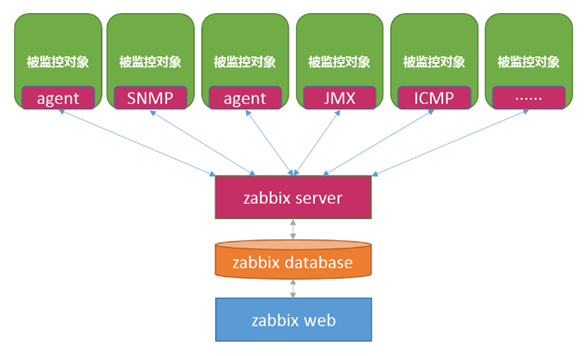
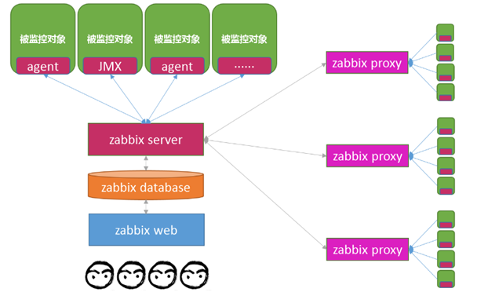
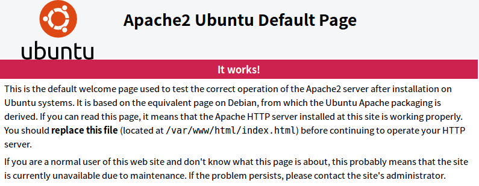
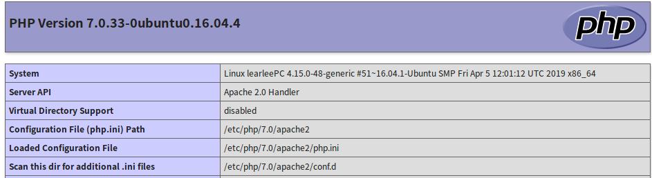
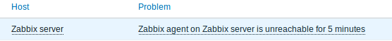

# Zabbix

zabbix（[`zæbiks]）是一个基于WEB界面的提供分布式系统监视以及网络监视功能的企业级的开源解决方案。

zabbix由2部分构成，zabbix server与可选组件zabbix agent。

zabbix server可以通过SNMP，zabbix agent，ping，ssh/telnet,IPMI,JMX,端口监视等方法提供对远程服务器/网络状态的监视，数据收集等功能，它可以运行在Linux，Solaris，HP-UX，AIX，Free BSD，Open BSD，OS X等平台上。

Zabbix 是基于先进 Apache Web 服务器、领先的数据库引擎和 PHP 脚本语言构建的。
- Apache 	1.3.12 或以上 	
- PHP 	5.4.0 或以上 
- DB 见下列表
 
| 数据库 | 版本 | 备注 |
|:----|:----|:----| 
|Apache|1.3.12 或以上 |使用 MySQL 作为 Zabbix 后端数据库。需要InnoDB引擎。
MariaDB 同样支持。 |
|Oracle|10g or later |	使用 Oracle 作为 Zabbix 后端数据库。 |
|PostgreSQL |	8.1 or later |	使用 PostgreSQL 作为 Zabbix 后端数据库。
建议使用 PostgreSQL 8.3 以上的版本, 以 提供更好的VACUUM性能。 |
|IBM DB2 |	9.7 or later |	使用 DB2 作为 Zabbix 后端数据库。
|SQLite |	3.3.5 or later |	只有 Zabbix proxy 支持 SQLite ，可以使用 SQLite 作为 Zabbix proxy 数据库。 

## 数据库容量

Zabbix 配置文件数据需要固定数量的磁盘空间，且增长不大。

Zabbix 数据库大小主要取决于这些变量，这些变量决定了存储的历史数据量:

**每秒处理值的数量**

这是 Zabbix server 每秒接收的新值的平均数。 例如，如果有3000个监控项用于监控，取值间隔为60秒，则这个值的数量计算为 3000/60 = 50 。

这意味着每秒有 50 个新值被添加到 Zabbix 数据库中。

**关于历史数据的管家设置**

Zabbix 将接收到的值保存一段固定的时间，通常为几周或几个月。 每个新值都需要一定量的磁盘空间用于数据和索引。

所以，如果我们每秒收到 50 个值，且希望保留 30 天的历史数据，值的总数将大约在 (30*24*3600)* 50 = 129.600.000，即大约 130M 个值。

根据所使用的数据库引擎，接收值的类型（浮点数、整数、字符串、日志文件等），单个值的磁盘空间可能在 40 字节到数百字节之间变化。 通常，数值类型的每个值大约为 90 个字节。

在上面的例子中，这意味着 130M 个值需要占用 130M * 90 bytes = 10.9GB 磁盘空间。 

**趋势数据的管家设置**

Zabbix 为表 trends 中的每个项目保留1小时的最大值 / 最小值 / 平均值 / 统计值。 该数据用于趋势图形和历史数据图形。 这一个小时的时间段是无法自定义。

Zabbix数据库，根据数据库类型，每个值总共需要大约90个字节。

假设我们希望将趋势数据保持5年。 3000 个监控项的值每年需要占用 3000*24*365* 90 = 2.2GB 空间，或者5年需要占用 11GB 空间。 

下表包含可用于计算 Zabbix 系统所需磁盘空间的公式： 

- Zabbix : 配置文件 :固定大小。通常为 10MB 或更少。
- History : days*(items/refresh rate)*24*3600*bytes
  - items：监控项数量。
  - days：保留历史数据的天数。
  - refresh rate：监控项的更新间隔。
  - bytes：保留单个值所需要占用的字节数，依赖于数据库引擎，通常为 ~90 字节。 
- Trends : days*(items/3600)*24*3600*bytes
  - items：监控项数量。
  - days：保留历史数据的天数。
  - bytes：保留单个趋势数据所需要占用的字节数，依赖于数据库引擎，通常为 ~90 字节。 
- Events: days*events*24*3600*bytes
  - events：每秒产生的事件数量。假设最糟糕的情况下，每秒产生 1 个事件。
  - days：保留历史数据的天数。
  - bytes：保留单个趋势数据所需的字节数，取决于数据库引擎，通常为 ~170 字节

因此，所需要的磁盘总空间按下列方法计算：

**配置文件数据+ 历史数据+ 趋势数据+ 事件数据**

**事件的管家设置**

每个 Zabbix 事件需要大约 170 个字节的磁盘空间。 很难估计 Zabbix 每天生成的事件数量。 在最坏的情况下，假设 Zabbix 每秒生成一个事件。

这意味着如果想要保留3年的事件，这将需要占用 3*365*24*3600* 170 = 15GB 的空间。 

[原文](https://www.zabbix.com/documentation/4.0/zh/manual/installation/requirements)


## 时间同步

在运行 Zabbix 的服务器上拥有精确的系统日期非常重要。 ntpd 是最受欢迎的守护进程，它将主机的时间与其他服务器的时间同步。 对于所有运行 Zabbix 组件的系统，强烈建议这些系统的时间保持同步。

如果时间未同步，Zabbix将在建立数据连接之后，根据得到的客户端和服务器的时间戳，并通过客户端和服务器的时间差对获得值的时间戳进行调整，将获得值的时间戳转化为 Zabbix server 的时间。 为了尽可能简化并且避免可能的并发问题出现，网络延迟将会被忽略。因此，通过主动连接（active agent, active proxy, sender）获得的时间戳数据将包含网络延迟，通过被动连接（passive proxy）获得的数据已经减去了网络延迟。所有其他监控类型都在服务器时间里完成，并且不会调整其时间戳。


[原文](https://www.zabbix.com/documentation/4.0/zh/manual/installation/requirements)

## Zabbix 架构

Zabbix的整体框架如下图所示：



- zabbix agent : 部署在被监控目标上，用于主动监控本地资源和应用程序，并将收集的数据发送给 Zabbix server
  
  ```
  被动检查 模式中 agent 应答数据请求。Zabbix server（或 proxy）询求数据，例如 CPU load，然后 Zabbix agent 返还结果。

  主动检查 处理过程将相对复杂。Agent 必须首先从 Zabbix sever 索取监控项列表以进行独立处理，然后会定期发送采集到的新值给 Zabbix server。 
  ```

- zabbix server : 是 Zabbix软件的核心组件，agent 向其报告可用性、系统完整性信息和统计信息。server也是存储所有配置信息、统计信息和操作信息的核心存储库

- zabbix database : 存储监控对像数据

- zabbix web : php编写的GUI（所以如果需要展示信息需要依赖LAMP）
  


如果当监控的服务器变多，可以使用代理的方式来分担Zabbix Server压力，并通proxy分组的形式也会使监控变的容管理。这个时候proxy在每个代理组中可以理解为该组中的“Zabbix Server”，由Proxy收集完的数据最后再统一提交给Zabbix Server处理



- zabbix proxy : 可选组件，用于分布式监控环境中，zabbix proxy代表server端，完成组内信息收集，最终发给zabbix server

zabbix的主要特点：
- 安装与配置简单，学习成本低
- 支持多语言（包括中文）
- 免费开源
- 自动发现服务器与网络设备
- 分布式监视以及WEB集中管理功能
- 可以无agent监视
- 用户安全认证和柔软的授权方式
- 通过WEB界面设置或查看监视结果
- email等通知功能

Zabbix监控内容：
- CPU负荷
- 内存使用
- 磁盘使用
- 网络状况
- 端口监视
- 日志监视。

## Zabbix自动化核心功能介绍

Zabbix是企业级监控解决方案，和自动化相关的核心功能包括：LLD、API、Zabbix_trapper。

**LLD** : 通过LLD能自动发现并自动发现添加新部署实例的监控项，包括Item、Trigger这些的自动添加，做到一次部署永久受益，提高数据库监控人员的幸福值。这样就解决了当监控的内容比较多的时候，此时每次添加一批实例都去手动部署监控、配置告警的话就会造成大量人力的消耗。

**API** ： API是Zabbix中非常强大的功能，通过调用API可以将Zabbix和其他系统串联到一起，在自动化运维环境中非常有用。Zabbix API是一个JSON-RPC的API，通过http请求，它提供了几乎所有Zabbix的功能，比如更新Item、添加Host监控等。

**Zabbix_trapper** ： Zabbix_trapper是不通过zabbix-client收集数据，直接主动向Zabbix Server发送数据的一种方式。我们监控数据库，如果使用Agent的方式发送，要用到agent conf文件中的userParameter，这样需要接受一个参数，来返回对应的监控数据，这样等于有多少个Item就要在一次监控周期内执行多少次命令，并且对数据库说也是要建立相应次的短链接，增加了数据库的负担。此外，在监控的数据库实例比较多的情况下，也将给Zabbix Server带来较大的压力，可以通过使用trapper的方式，一次搜集所有的监控数据到一个JSON中，并且只给Zabbix Server发送一次。

## Zabbix安装

安装步骤如下：

1. 安装Apache2 HTTP Server

```bash
sudo apt update
sudo apt install apache2

#the commands below can be used to stop, start and enable Apache2 service to always start up with the server boots.

sudo systemctl stop apache2.service
sudo systemctl start apache2.service
sudo systemctl enable apache2.service
```
启动后可以通过http://localhost看到 默认页


2. 安装MariaDB

```sudo apt-get install mariadb-server mariadb-client```

安装完成后，可以使用下面命令去start stop 随机启动

```bash
#Run these on Ubuntu 16.04 LTS
sudo systemctl stop mysql.service
sudo systemctl start mysql.service
sudo systemctl enable mysql.service

#Run these on Ubuntu 18.04 and 18.10 LTS
sudo systemctl stop mariadb.service
sudo systemctl start mariadb.service
sudo systemctl enable mariadb.service

```   

完成后，运行```sudo mysql_secure_installation```命令使MariaDB Server更加安全

当有提示弹出时按下面操作进行设置

    Enter current password for root (enter for none): Just press the Enter
    Set root password? [Y/n]: Y
    New password: Enter password
    Re-enter new password: Repeat password
    Remove anonymous users? [Y/n]: Y
    Disallow root login remotely? [Y/n]: Y
    Remove test database and access to it? [Y/n]:  Y
    Reload privilege tables now? [Y/n]:  Y

最后通过 ```sudo mysql -u root -p```命令看是否能按你设定的密码成功登录

3.  安装PHP7.2和相关Modules

  a) 安装PHP7.2和相磁modules

  ```bash
  sudo apt-get install software-properties-common
  sudo add-apt-repository ppa:ondrej/php

  #Then update and upgrade to PHP 7.2
  sudo apt update

  #Next, run the commands below to install PHP 7.2 and related modules.
  sudo apt install php7.2 libapache2-mod-php7.2 php7.2-common php7.2-mysql php7.2-gmp php7.2-curl php7.2-intl php7.2-mbstring php7.2-xmlrpc php7.2-mysql php7.2-gd php7.2-xml php7.2-cli php7.2-zip
  ```

  b) 创建phpinfo.php，并发到Apache2根目录下 
  
  ``` bash
  sudo nano /var/www/html/phpinfo.php
  #Then type the content below and save the file.
  <?php phpinfo( ); ?>
  ```
  
  c) http://localhost/phpinfo.php 访问刚创建的网页

  

  d) 完成其中Loaded Configuration File 指定文件的设置，要不然后面zabbix进行第二步验证的时候不会通过

  ```bash
  sudo vi /etc/php/7.0/apache2/php.ini

  file_uploads = On
  allow_url_fopen = On
  short_open_tag = On
  memory_limit = 256M
  upload_max_filesize = 100M
  max_execution_time = 360
  date.timezone = Asia/Shanghai
  ```

  e) 配置完成后重启服务 ```sudo systemctl restart apache2.service```


4. 安装zabbix
  
  [zabbix](https://www.zabbix.com/download)官方网站会依据你的OS、OS VERSION、DATABASE选择给出不同的安装指令，过程如下

  a) 选择平台，通过选择你的OS、OS VERSION、DATABASE第二步会给出适合的安装命令

  ```
  ZABBIX VERSION：4.0LTS
  OS DISTRIBUTION:Ubuntu 
  OS VERSION：16.04
  DATABASE：MySQL
  ```

  b) 安装配置Zabbix：通过第一步的设定，该部分的安装程序命令按要求适应你的选择
   
   - 安装Zabbix仓库
   
   ```bash
   # wget https://repo.zabbix.com/zabbix/4.0/ubuntu/pool/main/z/zabbix-release/zabbix-release_4.0-2+xenial_all.deb
   # dpkg -i zabbix-release_4.0-2+xenial_all.deb
   # apt update 
   ``` 

   - 安装Zabbix server,frontend, agent

   ```bash
   # apt -y install zabbix-server-mysql zabbix-frontend-php zabbix-agent 
   ```

5. 创建zabbix数据库及初始化数据

  ```bash
  sudo mysql -u root -p
   
  # Then create a database called zabbix
  CREATE DATABASE zabbix character set utf8 collate utf8_bin;
  # Next, run the commands below to open MariaDB default config file…
  sudo vi /etc/mysql/mariadb.conf.d/50-server.cnf
  
  #Create a database user called zabbixuser with new password，这步的数据库用户名和密码最后是要配置到zabbix_server.conf中
  CREATE USER 'zabbixuser'@'localhost' IDENTIFIED BY 'new_password_here';
    
  #Then grant the user full access to the database.
  GRANT ALL ON zabbix.* TO 'zabbixuser'@'localhost' IDENTIFIED BY 'user_password_here' WITH GRANT OPTION;
  #save your changes and exit db
  FLUSH PRIVILEGES;
  EXIT;

  # finally, use zabbix sql file to create db and insert value.这里用zabbixuser就是前面创建的用户帐号
  zcat /usr/share/doc/zabbix-server-mysql/create.sql.gz | mysql -u zabbixuser -p zabbix
  ```
6. 配置Zabbix

  ```bash
  sudo vi /etc/zabbix/zabbix_server.conf

  #Then make the changes below and save the file…
  DBName=zabbix  
  DBUser=zabbixuser  #刚创建建的能操作zabbix数据库的用户
  DBPassword= zabbixuser_password_here #对应数据库用户的密码
  
  # run the commands below to open Zabbix agent config file加入主机名
  sudo nano /etc/zabbix/zabbix_agentd.conf
  Hostname=your_host_name
  ```

7. 重启apache2和zabbix服务

```bash
sudo systemctl restart zabbix-server
sudo systemctl enable zabbix-server
sudo systemctl reload apache2.service

#Now open your browser and browse to the Zabbix hostname or IP address followed by /zabbix/
http://your_host_name/zabbix/

# You should see Zabbix setup page
  step1: welcome
  step2: Check of pre-requisites #以上两步都不需要做什么,如果检查有问题会在有问题的过地方打出红叉
  step3: Configure DB connection #设置用那个库，以那个数据库用户登录及其密码。“创建 zabbix数据库及初始化数据”中设置的
  step4: Zabbix server details #就写一个主机名。Linux中用hostname命令就能拿到在zabbix_server.conf中也有配过
  step5: Pre-installation summary
  step6: install #56两步也不需要干预

```
8. 登录zabbix
When you’re done, logon with: Case Sensitive
Username: Admin
Password zabbix

9. 这一会你会发现在Monitoring-->Dashboard页下会在Problems里看到Zabbix agent on Zabbix server is unreachable for 5 minutes的错，如下图所示。这是因为在安装Zabbix Server的时候给默认创建了Zabbix server监控，所以只需要在Zabbix server机器上使用```sudo sysytemctl start zabbix-agent```启动agent即可。但要看到数据要过2分钟左右。（通过本文安装过程安装的Zabbix会包含Server和Agent两部分,server的配置文件在第6步讲过，agent在/etc/zabbix/zabbix_agentd.conf）




参考：

[参考博客地址](https://websiteforstudents.com/how-to-install-zabbix-4-0-monitoring-system-with-apache2-mariadb-and-php-7-2-on-ubuntu-16-04-18-04-18-10/)

[zabbix](https://www.zabbix.com/download)官方网站安装指南

