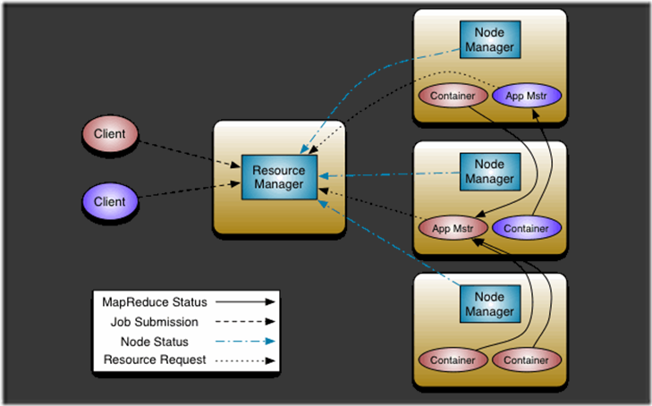
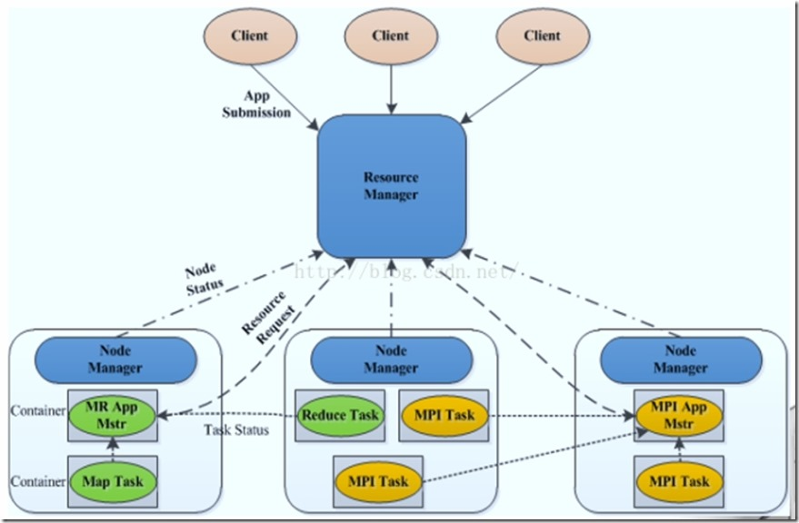

# 一、YARN介绍

　　YARN总体上仍然是Master/Slave结构，在整个资源管理框架中，ResourceManager为Master，NodeManager为Slave,ResourceManager负责对各个NodeManager上的资源进行统一管理和调度。当用户提交一个应用程序时，需要提供一个用以跟踪和管理这个程序的ApplicationMaster，它负责向ResourceManager申请资源，并要求NodeManager启动可以占用一定资源的任务。

　　 Hadoop2.0 YARN包含以下实体，可以看图：



　　YARN总体上仍然是master/slave结构，在整个资源管理框架中，resourcemanager为master，nodemanager是slave。Resourcemanager负责对各个nademanger上资源进行统一管理和调度。当用户提交一个应用程序时，需要提供一个用以跟踪和管理这个程序的ApplicationMaster，它负责向ResourceManager申请资源，并要求NodeManger启动可以占用一定资源的任务。由于不同的ApplicationMaster被分布到不同的节点上，因此它们之间不会相互影响。

　　YARN的基本组成结构，YARN主要由ResourceManager、NodeManager、ApplicationMaster和Container等几个组件构成。

　　ResourceManager是Master上一个独立运行的进程，负责集群统一的资源管理、调度、分配等等；NodeManager是Slave上一个独立运行的进程，负责上报节点的状态；App Master和Container是运行在Slave上的组件，Container是yarn中分配资源的一个单位，包涵内存、CPU等等资源，yarn以Container为单位分配资源。

　　Client向ResourceManager提交的每一个应用程序都必须有一个Application Master，它经过ResourceManager分配资源后，运行于某一个Slave节点的Container中，具体做事情的Task，同样也运行与某一个Slave节点的Container中。RM，NM，AM乃至普通的Container之间的通信，都是用RPC机制。

　　通信如下图所示



**1.Resourcemanager (RM)**

　　RM是一个全局的资源管理器，集群只有一个，负责整个系统的资源管理和分配，包括处理客户端请求、启动/监控APP master、监控nodemanager、资源的分配与调度。它主要由两个组件构成：调度器（Scheduler）和应用程序管理器（Applications Manager，ASM）。

（1）调度器（Scheduler）

　　调度器根据容量、队列等限制条件（如每个队列分配一定的资源，最多执行一定数量的作业等），将系统中的资源分配给各个正在运行的应用程序。需要注意的是，该调度器是一个“纯调度器”，它不再从事任何与具体应用程序相关的工作，比如不负责监控或者跟踪应用的执行状态等，也不负责重新启动因应用执行失败或者硬件故障而产生的失败任务，这些均交由应用程序相关的ApplicationMaster完成。调度器仅根据各个应用程序的资源需求进行资源分配，而资源分配单位用一个抽象概念“资源容器”（Resource Container，简称Container）表示，Container是一个动态资源分配单位，它将内存、CPU、磁盘、网络等资源封装在一起，从而限定每个任务使用的资源量。此外，该调度器是一个可插拔的组件，用户可根据自己的需要设计新的调度器，YARN提供了多种直接可用的调度器，比如Fair Scheduler和Capacity Scheduler等。

（2）应用程序管理器（ApplicationsManager，ASM）

　　应用程序管理器负责管理整个系统中所有应用程序，包括应用程序提交、与调度器协商一个容器以启动ApplicationMaster、监控ApplicationMaster运行状态并在失败时重新启动它等。

　　为了完成该功能，ASM主要有以下几个组件：

  1. SchedulerNegotiator：与调度器协商容器资源，用来启动AM
  2. AMContainerManager：告知NM，启动或者停止某个AM的容器
  3. AMMonitor：查看AM是否活着，并在必要的时候重启AM

**2.ApplicationMaster（AM）**

　　管理YARN内运行的应用程序的每个实例。用户提交每个应用程序均包含一个AM，主要功能与RM调度器协商以获取资源，进一步分配给内部的任务，与NM通信启动/停止任务，监控任务的运行状态。

功能：

1. 数据切分
2. 计算应用程序所需的资源量，并转化成调度器可识别的格式（协议）
3. 为应用程序申请资源并进一步分配给内部任务。
4. 负责协调来自resourcemanager的资源，并通过nodemanager（NM）监视容易的执行和资源使用情况。
5. 任务监控与容错
6. 如果container出现故障，AM会重新向调度器申请资源.
7. AM出现故障后，ASM会重启它，而由AM自己从之前保存的应用程序执行状态中恢复应用程序。

```
注：在MapReduce中，由于AM会定时的保存job的运行时状态，因此，当AM重启时可以恢复对应的job，按照粒度有三种策略：

1. 整个作业重新计算
2. 保存已经完成的map task和reduce task，只重新计算未完成的task
3. 保存task的进度，从task断点处开始计算，如：某个task完成了20%，则AM重启后，让该task从20%处开始计算。
```

**3. NodeManager（NM）**

　　Nodemanager整个集群有多个，负责每个节点上的资源和使用。定时向RM汇报本节上的资源使用情况和各个Container的运行状态，接受并处理来自AM的Container启动/停止等各种请求。

功能：

1. 单个节点上的资源管理和任务。
2. 处理来自于resourcemanager的命令。
3. 处理来自域app master的命令。

　　Nodemanager管理着抽象容器，这些抽象容器代表着一些特定程序使用针对每个节点的资源。
Nodemanager定时地向RM汇报本节点上的资源使用情况和各个Container的运行状态（cpu和内存等资源）

```
　　Container的运行是由ApplicationMaster向资源所在的NodeManager发起的或者ApplicationsManager（ASM）向次源所在的NodeManager发起的，Container运行时需提供内部执行的任务命令（可以使任何命令，比如java、Python、C++进程启动命令均可）以及该命令执行所需的环境变量和外部资源（比如词典文件、可执行文件、jar包等）。

　　另外，一个应用程序所需的Container分为两大类，如下：

　　（1）运行ApplicationMaster的Container：这是由ResourceManager（向内部的资源调度器）申请和启动的，用户提交应用程序时，可指定唯一的ApplicationMaster所需的资源；

　　（2）运行各类任务的Container：这是由ApplicationMaster向ResourceManager申请的，并由ApplicationMaster与NodeManager通信以启动之。

以上两类Container可能在任意节点上，它们的位置通常而言是随机的，即ApplicationMaster可能与它管理的任务运行在一个节点上。
```

**4.Container**

　　Container是YARN中的资源抽象，它封装了某个节点上的多维度资源，如内存、CPU、磁盘、网络等，当AM向RM申请资源时，RM为AM返回的资源便是用Container表示的。YARN会为每个任务分配一个Container，且该任务只能使用该Container中描述的资源。需要注意的是，Container不同于MRv1中的slot，它是一个动态资源划分单位，是根据应用程序的需求动态生成的。目前为止，YARN仅支持CPU和内存两种资源，且使用了轻量级资源隔离机制Cgroups进行资源隔离。

功能：

1. 对task环境的抽象
2. 描述一系列信息
3. 任务运行资源的集合（cpu、内存、io等）
4. 任务运行环境

# 二、YARN的资源管理

1、资源调度和隔离是yarn作为一个资源管理系统，最重要且最基础的两个功能。资源调度由resourcemanager完成，而资源隔离由各个nodemanager实现。

2、Resourcemanager将某个nodemanager上资源分配给任务（这就是所谓的“资源调度”）后，nodemanager需按照要求为任务提供相应的资源，甚至保证这些资源应具有独占性，为任务运行提供基础和保证，这就是所谓的资源隔离。

3、当谈及到资源时，我们通常指内存、cpu、io三种资源。Hadoop yarn目前为止仅支持cpu和内存两种资源管理和调度。

4、内存资源多少决定任务的生死，如果内存不够，任务可能运行失败；相比之下，cpu资源则不同，它只会决定任务的快慢，不会对任务的生死产生影响。

**Yarn的内存管理：**

　　yarn允许用户配置每个节点上可用的物理内存资源，注意，这里是“可用的”，因为一个节点上内存会被若干个服务贡享，比如一部分给了yarn，一部分给了hdfs，一部分给了hbase等，yarn配置的只是自己可用的。

1.  yarn.nodemanager.resource.memory-mb：表示该节点上yarn可以使用的物理内存总量，默认是8192m，注意，如果你的节点内存资源不够8g，则需要调减这个值，yarn不会智能的探测节点物理内存总量。

3. yarn.nodemanager.vmem-pmem-ratio：任务使用1m物理内存最多可以使用虚拟内存量，默认是2.1。

4. yarn.nodemanager.pmem-check-enabled：是否启用一个线程检查每个任务证使用的物理内存量，如果任务超出了分配值，则直接将其kill，默认是true。

5. yarn.nodemanager.vmem-check-enabled：是否启用一个线程检查每个任务证使用的虚拟内存量，如果任务超出了分配值，则直接将其kill，默认是true。

6. yarn.scheduler.minimum-allocation-mb：单个任务可以使用最小物理内存量，默认1024m，如果一个任务申请物理内存量少于该值，则该对应值改为这个数。

7. yarn.scheduler.maximum-allocation-mb：单个任务可以申请的最多的内存量，默认8192m

**Yarn cpu管理：**

　　目前cpu被划分为虚拟cpu，这里的虚拟cpu是yarn自己引入的概念，初衷是考虑到不同节点cpu性能可能不同，每个cpu具有计算能力也是不一样的，比如，某个物理cpu计算能力可能是另外一个物理cpu的2倍，这时候，你可以通过为第一个物理cpu多配置几个虚拟cpu弥补这种差异。用户提交作业时，可以指定每个任务需要的虚拟cpu个数。在yarn中，cpu相关配置参数如下：

1. yarn.nodemanager.resource.cpu-vcores：表示该节点上yarn可使用的虚拟cpu个数，默认是8个，注意，目前推荐将该值为与物理cpu核数相同。如果你的节点cpu合数不够8个，则需要调减小这个值，而yarn不会智能的探测节点物理cpu总数。

2. yarn.scheduler.minimum-allocation-vcores：单个任务可申请最小cpu个数，默认1，如果一个任务申请的cpu个数少于该数，则该对应值被修改为这个数

3. yarn.scheduler.maximum-allocation-vcores：单个任务可以申请最多虚拟cpu个数，默认是32.

# 一个应用程序在YARN上的运行步骤　

步骤1：用户将应用程序提交到ResourceManager上；

步骤2：ResourceManager为应用程序ApplicationMaster申请资源，并与某个NodeManager通信，以启动ApplicationMaster；

步骤3：ApplicationMaster与ResourceManager通信，为内部要执行的任务申请资源，一旦得到资源后，将于NodeManager通信，以启动对应的任务。

步骤4：所有任务运行完成后，ApplicationMaster向ResourceManager注销，整个应用程序运行结束。
