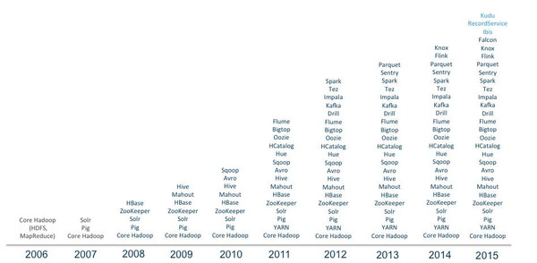
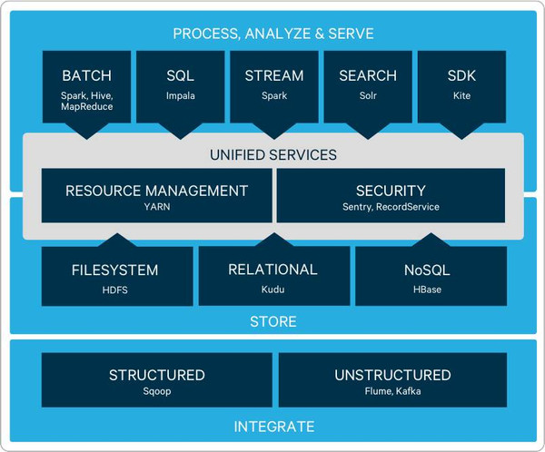
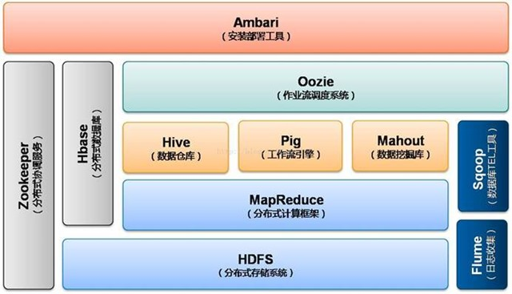
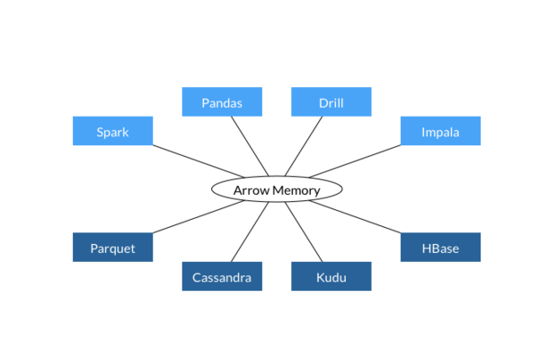
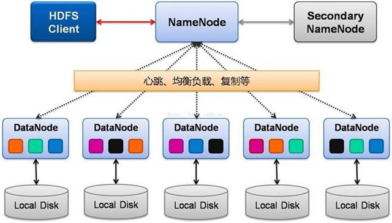
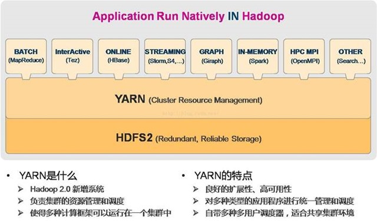

# Hadoop简介
https://blog.csdn.net/c929833623lvcha/article/details/81220612  一些图需要从中拿到整合到文档中

## Hadoop演进



　　2006年项目成立的一开始，“Hadoop”这个单词只代表了两个组件——HDFS和MapReduce。这个单词代表的是“核心”（即Core Hadoop项目:HDFS与MapReduce）以及与之相关的一个不断成长的生态系统。这个和Linux非常类似，都是由一个核心和一个生态系统组成。

　　已经从传统的Hadoop三驾马车HDFS，MapReduce和HBase社区发展为60多个相关组件组成的庞大生态，其中包含在各大发行版中的组件就有25个以上，包括数据存储、执行引擎、编程和数据访问框架等。

　　Hadoop在2.0将资源管理从MapReduce中独立出来变成通用框架后，就从1.0的三层结构演变为了现在的四层架构：
  1. 底层——存储层，文件系统HDFS
  2. 中间层——资源及数据管理层，YARN以及Sentry等
  3. 上层——MapReduce、Impala、Spark等计算引擎
  4. 顶层——基于MapReduce、Spark等计算引擎的高级封装及工具，如Hive、Pig、Mahout等等



　　**Hadoop系统架构图演进对比**

　　下图为hadoop1.0时期的架构,从图中可以看出,这个时期还没有把资源管理抽象出来,所有的应用都架构在MapReduce之上.



　　到了hadoop2.0时期最明显的变化即是把各个任务的监管下放给了每个用户提交的应用自己的AM(下面YARN章节会专门描述),而YARN只负责资源分配与监管、AM启动与监管。MapReduce也变为了YARN下的一个“应用”,细节见下图。


### 存储层

　　HDFS已经成为了大数据磁盘存储的事实标准，用于海量日志类大文件的在线存储。经过这些年的发展，HDFS的架构和功能基本固化，像HA、异构存储、本地数据短路访问等重要特性已经实现。

　　随着HDFS越来越稳定，社区的活跃度也越来越低，同时HDFS的使用场景也变得成熟和固定，而上层会有越来越多的文件格式封装：列式存储的文件格式，如Parquent，很好的解决了现有BI类数据分析场景；以后还会出现新的存储格式来适应更多的应用场景，如数组存储来服务机器学习类应用等。未来HDFS会继续扩展对于新兴存储介质和服务器架构的支持。

　　2015年HBase 发布了1.0版本，这也代表着 HBase 走向了稳定。未来HBase不会再添加大的新功能，而将会更多的在稳定性和性能方面进化，尤其是大内存支持、内存GC效率等。

　　Kudu是Cloudera在2015年10月才对外公布的新的分布式存储架构，与HDFS完全独立。其实现参考了2012年Google发表的Spanner论文。鉴于Spanner在Google 内部的巨大成功，Kudu被誉为下一代分析平台的重要组成，用于处理快速数据的查询和分析，填补HDFS和HBase之间的空白。其出现将进一步把Hadoop市场向传统数据仓库市场靠拢。

　　Apache Arrow项目为列式内存存储的处理和交互提供了规范。目前来自Apache Hadoop社区的开发者们致力于将它制定为大数据系统项目的事实性标准。



#### HDFS的架构



　　Active Namenode：主 Master（只有一个），管理 HDFS 的名称空间，管理数据块映射信息；配置副本策略；处理客户端读写请求

　　Secondary NameNode：NameNode 的热备；定期合并 fsimage 和 fsedits，推送给 NameNode；当Active NameNode 出现故障时，快速切换为新的 Active NameNode。

　　Datanode：Slave（有多个）；存储实际的数据块；执行数据块读 / 写

　　Client：与 NameNode 交互，获取文件位置信息；**与 DataNode 交互，读取或者写入数据**；管理 HDFS、访问HDFS。例如：MR程序就是一种client, Spark也是一种client即只要是由YARN调度的都可以理解成一种client

### 管控层

　　管控又分为数据管控和资源管控。

　　随着Hadoop集群规模的增大以及对外服务的扩展，如何有效可靠的共享利用资源是管控层需要解决的问题。脱胎于MapReduce1.0的YARN成为了Hadoop 2.0通用资源管理平台。由于占据了Hadoop的地利，业界对其在资源管理领域未来的前景非常看好。

　　传统其他资源管理框架如Mesos，还有现在兴起的Docker等都会对YARN未来的发展产生影响。如何提高YARN性能、如何与容器技术深度融合，如何更好的适应短任务的调度，如何更完整的多租户支持、如何细粒度的资源管控等都是企业实际生产中迫在眉睫的需求，需要YARN解决。要让Hadoop走得更远，未来YARN需要做的工作还很多。

　　另一方面大数据的安全和隐私越来越多的受到关注。Hadoop依靠且仅依靠Kerberos来实现安全机制，但每一个组件都将进行自己的验证和授权策略。开源社区似乎从来不真正关心安全问题，如果不使用来自Hortonworks的Ranger或来自Cloudera的Sentry这样的组件，那么大数据平台基本上谈不上安全可靠。

　　Cloudera刚推出的RecordService组件使得Sentry在安全竞赛中拔得先机。RecordService不仅提供了跨所有组件一致的安全颗粒度，而且提供了基于Record的底层抽象（有点像Spring，代替了原来Kite SDK的作用），让上层的应用和下层存储解耦合的同时、提供了跨组件的可复用数据模型。

### 计算引擎层

　　Hadoop生态和其他生态最大的不同之一就是“单一平台多种应用”的理念了。传的数据库底层只有一个引擎，只处理关系型应用，所以是“单一平台单一应用”；而NoSQL市场有上百个NoSQL软件(比如cassandra,mongoDB等)，每一个都针对不同的应用场景且完全独立，因此是“多平台多应用”的模式。而Hadoop在底层共用一份HDFS存储（现在存储层也可以用HBase和Kudu,但HBase的实际存储是存在HDFS中的。管理层是统一的，所以对计算引擎层是透明的），上层有很多个组件分别服务多种应用场景，如：

- 确定性数据分析：主要是简单的数据统计任务，例如OLAP，关注快速响应，实现组件有Impala等；（OLAP，也叫联机分析处理（Online Analytical Processing）OLTP，也叫联机事务处理（Online Transaction Processing））
- 探索性数据分析：主要是信息关联性发现任务，例如搜索，关注非结构化全量信息收集，实现组件有Search等；
- 预测性数据分析：主要是机器学习类任务，例如逻辑回归等，关注计算模型的先进性和计算能力，实现组件有Spark、MapReduce等；
- 数据处理及转化：主要是ETL类任务，例如数据管道等，关注IO吞吐率和可靠性，实现组件有MapReduce等（ETL是将业务系统的数据经过抽取、清洗转换之后加载到数据仓库的过程，目的是将企业中的分散、零乱、标准不统一的数据整合到一起，为企业的决策提供分析依据。）
- …

　　其中，最耀眼的就是Spark了。IBM宣布培养100万名Spark开发人员，Cloudera在One Platform倡议中宣布支持Spark为Hadoop的缺省通用任务执行引擎，加上Hortonworks全力支持Spark，我们相信Spark将会是未来大数据分析的核心。

　　虽然Spark很快，但现在在生产环境中仍然不尽人意，无论扩展性、稳定性、管理性等方面都需要进一步增强。同时，Spark在流处理领域能力有限，如果要实现亚秒级或大容量的数据获取或处理需要其他流处理产品。Cloudera宣布旨在让Spark流数据技术适用于80%的使用场合，就考虑到了这一缺陷。我们确实看到实时分析（而非简单数据过滤或分发）场景中，很多以前使用S4或Storm等流式处理引擎的实现已经逐渐Kafka+Spark Streaming代替。

　　Spark的流行将逐渐让MapReduce、Tez走进博物馆。

### 服务层

　　服务层是包装底层引擎的编程API细节，对业务人员提供更高抽象的访问模型，如Pig、Hive等。

　　而其中最炙手可热的就是OLAP的SQL市场了。现在，Spark有70%的访问量来自于SparkSQL！SQL on Hadoop到底哪家强？Hive、Facebook的Pheonix、Presto、SparkSQL、Cloudera推的Impala、MapR推的Drill、IBM的BigSQL、还是Pivital开源的HAWQ？

　　这也许是碎片化最严重的地方了，从技术上讲几乎每个组件都有特定的应用场景，从生态上讲各个厂家都有自己的宠爱，因此Hadoop上SQL引擎已经不仅仅是技术上的博弈（也因此考虑到本篇中立性，此处不做评论）。可以遇见的是，未来所有的SQL工具都将被整合，有些产品已经在竞争钟逐渐落伍，我们期待市场的选择。

　　**周边的工具更是百花齐放，最重要的莫过于可视化、任务管理和数据管理了。**

　　有很多开源工具都支持基于Hadoop 的查询程序编写以及即时的图形化表示，如HUE、Zeppelin等。用户可以编写一些SQL或Spark代码以及描述代码的一些标记，并指定可视化的模版，执行后保存起来，就可供其他人复用，这种模式也被叫做“敏捷BI”。这个领域的商业产品更是竞争激烈，如Tableau、Qlik等。

　　调度类工具的鼻祖Oozie能实现几个MapReduce任务串连运行的场景，后来的Nifi及Kettle等其他工具则提供了更加强大的调度实现，值得一试。

　　毫无疑问，相对与传统的数据库生态，Hadoop的数据治理相对简单。Atlas是Hortonworks新的数据治理工具，虽然还谈不上完全成熟，不过正取得进展。Cloudera的Navigator是Cloudera商业版本的核心，汇聚了生命周期管理、数据溯源、安全、审计、SQL迁移工具等一系列功能。Cloudera收购Explain.io以后将其产品整合为Navigator Optimizator组件，能帮助用户把传统的SQL应用迁移到Hadoop平台并提供优化建议，可以节省数人月的工作量。

### 算法及机器学习

　　实现基于机器学习的自动的智能化数据价值挖掘是大数据和Hadoop最诱人的愿景了，也是很多企业对大数据平台的最终期望。随着可获得的数据越来越多，未来大数据平台的价值更多的取决于其计算人工智能的程度。

　　现在机器学习正慢慢跨出象牙塔，从一个少部分学术界人士研究的科技课题变成很多企业正在验证使用的数据分析工具，而且已经越来越多的进入我们的日常生活。

　　机器学习的开源项目除了之前的Mahout、MLlib、Oryx等，今年发生了很多令人瞩目的大事，迎来了数个明星巨头的重磅加入：

　　时至今日，Hadoop虽然在技术上已经得到验证、认可甚至已经到了成熟期。其中最能代表Hadoop发展轨迹的莫过于商业公司推出的Hadoop发行版了。自从2008年Cloudera成为第一个Hadoop商业化公司，并在2009年推出第一个Hadoop发行版后，很多大公司也加入了做Hadoop产品化的行列。

- 2015年1月，Facebook开源前沿深度学习工具“Torch”。
- 2015年4月，亚马逊启动其机器学习平台Amazon Machine Learning，这是一项全面的托管服务，让开发者能够轻松使用历史数据开发并部署预测模型。
- 2015年11月，谷歌开源其机器学习平台TensorFlow。
- 同一月，IBM开源SystemML并成为Apache官方孵化项目。
- 同时，微软亚洲研究院将分布式机器学习工具DMTK通过Github开源。DMTK由一个服务于分布式机器学习的框架和一组分布式机器学习算法组成，可将机器学习算法应用到大数据中。
- 2015年12月，Facebook开源针对神经网络研究的服务器“Big Sur”，配有高性能图形处理单元（GPUs），转为深度学习方向设计的芯片。

　　“发行版”这个词是开源文化特有的符号，看起来任何一个公司只要将开源代码打个包，再多多少少加个佐料就能有一个“发行版”，然而背后是:*对海量生态系统组件的价值筛选、兼容和集成保证以及支撑服务*。
　　2012年以前的发行版基本为对Hadoop打补丁为主，出现了好几个私有化Hadoop版本，所折射的是Hadoop产品在质量上的缺陷。同期HDFS、HBase等社区的超高活跃度印证了这个事实。
　　而之后的公司更多是工具、集成、管理，所提供的不是“更好的Hadoop”而是如何更好的用好“现有”的Hadoop。
　　2014年以后，随着Spark和其他OLAP产品的兴起，折射出来是Hadoop善长的离线场景等已经能够很好的解决，希望通过扩大生态来适应新的硬件和拓展新的市场。

　　这几年Hadoop在数个此类应用场景中已经被证明是非常适合的解决方案，包括：

  - 历史日志数据在线查询：传统的解决方案将数据存放在昂贵的关系型数据库中，不仅成本高、效率低，而且无法满足在线服务时高并发的访问量。以HBase为底层存储和查询引擎的架构非常适合有固定场景（非ad hoc）的查询需求，如航班查询、个人交易记录查询等等。现在已经成为在线查询应用的标准方案，中国移动在企业技术指导意见中明确指明使用HBase技术来实现所有分公司的清账单查询业务。

  - ETL任务：不少厂商已经提供了非常优秀的ETL产品和解决方案，并在市场中得到了广泛的应用。然而在大数据的场景中，传统ETL遇到了性能和QoS保证上的严重挑战。多数ETL任务是轻计算重IO类型的，而传统的IT硬件方案，如承载数据库的小型计算机，都是为计算类任务设计的，即使使用了最新的网络技术，IO也顶多到达几十GB。采用分布式架构的Hadoop提供了完美的解决方案，不仅使用share-nothing的scale-out架构提供了能线性扩展的无限IO，保证了ETL任务的效率，同时框架已经提供负载均衡、自动FailOver等特性保证了任务执行的可靠性和可用性。

  - 数据仓库offload：传统数据仓库中有很多离线的批量数据处理业务，如日报表、月报表等，占用了大量的硬件资源。而这些任务通常又是Hadoop所善长的

　　经常被问到的一个问题就是，Hadoop是否可以代替数据仓库，或者说企业是否可以使用免费的Hadoop来避免采购昂贵的数据仓库产品。数据库界的泰斗Mike Stonebroker在一次技术交流中说：数据仓库和Hadoop所针对的场景重合型非常高，未来这两个市场一定会合并。

　　我们相信在数据仓库市场Hadoop会迟早替代到现在的产品，只不过，那时候的Hadoop已经又不是现在的样子了。就现在来讲，Hadoop还只是数据仓库产品的一个补充，和数据仓库一起构建混搭架构为上层应用联合提供服务。

　　未来的几年，我们会继续见证“后Hadoop时代”的下一代企业大数据平台：

　　内存计算时代的来临。随着高级分析和实时应用的增长，对处理能力提出了更高的要求，数据处理重点从IO重新回到CPU。以内存计算为核心的Spark将代替以IO吞吐为核心的MapReduce成为分布式大数据处理的缺省通用引擎。做为既支持批处理有支持准实时流处理的通用引擎，Spark将能满足80%以上的应用场景。

　　然而，Spark毕竟核心还是批处理，擅长迭代式的计算，但并不能满足所有的应用场景。其他为特殊应用场景设计的工具会对其补充，包括：

　　a) OLAP，尤其是聚合类的在线统计分析应用，对于数据的存储、组织和处理都和单纯离线批处理应用有很大不同。

　　b) 知识发现。与传统应用解决已知问题不同，大数据的价值在于发现并解决未知问题。因此，要最大限度地发挥分析人员的智能，将数据检索变为数据探索。

　　统一数据访问管理。现在的数据访问由于数据存储的格式不同、位置不同，用户需要使用不同的接口、模型甚至语言。同时，不同的数据存储粒度都带来了在安全控制、管理治理上的诸多挑战。未来的趋势是将底层部署运维细节和上层业务开发进行隔离，因此，平台需要系统如下的功能保证：

　　a) 安全。能够大数据平台上实现和传统数据管理系统中相同口径的数据管理安全策略，包括跨组件和工具的一体化的用户权利管理、细粒度访问控制、加解密和审计。

　　b) 统一数据模型。通过抽象定义的数据描述，不仅可以统一管理数据模型、复用数据解析代码，还可以对于上层处理屏蔽底层存储的细节，从而实现开发/处理与运维/部署的解偶。

　　简化实时应用。现在用户不仅关心如何实时的收集数据，而且关心同时尽快的实现数据可见和分析结果上线。无论是以前的delta架构还是现在lambda架构等，都希望能够有一种解决快速数据的方案。Cloudera最新公开的Kudu虽然还没有进入产品发布，但却是现在解决这个问题可能的最佳方案：采用了使用单一平台简化了快速数据的“存取用”实现，是未来日志类数据分析的新的解决方案。


# 一、YARN介绍

　　YARN简明解释



　　YARN总体上仍然是Master/Slave结构，在整个资源管理框架中，ResourceManager为Master，NodeManager为Slave,ResourceManager负责对各个NodeManager上的资源进行统一管理和调度。当用户提交一个应用程序时，需要提供一个用以跟踪和管理这个程序的ApplicationMaster，它负责向ResourceManager申请资源，并要求NodeManager启动可以占用一定资源的任务。

　　 Hadoop2.0 YARN包含以下实体，可以看图：


　　YARN总体上仍然是master/slave结构，在整个资源管理框架中，resourcemanager为master，nodemanager是slave。Resourcemanager负责对各个nademanger上资源进行统一管理和调度。当用户提交一个应用程序时，需要提供一个用以跟踪和管理这个程序的ApplicationMaster，它负责向ResourceManager申请资源，并要求NodeManger启动可以占用一定资源的任务。由于不同的ApplicationMaster被分布到不同的节点上，因此它们之间不会相互影响。

　　YARN的基本组成结构，YARN主要由ResourceManager、NodeManager、ApplicationMaster和Container等几个组件构成。

　　ResourceManager是Master上一个独立运行的进程，负责集群统一的资源管理、调度、分配等等；NodeManager是Slave上一个独立运行的进程，负责上报节点的状态；App Master和Container是运行在Slave上的组件，Container是yarn中分配资源的一个单位，包涵内存、CPU等等资源，yarn以Container为单位分配资源。

　　Client向ResourceManager提交的每一个应用程序都必须有一个Application Master，它经过ResourceManager分配资源后，运行于某一个Slave节点的Container中，具体做事情的Task，同样也运行与某一个Slave节点的Container中。RM，NM，AM乃至普通的Container之间的通信，都是用RPC机制。

　　通信如下图所示


**1.Resourcemanager (RM)**

　　RM是一个全局的资源管理器，集群只有一个，负责整个系统的资源管理和分配，包括处理客户端请求、启动/监控APP master、监控nodemanager、资源的分配与调度。它主要由两个组件构成：调度器（Scheduler）和应用程序管理器（Applications Manager，ASM）。

（1）调度器（Scheduler）

　　调度器根据容量、队列等限制条件（如每个队列分配一定的资源，最多执行一定数量的作业等），将系统中的资源分配给各个正在运行的应用程序。需要注意的是，该调度器是一个“纯调度器”，它不再从事任何与具体应用程序相关的工作，比如不负责监控或者跟踪应用的执行状态等，也不负责重新启动因应用执行失败或者硬件故障而产生的失败任务，这些均交由应用程序相关的ApplicationMaster完成。调度器仅根据各个应用程序的资源需求进行资源分配，而资源分配单位用一个抽象概念“资源容器”（Resource Container，简称Container）表示，Container是一个动态资源分配单位，它将内存、CPU、磁盘、网络等资源封装在一起，从而限定每个任务使用的资源量。此外，该调度器是一个可插拔的组件，用户可根据自己的需要设计新的调度器，YARN提供了多种直接可用的调度器，比如Fair Scheduler和Capacity Scheduler等。

（2）应用程序管理器（ApplicationsManager，ASM）

　　应用程序管理器负责管理整个系统中所有应用程序，包括应用程序提交、与调度器协商一个容器以启动ApplicationMaster、监控ApplicationMaster运行状态并在失败时重新启动它等。

　　为了完成该功能，ASM主要有以下几个组件：

  1. SchedulerNegotiator：与调度器协商容器资源，用来启动AM
  2. AMContainerManager：告知NM，启动或者停止某个AM的容器
  3. AMMonitor：查看AM是否活着，并在必要的时候重启AM

**2.ApplicationMaster（AM）**

　　管理YARN内运行的应用程序的每个实例。用户提交每个应用程序均包含一个AM，主要功能与RM调度器协商以获取资源，进一步分配给内部的任务，与NM通信启动/停止任务，监控任务的运行状态。

功能：

1. 数据切分
2. 计算应用程序所需的资源量，并转化成调度器可识别的格式（协议）
3. 为应用程序申请资源并进一步分配给内部任务。
4. 负责协调来自resourcemanager的资源，并通过nodemanager（NM）监视容易的执行和资源使用情况。
5. 任务监控与容错
6. 如果container出现故障，AM会重新向调度器申请资源.
7. AM出现故障后，ASM会重启它，而由AM自己从之前保存的应用程序执行状态中恢复应用程序。

```
注：在MapReduce中，由于AM会定时的保存job的运行时状态，因此，当AM重启时可以恢复对应的job，按照粒度有三种策略：

1. 整个作业重新计算
2. 保存已经完成的map task和reduce task，只重新计算未完成的task
3. 保存task的进度，从task断点处开始计算，如：某个task完成了20%，则AM重启后，让该task从20%处开始计算。
```

**3. NodeManager（NM）**

　　Nodemanager整个集群有多个，负责每个节点上的资源和使用。定时向RM汇报本节上的资源使用情况和各个Container的运行状态，接受并处理来自AM的Container启动/停止等各种请求。

功能：

1. 单个节点上的资源管理和任务。
2. 处理来自于resourcemanager的命令。
3. 处理来自域app master的命令。

　　Nodemanager管理着抽象容器，这些抽象容器代表着一些特定程序使用针对每个节点的资源。
Nodemanager定时地向RM汇报本节点上的资源使用情况和各个Container的运行状态（cpu和内存等资源）

```
　　Container的运行是由ApplicationMaster向资源所在的NodeManager发起的或者ApplicationsManager（ASM）向次源所在的NodeManager发起的，Container运行时需提供内部执行的任务命令（可以使任何命令，比如java、Python、C++进程启动命令均可）以及该命令执行所需的环境变量和外部资源（比如词典文件、可执行文件、jar包等）。

　　另外，一个应用程序所需的Container分为两大类，如下：

　　（1）运行ApplicationMaster的Container：这是由ResourceManager（向内部的资源调度器）申请和启动的，用户提交应用程序时，可指定唯一的ApplicationMaster所需的资源；

　　（2）运行各类任务的Container：这是由ApplicationMaster向ResourceManager申请的，并由ApplicationMaster与NodeManager通信以启动之。

以上两类Container可能在任意节点上，它们的位置通常而言是随机的，即ApplicationMaster可能与它管理的任务运行在一个节点上。
```

**4.Container**

　　Container是YARN中的资源抽象，它封装了某个节点上的多维度资源，如内存、CPU、磁盘、网络等，当AM向RM申请资源时，RM为AM返回的资源便是用Container表示的。YARN会为每个任务分配一个Container，且该任务只能使用该Container中描述的资源。需要注意的是，Container不同于MRv1中的slot，它是一个动态资源划分单位，是根据应用程序的需求动态生成的。目前为止，YARN仅支持CPU和内存两种资源，且使用了轻量级资源隔离机制Cgroups进行资源隔离。

功能：

1. 对task环境的抽象
2. 描述一系列信息
3. 任务运行资源的集合（cpu、内存、io等）
4. 任务运行环境

# 二、YARN的资源管理

1、资源调度和隔离是yarn作为一个资源管理系统，最重要且最基础的两个功能。资源调度由resourcemanager完成，而资源隔离由各个nodemanager实现。

2、Resourcemanager将某个nodemanager上资源分配给任务（这就是所谓的“资源调度”）后，nodemanager需按照要求为任务提供相应的资源，甚至保证这些资源应具有独占性，为任务运行提供基础和保证，这就是所谓的资源隔离。

3、当谈及到资源时，我们通常指内存、cpu、io三种资源。Hadoop yarn目前为止仅支持cpu和内存两种资源管理和调度。

4、内存资源多少决定任务的生死，如果内存不够，任务可能运行失败；相比之下，cpu资源则不同，它只会决定任务的快慢，不会对任务的生死产生影响。

**Yarn的内存管理：**

　　yarn允许用户配置每个节点上可用的物理内存资源，注意，这里是“可用的”，因为一个节点上内存会被若干个服务贡享，比如一部分给了yarn，一部分给了hdfs，一部分给了hbase等，yarn配置的只是自己可用的。

1.  yarn.nodemanager.resource.memory-mb：表示该节点上yarn可以使用的物理内存总量，默认是8192m，注意，如果你的节点内存资源不够8g，则需要调减这个值，yarn不会智能的探测节点物理内存总量。

3. yarn.nodemanager.vmem-pmem-ratio：任务使用1m物理内存最多可以使用虚拟内存量，默认是2.1。

4. yarn.nodemanager.pmem-check-enabled：是否启用一个线程检查每个任务证使用的物理内存量，如果任务超出了分配值，则直接将其kill，默认是true。

5. yarn.nodemanager.vmem-check-enabled：是否启用一个线程检查每个任务证使用的虚拟内存量，如果任务超出了分配值，则直接将其kill，默认是true。

6. yarn.scheduler.minimum-allocation-mb：单个任务可以使用最小物理内存量，默认1024m，如果一个任务申请物理内存量少于该值，则该对应值改为这个数。

7. yarn.scheduler.maximum-allocation-mb：单个任务可以申请的最多的内存量，默认8192m

**Yarn cpu管理：**

　　目前cpu被划分为虚拟cpu，这里的虚拟cpu是yarn自己引入的概念，初衷是考虑到不同节点cpu性能可能不同，每个cpu具有计算能力也是不一样的，比如，某个物理cpu计算能力可能是另外一个物理cpu的2倍，这时候，你可以通过为第一个物理cpu多配置几个虚拟cpu弥补这种差异。用户提交作业时，可以指定每个任务需要的虚拟cpu个数。在yarn中，cpu相关配置参数如下：

1. yarn.nodemanager.resource.cpu-vcores：表示该节点上yarn可使用的虚拟cpu个数，默认是8个，注意，目前推荐将该值为与物理cpu核数相同。如果你的节点cpu合数不够8个，则需要调减小这个值，而yarn不会智能的探测节点物理cpu总数。

2. yarn.scheduler.minimum-allocation-vcores：单个任务可申请最小cpu个数，默认1，如果一个任务申请的cpu个数少于该数，则该对应值被修改为这个数

3. yarn.scheduler.maximum-allocation-vcores：单个任务可以申请最多虚拟cpu个数，默认是32.

# 一个应用程序在YARN上的运行步骤　

步骤1：用户将应用程序提交到ResourceManager上；

步骤2：ResourceManager为应用程序ApplicationMaster申请资源，并与某个NodeManager通信，以启动ApplicationMaster；

步骤3：ApplicationMaster与ResourceManager通信，为内部要执行的任务申请资源，一旦得到资源后，将于NodeManager通信，以启动对应的任务。

步骤4：所有任务运行完成后，ApplicationMaster向ResourceManager注销，整个应用程序运行结束。
